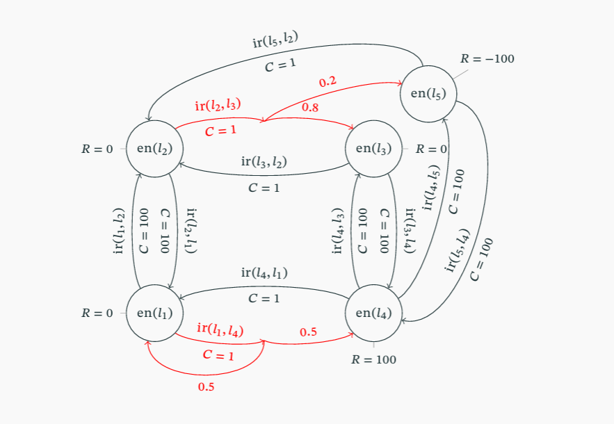

# Planificación bajo Incertidumbre

## Recorrido matemático

El recorrido matemático que describe la teoría del aprendizaje por refuerzo es fascinante, ya que construye paso a paso un modelo para poder tomar decisiones en un entorno donde no controlamos totalmente los resultados. En la planificación bajo incertidumbre, los efectos de las acciones son **no deterministas** (una misma acción en un mismo estado puede dar distintos resultados).

Para resolver esto, la formulación matemática eleva su complejidad de manera secuencial. Aquí tienes el recorrido paso a paso, integrando las fórmulas y el concepto que las motiva:

### 1. La base probabilística: El Proceso de Decisión de Markov (MDP)

- **Concepto:** Como no sabemos qué va a pasar exactamente al aplicar una acción, necesitamos modelar todas las posibilidades y sus probabilidades.
- **Fórmula:** El sistema se define como la tupla $(S, A, P)$. La pieza clave aquí es la función de transición **$P_a(s'|s)$**, que representa la probabilidad de que, estando en el estado $s$ y aplicando la acción $a$, el sistema acabe en el estado $s'$.
- **Restricción:** La suma de las probabilidades de ir a todos los posibles estados futuros $s'$ debe ser exactamente 1 ($ \sum P_a(s'|s) = 1 $).

### 2. La estrategia: Las Políticas ($\pi$)

- **Concepto:** En la planificación clásica creábamos un plan lineal (una secuencia de acciones). Como aquí el resultado de cada acción es incierto, un plan lineal fracasaría al primer imprevisto. En su lugar, el plan se convierte en una **política**.
- **Fórmula:** **$\pi: S \rightarrow A$**. Una política es una función que asigna una acción ejecutable a cada estado del sistema. Es un "manual de instrucciones" universal: pase lo que pase, miras en qué estado estás y la política te dice qué acción tomar.

### 3. La ejecución en el tiempo: Historias y su Probabilidad

- **Concepto:** Al ejecutar una política, el sistema va saltando de estado en estado indefinidamente, generando una **historia** ($h$). Queremos saber qué tan probable es que ocurra una historia específica.
- **Fórmula:** **$\mathbb{P}(h|\pi) = \prod_{i\ge0} P_{\pi(s_i)}(s_{i+1}|s_i)$**.
- **Evolución:** Esta fórmula eleva la complejidad combinando el Paso 1 y el 2. Aprovechando la **propiedad de Markov** (el siguiente estado solo depende del actual), calcula la probabilidad de toda la historia multiplicando ($\prod$) las probabilidades individuales de cada salto de estado que la política $\pi$ va dictando.

### 4. La evaluación de la ejecución: Utilidad y Factor de Descuento

- **Concepto:** Ya sabemos calcular la probabilidad de una historia, pero ¿es una "buena" o "mala" historia? Para medirlo, el entorno nos da Recompensas ($R$) o Costes al pasar por los estados. La idea inicial sería simplemente sumar todas las recompensas de la historia: $\sum R(s_i, \pi(s_i))$.
- **El problema:** Como las historias son sucesiones infinitas de estados, esta suma tendería a infinito, lo que nos impediría comparar matemáticamente qué historia es mejor.
- **Fórmula corregida:** **$U(h|\pi) = \sum_{i\ge0} \gamma^i R(s_i, \pi(s_i))$**.
- **Evolución:** Para asegurar un valor acotado y manejable, se introduce el **factor de descuento $\gamma$** (un valor entre 0 y 1). Al multiplicar las recompensas futuras por un $\gamma$ cada vez más elevado a una potencia mayor, el modelo indica conceptualmente que las recompensas inmediatas valen más que las recompensas lejanas en el futuro.

### 5. La unificación final: Utilidad Esperada de un Estado

- **Concepto:** Ahora tenemos un problema: desde un mismo estado inicial $s$, seguir la política $\pi$ puede generar múltiples historias diferentes (debido a la incertidumbre del entorno). Por tanto, la "utilidad" del estado $s$ no puede basarse en una sola historia, sino que debe ser el **valor esperado** (la esperanza matemática) de todas las historias posibles.
- **Fórmula:** **$U_\pi(s) = \mathbb{E}[U(h|\pi)] = \sum_{h \in H(s)} \mathbb{P}(h|\pi) U(h|\pi)$**.
- **Evolución:** Esta ecuación representa la cúspide teórica, ya que **fusiona la Parte 3 y la Parte 4**. Multiplica la utilidad exacta de cada historia posible ($U$) por su probabilidad de ocurrir ($\mathbb{P}$) y suma todos esos escenarios.

### 6. La simplificación práctica (El sistema de ecuaciones)

Calcular infinitas historias con la fórmula anterior es imposible en la práctica. Por ello, las matemáticas permiten simplificar esa compleja esperanza matemática en una ecuación recursiva y elegante:
**$U(s) = R(s, \pi(s)) + \gamma \sum_{s' \in S} P_{\pi(s)}(s'|s) U(s')$**

Como recordaremos de nuestra conversación anterior, el concepto detrás de esta fórmula final es que el valor de un estado es igual a su recompensa inmediata, más el valor futuro de los estados a los que podría transitar. Al aplicar esta regla universal ($\forall s \in S$), la complejidad abstracta de las infinitas historias se reduce a **un simple sistema de ecuaciones lineales** fácil de resolver matemáticamente.

#### 6.1 La explicación del concepto extendida

Esta fórmula divide el valor de estar en un estado $s$ en dos bloques perfectamente diferenciados:

1.  **Lo que consigues ahora mismo:** El término $R(s, \pi(s))$ representa la recompensa inmediata neta de aplicar la acción dictada por la política en ese estado.
2.  **Lo que esperas conseguir en el futuro:** El término sumatorio multiplica la probabilidad de acabar en cada uno de los posibles estados futuros $s'$ por el valor que tienen esos estados $U_\pi(s')$, y a todo ello se le aplica el factor de descuento $\gamma$ para penalizar que es una recompensa futura.

**¿Por qué esto se transforma en un sistema de ecuaciones lineales?**
Por dos razones derivadas de la matemática del modelo:

- **La cuantificación universal ($\forall s \in S$):** Esta fórmula no se aplica a un solo estado de forma aislada, sino que debe cumplirse para _todos_ los estados del dominio simultáneamente. Si tu problema tiene $n$ estados, al aplicar la regla generas automáticamente $n$ ecuaciones.
- **La interdependencia:** Como has visto, la utilidad de $s$ ($U(s)$) se calcula usando la utilidad de los estados futuros ($U(s')$).

Como las utilidades son las incógnitas que queremos averiguar, conformamos un sistema de ecuaciones lineales cerrado donde el número de ecuaciones coincide con el número de variables (los estados). Resolver algebraicamente este sistema nos da el valor exacto de la utilidad de todos los estados sin tener que simular ni una sola historia infinita.

#### 6.4 Un Ejemplo Práctico

Imagina un problema donde un robot se mueve por un mapa con 5 localizaciones (los estados $s_1, s_2, s_3, s_4, s_5$) intentando llegar al estado $s_4$, que da una gran recompensa. Las acciones tienen un coste (gasto de energía) y en ocasiones el movimiento falla.

Vamos a evaluar una política concreta (llamémosla $\pi_2$) que le da al robot las siguientes instrucciones y genera las siguientes `**recompensas inmediatas netas ($R(s) - Coste$)**`:

- En $s_1$: "Ir a $s_2$". Probabilidad de éxito: 100%. Recompensa inmediata neta: **-100**.
- En $s_2$: "Ir a $s_3$". Probabilidad de éxito: 80% (acaba en $s_3$) o falla con 20% (acaba desviado en $s_5$). Recompensa inmediata neta: **-1**.
- En $s_3$: "Ir a $s_4$". Probabilidad de éxito: 100%. Recompensa inmediata neta: **-100**.
- En $s_4$: "Esperar" (Ya está en la meta). Probabilidad de quedarse en $s_4$: 100%. Recompensa inmediata neta: **100**.
- En $s_5$: "Ir a $s_4$". Probabilidad de éxito: 100%. Recompensa inmediata neta: **-200**.

Si aplicamos la fórmula teórica a esta situación (usando un factor de descuento $\gamma = 0.9$), la complejidad abstracta se convierte directamente en este sencillo sistema de 5 ecuaciones:

1.  $U(s_1) = -100 + 0.9 \cdot (1 \cdot U(s_2))$
2.  $U(s_2) = -1 + 0.9 \cdot (\mathbf{0.8 \cdot U(s_3)} + \mathbf{0.2 \cdot U(s_5)})$ _(Aquí se ve el no determinismo)_
3.  $U(s_3) = -100 + 0.9 \cdot (1 \cdot U(s_4))$
4.  $U(s_4) = 100 + 0.9 \cdot (1 \cdot U(s_4))$
5.  $U(s_5) = -200 + 0.9 \cdot (1 \cdot U(s_4))$

Al observar las ecuaciones, verás que es facilísimo resolverlo de abajo a arriba:

- De la ecuación 4 podemos despejar $U(s_4)$ directamente: $U(s_4) = 100 + 0.9 \cdot U(s_4) \rightarrow U(s_4) = 1000$.
- Con ese valor, sustituimos en la 3 y la 5: $U(s_3) = 800$ y $U(s_5) = 700$.
- Ahora la ecuación 2 (que tenía incertidumbre) se puede resolver: $U(s_2) = -1 + 0.9 \cdot (0.8 \cdot 800 + 0.2 \cdot 700) = 701$.
- Y finalmente la 1: $U(s_1) = -100 + 0.9 \cdot 701 = 530.9$.

De esta forma matemática tan limpia, el sistema nos ha calculado la utilidad exacta de cada estado para esa política, teniendo en cuenta infinitos futuros y probabilidades de fallo, todo reducido a álgebra básica.
