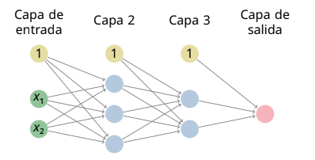

<link rel="stylesheet" href="../css/estilo.css">

## Propagación hacia adelante - Ejercicio 11

### Enunciado

Considera la red neuronal siguiente:

donde la función de activación de las neuronas artificiales es la función sigmoide en las capas ocultas y la función identidad en la capa de salida y donde las matrices de pesos y sesgos son:

**Matrices de Pesos y Sesgos**

$$W^{2}=\begin{pmatrix}-0.9&0.6 \\ 0.0&0.5 \\ 0.4&-0.2\end{pmatrix}$$

$$W^{3}=\begin{pmatrix}0.3&0.5&-0.4 \\ -0.8&-0.9&0.3\end{pmatrix}$$

$$W^{4}=\begin{pmatrix}0.7&-0.5\end{pmatrix}$$

$$w\_{0}^{2}=\begin{pmatrix}-0.6 \\ 0.5 \\ -0.8\end{pmatrix}$$

$$w\_{0}^{3}=\begin{pmatrix}0.5 \\ 0.8\end{pmatrix}$$

$$w\_{0}^{4}=\begin{pmatrix}-0.2\end{pmatrix}$$

Se pide calcular el error absoluto medio, el error cuadrático medio y el coeficiente de determinación de la red sobre el siguiente conjunto de ejemplos:

**Tabla de Ejemplos**

| $x\_{1}$ | $x\_{2}$ | $y$   |
| :------- | :------- | :---- |
| 1.0      | \-1.9    | \-0.4 |
| \-1.7    | \-3.9    | \-0.2 |
| 0.3      | 0.0      | 0.2   |
| \-2.4    | 4.7      | 0.3   |
| 0.9      | 1.1      | \-0.2 |

## ¿Cómo abordar el Ejercicio 11?

Para practicar pura _forward propagation_ (propagación hacia adelante), te recomiendo sin duda que empieces por el **Ejercicio 11** del boletín de Redes Neuronales.

**¿Por qué el Ejercicio 11 es perfecto para empezar?**
El enunciado te pide calcular el Error Absoluto Medio, el Error Cuadrático Medio y el coeficiente de determinación sobre 5 ejemplos. Para poder calcular cualquier métrica de error final, tu único camino es coger los datos de entrada de cada ejemplo y empujarlos matemáticamente por toda la red, capa a capa, hasta obtener la predicción final.

Además, su arquitectura es ideal para poner en práctica la notación matricial sin que las matrices sean excesivamente grandes:

- **Capa 1 (Entrada):** 2 neuronas ($x_1, x_2$).
- **Capas 2 y 3 (Ocultas):** Tienen 3 y 2 neuronas respectivamente, y ambas usan la función de activación **sigmoide**.
- **Capa 4 (Salida):** 1 sola neurona con función **identidad**, ya que se trata de un problema de regresión.

**Cómo abordarlo aplicando la plantilla matricial:**
Para cada uno de los 5 ejemplos de la tabla, deberás aplicar secuencialmente el "Paso 2" de propagación hacia adelante:

1. Escribe la entrada como un vector columna: $a^1 = (x_1, x_2)^T$.
2. Calcula la entrada bruta a la Capa 2: $z^2 = W^2 a^1 + w_0^2$.
3. Aplica la activación sigmoide a todo el vector: $a^2 = \sigma(z^2)$.
4. Repite el proceso para la Capa 3 ($z^3 = W^3 a^2 + w_0^3$ y $a^3 = \sigma(z^3)$) y finalmente para la Capa 4 de salida, recordando que esta última usa la identidad, por lo que $a^4 = z^4$.
5. Compara tu $a^4$ final con la $y$ real de la tabla para sacar los errores.

#### Solución

Desglose matricial paso a paso de los dos primeros ejemplos para que puedas comprobar todas tus operaciones, junto con los resultados directos de los tres ejemplos siguientes y el cálculo de las métricas globales finales que pide el **Ejercicio 11**.

_(Nota: Los resultados se muestran con 4 decimales en cada capa intermedia para evitar arrastrar errores de redondeo)._

**Recuerda la fórmula de la función sigmoide**: $\sigma(z) = \frac{1}{1 + e^{-z}}$ y su derivada: $\sigma^{\prime}(z) = \sigma(z)(1 - \sigma(z))$

### Cálculos desarrollados (Ejemplos 1 y 2)

**Ejemplo 1: $x = (1.0, -1.9)^T$, $y = -0.4$**

1. **Capa 2 (Oculta):**
   - $z^2 = W^2 a^1 + w_0^2 = \begin{pmatrix} -0.9 & 0.6 \\ 0.0 & 0.5 \\ 0.4 & -0.2 \end{pmatrix} \begin{pmatrix} 1.0 \\ -1.9 \end{pmatrix} + \begin{pmatrix} -0.6 \\ 0.5 \\ -0.8 \end{pmatrix} = \begin{pmatrix} -2.64 \\ -0.45 \\ -0.02 \end{pmatrix}$
   - $a^2 = \sigma(z^2) = (0.0666, 0.3894, 0.4950)^T$
2. **Capa 3 (Oculta):**
   - $z^3 = W^3 a^2 + w_0^3 = \begin{pmatrix} 0.3 & 0.5 & -0.4 \\ -0.8 & -0.9 & 0.3 \end{pmatrix} \begin{pmatrix} 0.0666 \\ 0.3894 \\ 0.4950 \end{pmatrix} + \begin{pmatrix} 0.5 \\ 0.8 \end{pmatrix} = \begin{pmatrix} 0.5167 \\ 0.5448 \end{pmatrix}$
   - $a^3 = \sigma(z^3) = (0.6264, 0.6329)^T$
3. **Capa 4 (Salida):**
   - $z^4 = W^4 a^3 + w_0^4 = (0.7, -0.5) \begin{pmatrix} 0.6264 \\ 0.6329 \end{pmatrix} - 0.2 = -0.0780$
   - $a^4 = z^4 = \mathbf{-0.0780}$ (Al usar la función identidad, se queda igual).
4. **Errores:**
   - Error Absoluto $= |-0.4 - (-0.0780)| = \mathbf{0.3220}$
   - Error Cuadrático $= 0.3220^2 = \mathbf{0.1037}$

**Ejemplo 2: $x = (-1.7, -3.9)^T$, $y = -0.2$**

1. **Capa 2 (Oculta):**
   - $z^2 = \begin{pmatrix} -0.9 & 0.6 \\ 0.0 & 0.5 \\ 0.4 & -0.2 \end{pmatrix} \begin{pmatrix} -1.7 \\ -3.9 \end{pmatrix} + \begin{pmatrix} -0.6 \\ 0.5 \\ -0.8 \end{pmatrix} = \begin{pmatrix} -1.41 \\ -1.45 \\ -0.70 \end{pmatrix}$
   - $a^2 = \sigma(z^2) = (0.1962, 0.1900, 0.3318)^T$
2. **Capa 3 (Oculta):**
   - $z^3 = \begin{pmatrix} 0.3 & 0.5 & -0.4 \\ -0.8 & -0.9 & 0.3 \end{pmatrix} \begin{pmatrix} 0.1962 \\ 0.1900 \\ 0.3318 \end{pmatrix} + \begin{pmatrix} 0.5 \\ 0.8 \end{pmatrix} = \begin{pmatrix} 0.5211 \\ 0.5716 \end{pmatrix}$
   - $a^3 = \sigma(z^3) = (0.6274, 0.6391)^T$
3. **Capa 4 (Salida):**
   - $z^4 = (0.7, -0.5) \begin{pmatrix} 0.6274 \\ 0.6391 \end{pmatrix} - 0.2 = -0.0804$
   - $a^4 = z^4 = \mathbf{-0.0804}$
4. **Errores:**
   - Error Absoluto $= |-0.2 - (-0.0804)| = \mathbf{0.1196}$
   - Error Cuadrático $= 0.1196^2 = \mathbf{0.0143}$

---

### Resultados finales (Ejemplos 3, 4 y 5)

Aplicando exactamente la misma iteración hacia adelante para el resto de la tabla, obtenemos:

- **Ejemplo 3 ($x_1=0.3, x_2=0.0$, $y=0.2$):**
  - Predicción final ($a^4$): **0.0147**
  - Error Absoluto: **0.1853**
  - Error Cuadrático: **0.0343**

- **Ejemplo 4 ($x_1=-2.4, x_2=4.7$, $y=0.3$):**
  - Predicción final ($a^4$): **0.1907**
  - Error Absoluto: **0.1093**
  - Error Cuadrático: **0.0120**

- **Ejemplo 5 ($x_1=0.9, x_2=1.1$, $y=-0.2$):**
  - Predicción final ($a^4$): **0.0401**
  - Error Absoluto: **0.2401**
  - Error Cuadrático: **0.0577**

---

### Métricas globales de la red neuronal

Ahora que hemos pasado por la red los 5 ejemplos del **Ejercicio 11**, podemos calcular el rendimiento global sumando los errores y dividiendo entre el total ($N=5$):

1. **Error Absoluto Medio (MAE):**
   $\frac{0.3220 + 0.1196 + 0.1853 + 0.1093 + 0.2401}{5} = \mathbf{0.1953}$

2. **Error Cuadrático Medio (MSE):**
   $\frac{0.1037 + 0.0143 + 0.0343 + 0.0120 + 0.0577}{5} = \mathbf{0.0444}$

3. **Coeficiente de Determinación ($R^2$):**
   Aplicando la fórmula que comentamos en el mensaje anterior ($\large R^2 = 1 - \frac{\sum (y_i - a_i)^2}{\sum (y_i - \bar{y})^2}$), calculamos primero la media de las $y$ reales ($\bar{y} = -0.06$).
   La suma de los errores al cuadrado ya la tenemos (es $0.222$). La suma total de las varianzas en el denominador da $0.352$.
   $\large R^2 = 1 - \frac{0.222}{0.352} = \mathbf{0.3695}$

_(Dato curioso de cara al examen: Al obtener casi un 0.37 en el $R^2$, significa que esta red neuronal con sus pesos iniciales solo es capaz de explicar el 37% de la varianza del problema. El modelo sigue siendo bastante malo y nos está pidiendo a gritos que apliquemos retropropagación para que mejore)._

## Algoritmo de retropropagación

¡Totalmente correcto! Has resumido a la perfección la esencia del algoritmo de retropropagación y el descenso por el gradiente.

Esa es exactamente la secuencia estructurada que debes seguir en tu hoja de examen tras haber completado el _forward propagation_.

Para que tengas el esquema mental definitivo, tu resumen se traduce en las siguientes operaciones matemáticas:

**1. Calculo de los deltas (Propagación del error hacia atrás):**
Empiezas calculando el error en la capa de salida final ($\Delta^L$), que utilizando las configuraciones típicas se suele simplificar a la resta entre tu predicción y el valor real ($a^L - y$). Una vez lo tienes, "empujas" ese error hacia las capas ocultas anteriores ($\Delta^l$) multiplicándolo por la matriz de pesos transpuesta de la capa siguiente y por la derivada de la función de activación de esa capa oculta.

**2. Cálculo de los gradientes locales:**
Con los deltas ya calculados en cada capa, averiguas cuánto debe cambiar cada parámetro. Para los sesgos (_bias_), el gradiente es directamente tu vector delta. Para los pesos, simplemente multiplicas tu vector delta por la activación de la capa anterior transpuesta ($(a^{l-1})^T$). Esto te genera una matriz de gradientes del mismo tamaño que tu matriz de pesos original.

**3. Actualización de pesos y bias (Descenso por el gradiente):**
Por último, entra en juego tu factor de aprendizaje ($\eta$). Si estás actualizando la red tras evaluar un minilote de $m$ ejemplos, sumas todas las matrices de gradientes que calculaste en el paso 2, haces la media multiplicándolas por $\frac{\eta}{m}$, y le restas ese resultado a los pesos y sesgos antiguos. Si el ejercicio te pide actualizar tras un solo ejemplo (regla delta), simplemente restas el gradiente multiplicado por $\eta$.

¡Con este esquema mental de 3 pasos y dominando las operaciones matriciales, tienes la base teórica y práctica necesaria para resolver cualquier problema de entrenamiento de Redes Neuronales!

## Ejemplo de retropropagación paso a paso de un solo ejemplo del ejercicio 11

Para cerrar el círculo completo de todo lo que hemos hablado, vamos a unificar los tres pasos y desarrollar el ciclo completo de retropropagación para el **Primer Ejemplo del Ejercicio 11** ($x_1=1.0, x_2=-1.9$, cuya respuesta correcta era $y=-0.4$).

_Asumiremos que vamos a actualizar los pesos usando la Regla Delta (actualización tras un solo ejemplo) con un factor de aprendizaje $\eta = 0.1$_.

### Datos de partida (obtenidos en el _Forward Propagation_)

Recordemos los vectores de activación (salidas) que obtuvimos en cada capa al pasar los datos hacia adelante:

- **Capa 1 (Entrada):** $a^1 = (1.0, -1.9)^T$
- **Capa 2 (Oculta):** $a^2 = (0.0666, 0.3894, 0.4950)^T$
- **Capa 3 (Oculta):** $a^3 = (0.6264, 0.6329)^T$
- **Capa 4 (Salida):** $a^4 = -0.0780$

---

### PASO 1: Cálculo de los Deltas (Errores hacia atrás)

Utilizamos las fórmulas matriciales para obtener el vector de error ($\Delta$) de cada capa. En mensajes anteriores ya hicimos este cálculo paso a paso:

- **$\Delta^4$ (Capa de salida):** $\frac{2}{n}(a^4 - y) = \mathbf{0.644}$
- **$\Delta^3$ (Capa oculta 3):** $((W^4)^T \Delta^4) \odot (a^3 \odot (1-a^3)) = \mathbf{(0.1055, -0.0748)^T}$
- **$\Delta^2$ (Capa oculta 2):** $((W^3)^T \Delta^3) \odot (a^2 \odot (1-a^2)) = \mathbf{(0.0057, 0.0286, -0.0162)^T}$

En el primer paso (el "Cálculo de los Deltas" o propagación de los errores hacia atrás), empleé **dos fórmulas matriciales distintas**, ya que matemáticamente el error no se calcula igual en la última capa (que conoce el valor objetivo) que en las capas intermedias.

Aquí tienes el desglose exacto de las ecuaciones que utilicé:

**1. Fórmula para la Capa de Salida ($\Delta^4$)**
La fórmula maestra que define el error en la última capa de cualquier red es $\Delta^L = \nabla_a C \odot \sigma^{\prime}(z^L)$. Sin embargo, como estamos en un problema de regresión que usa el Error Cuadrático Medio y la función identidad, esta ecuación se simplifica drásticamente al atajo que comentamos hace unos mensajes:
$$\Delta^4 = \frac{2}{n}(a^4 - y)$$

- **$a^4$**: Es tu predicción final.
- **$y$**: Es la respuesta real que debió dar la red.
- **$n$**: Es el número de neuronas en la capa de salida. Como en nuestro ejemplo solo había una neurona, quedó en $2 \times (a^4 - y)$.

**2. Fórmula para las Capas Ocultas ($\Delta^3$ y $\Delta^2$)**
Para trasladar ese error inicial hacia el interior de la red, apliqué la segunda gran ecuación fundamental de la retropropagación:
$$\Delta^l = ((W^{l+1})^T \Delta^{l+1}) \odot (g^l)^{\prime}(z^l)$$

- **$(W^{l+1})^T \Delta^{l+1}$**: Esta es la parte de "retroceder". Coges el error de la capa que tienes a la derecha ($\Delta^{l+1}$) y lo multiplicas por la matriz de pesos transpuesta. Esto te permite averiguar qué porcentaje de culpa del error total tiene cada neurona de la capa actual.
- **$\odot$**: Es el producto de Hadamard. Indica que los vectores se multiplican número a número (elemento a elemento), no haciendo álgebra de matrices tradicional.
- **$(g^l)^{\prime}(z^l)$**: Es la derivada de la función de activación de la capa donde estás. Como el Ejercicio 11 usa la función sigmoide en las capas ocultas, su derivada es maravillosamente simple y se calcula directamente usando la propia salida de la neurona: $a^l \odot (1 - a^l)$.

Por lo tanto, la fórmula exacta que tecleé en la calculadora para evaluar las capas ocultas fue la combinación de lo anterior:
$$\Delta^l = ((W^{l+1})^T \Delta^{l+1}) \odot (a^l \odot (1 - a^l))$$

### PASO 2: Cálculo de los Gradientes Locales

Ahora averiguamos cuánto debería cambiar cada parámetro. Para los sesgos, el gradiente es directamente el vector $\Delta^l$. Para los pesos, multiplicamos en orden el vector $\Delta^l$ (en columna) por la activación de la capa anterior $(a^{l-1})^T$ (en fila) para generar una matriz.

**Capa 4 (Salida):**

- **Gradiente del Sesgo:** $\Delta^4 = \mathbf{0.644}$
- **Gradiente de los Pesos:** $\Delta^4 \times (a^3)^T = 0.644 \times (0.6264, 0.6329) = \mathbf{\begin{pmatrix} 0.4034 & 0.4076 \end{pmatrix}}$

**Capa 3 (Oculta):**

- **Gradiente del Sesgo:** $\Delta^3 = \mathbf{\begin{pmatrix} 0.1055 \\ -0.0748 \end{pmatrix}}$
- **Gradiente de los Pesos:** $\Delta^3 \times (a^2)^T$
  $$\begin{pmatrix} 0.1055 \\ -0.0748 \end{pmatrix} \times (0.0666, 0.3894, 0.4950) = \mathbf{\begin{pmatrix} 0.0070 & 0.0411 & 0.0522 \\ -0.0050 & -0.0291 & -0.0370 \end{pmatrix}}$$

**Capa 2 (Oculta):**

- **Gradiente del Sesgo:** $\Delta^2 = \mathbf{\begin{pmatrix} 0.0057 \\ 0.0286 \\ -0.0162 \end{pmatrix}}$
- **Gradiente de los Pesos:** $\Delta^2 \times (a^1)^T$
  $$\begin{pmatrix} 0.0057 \\ 0.0286 \\ -0.0162 \end{pmatrix} \times (1.0, -1.9) = \mathbf{\begin{pmatrix} 0.0057 & -0.0108 \\ 0.0286 & -0.0543 \\ -0.0162 & 0.0308 \end{pmatrix}}$$

---

### PASO 3: Actualización Final de Parámetros (Descenso por el gradiente)

Finalmente, multiplicamos todos los gradientes anteriores por $\eta = 0.1$ y se los restamos a las matrices de pesos y sesgos iniciales del Ejercicio 11.

**Nuevos parámetros de la Capa 4:**

- $W^4_{nuevo} = \begin{pmatrix} 0.7 & -0.5 \end{pmatrix} - \begin{pmatrix} 0.0403 & 0.0407 \end{pmatrix} = \mathbf{\begin{pmatrix} 0.6597 & -0.5407 \end{pmatrix}}$
- $(w_0^4)_{nuevo} = -0.2 - 0.0644 = \mathbf{-0.2644}$

**Nuevos parámetros de la Capa 3:**

- $W^3_{nuevo} = \begin{pmatrix} 0.3 & 0.5 & -0.4 \\ -0.8 & -0.9 & 0.3 \end{pmatrix} - \begin{pmatrix} 0.0007 & 0.0041 & 0.0052 \\ -0.0005 & -0.0029 & -0.0037 \end{pmatrix} = \mathbf{\begin{pmatrix} 0.2993 & 0.4959 & -0.4052 \\ -0.7995 & -0.8971 & 0.3037 \end{pmatrix}}$
- $(w_0^3)_{nuevo} = \begin{pmatrix} 0.5 \\ 0.8 \end{pmatrix} - \begin{pmatrix} 0.0105 \\ -0.0075 \end{pmatrix} = \mathbf{\begin{pmatrix} 0.4895 \\ 0.8075 \end{pmatrix}}$

**Nuevos parámetros de la Capa 2:**

- $W^2_{nuevo} = \begin{pmatrix} -0.9 & 0.6 \\ 0.0 & 0.5 \\ 0.4 & -0.2 \end{pmatrix} - \begin{pmatrix} 0.0006 & -0.0011 \\ 0.0029 & -0.0054 \\ -0.0016 & 0.0031 \end{pmatrix} = \mathbf{\begin{pmatrix} -0.9006 & 0.6011 \\ -0.0029 & 0.5054 \\ 0.4016 & -0.2031 \end{pmatrix}}$
- $(w_0^2)_{nuevo} = \begin{pmatrix} -0.6 \\ 0.5 \\ -0.8 \end{pmatrix} - \begin{pmatrix} 0.0006 \\ 0.0029 \\ -0.0016 \end{pmatrix} = \mathbf{\begin{pmatrix} -0.6006 \\ 0.4971 \\ -0.7984 \end{pmatrix}}$

¡Y con esto has completado tu primer ciclo de entrenamiento íntegro! Los pequeños cambios en los decimales de $W_{nuevo}$ y $(w_0)_{nuevo}$ son el aprendizaje real de la red neuronal.

En el último paso (Paso 3: Actualización Final de Parámetros), he empleado la fórmula matemática conocida como la **regla delta** o método del **descenso por el gradiente para un solo ejemplo**.

En notación matricial, las fórmulas exactas que he aplicado para modificar las capas son:

Para actualizar las **matrices de pesos ($W^l$)**:
$$W^l_{nuevo} = W^l_{viejo} - \eta \Delta^l (a^{l-1})^T$$

Para actualizar los **vectores de sesgos ($w_0^l$)**:
$$(w_0^l)_{nuevo} = (w_0^l)_{viejo} - \eta \Delta^l$$

**Desglose de los elementos de la fórmula:**

- **$\eta$ (eta)**: Es el factor de aprendizaje, que en nuestro ejemplo fijamos numéricamente en 0.1.
- **$\Delta^l$**: Es el vector de error de la capa $l$ actual, el cual obtuvimos en el Paso 1 propagando hacia atrás.
- **$(a^{l-1})^T$**: Es el vector de activación (las salidas) de la capa inmediatamente anterior, colocado en formato fila (transpuesto).
- El bloque completo **$\Delta^l (a^{l-1})^T$** representa matemáticamente el **gradiente de los pesos** ($\frac{\partial C}{\partial W^l}$), que es exactamente lo que desglosamos en el Paso 2 de nuestra resolución.

Básicamente, la fórmula dice: _al peso antiguo, réstale una pequeña fracción (dictada por $\eta$) del gradiente que acabas de calcular_.

_(Nota técnica: He usado esta versión directa de la fórmula porque actualizamos la red inmediatamente tras ver el Ejemplo 1. Si hubiésemos esperado a evaluar un minilote de $m$ ejemplos juntos, la fórmula habría requerido sumar los gradientes de todos ellos y dividir entre el tamaño del lote: $W^l_{nuevo} = W^l*{viejo} - \frac{\eta}{m} \sum (\Delta^l (a^{l-1})^T)$)*.

