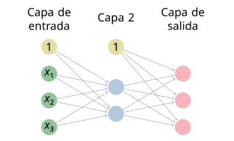

# Clasificación multiclase

## Ejercicio 13

Dada la siguiente red neuronal

Donde la función de activación de las neuronas artificiales es la función rectificador en la capa oculta y la función softmax en la capa de salida y donde las matrices de pesos y de sesgos son:

**Matrices de pesos:**

$$W^{2}=\begin{pmatrix}-0.9&-0.7&0.3\\ 0.0&0.5&-1.0\end{pmatrix}$$

$$W^{3}=\begin{pmatrix}-0.2&-0.1\\ -0.2&0.3\\ 0.6&-0.6\end{pmatrix}$$

**Vectores de sesgos (bias):**

$$w\_{0}^{2}=\begin{pmatrix}0.7\\ 0.4\end{pmatrix}$$

$$w\_{0}^{3}=\begin{pmatrix}0.7\\ 0.9\\ -0.9\end{pmatrix}$$

Se pide calcular la entropía cruzada categórica media de la red sobre el siguiente conjunto de ejemplos:

| $x\_{1}$ | $x\_{2}$ | $x\_{3}$ | $y$           |
| :------- | :------- | :------- | :------------ |
| 0.1      | 1.0      | \-1.3    | $(1,0,0)^{T}$ |
| \-2.5    | 4.1      | 1.2      | $(0,0,1)^{T}$ |
| \-4.4    | \-3.2    | 2.6      | $(0,1,0)^{T}$ |
| 0.9      | 3.6      | 2.3      | $(0,0,1)^{T}$ |
| 1.4      | 4.6      | 1.1      | $(1,0,0)^{T}$ |

---

### Solución

El **Ejercicio 13** tiene como objetivo evaluar cómo se comporta una red neuronal en una tarea de clasificación multiclase. Te pide pasar 5 ejemplos por la red (_forward propagation_) y, al final, calcular el error global utilizando la entropía cruzada categórica media.

Para resolverlo, primero debemos tener clara la arquitectura de la red:

- **Capa 1 (Entrada):** 3 neuronas, que reciben los atributos $x_1, x_2, x_3$.
- **Capa 2 (Oculta):** 2 neuronas, equipadas con la **función de activación rectificador (ReLU)**.
- **Capa 3 (Salida):** 3 neuronas (una para cada clase posible), equipadas con la **función de activación softmax**.

Vamos a resolver **el Primer Ejemplo** de la tabla ($x = (0.1, 1.0, -1.3)^T$ con objetivo $y = (1, 0, 0)^T$) paso a paso, para que veas cómo aplicar las fórmulas:

### Paso 1: Propagación hacia la Capa 2 (Oculta)

Primero, calculamos la entrada bruta ($z^2$) multiplicando la matriz de pesos $W^2$ por la entrada y sumando el sesgo $w_0^2$:
$$z^2 = \begin{pmatrix} -0.9 & -0.7 & 0.3 \\ 0.0 & 0.5 & -1.0 \end{pmatrix} \begin{pmatrix} 0.1 \\ 1.0 \\ -1.3 \end{pmatrix} + \begin{pmatrix} 0.7 \\ 0.4 \end{pmatrix}$$

- Fila 1: $(-0.9 \times 0.1) + (-0.7 \times 1.0) + (0.3 \times -1.3) = -0.09 - 0.7 - 0.39 = -1.18$
- Fila 2: $(0.0 \times 0.1) + (0.5 \times 1.0) + (-1.0 \times -1.3) = 0 + 0.5 + 1.3 = 1.8$

Sumamos el sesgo:
$$z^2 = \begin{pmatrix} -1.18 \\ 1.8 \end{pmatrix} + \begin{pmatrix} 0.7 \\ 0.4 \end{pmatrix} = \begin{pmatrix} -0.48 \\ 2.2 \end{pmatrix}$$

Ahora aplicamos la función **Rectificador (ReLU)**, que deja igual los números positivos y convierte los negativos en $0$:
$$a^2 = \max(0, z^2) = \mathbf{\begin{pmatrix} 0 \\ 2.2 \end{pmatrix}}$$

### Paso 2: Propagación hacia la Capa 3 (Salida)

Calculamos la entrada bruta ($z^3$) a partir de lo que ha devuelto la capa anterior ($a^2$):
$$z^3 = \begin{pmatrix} -0.2 & -0.1 \\ -0.2 & 0.3 \\ 0.6 & -0.6 \end{pmatrix} \begin{pmatrix} 0 \\ 2.2 \end{pmatrix} + \begin{pmatrix} 0.7 \\ 0.9 \\ -0.9 \end{pmatrix}$$

- Fila 1: $0 - 0.22 = -0.22$
- Fila 2: $0 + 0.66 = 0.66$
- Fila 3: $0 - 1.32 = -1.32$

Sumamos el sesgo:
$$z^3 = \begin{pmatrix} -0.22 \\ 0.66 \\ -1.32 \end{pmatrix} + \begin{pmatrix} 0.7 \\ 0.9 \\ -0.9 \end{pmatrix} = \begin{pmatrix} 0.48 \\ 1.56 \\ -2.22 \end{pmatrix}$$

Ahora llega el momento clave: aplicar la **función softmax**. Esta función coge esos tres valores y los convierte en porcentajes de probabilidad que suman 1. La fórmula es elevar el número $e$ a cada valor y dividirlo entre la suma de todos:

- $e^{0.48} \approx 1.616$
- $e^{1.56} \approx 4.759$
- $e^{-2.22} \approx 0.109$
- **Suma total** $\approx 6.484$

Las probabilidades finales ($a^3$) de nuestro primer ejemplo son:

- $a_1^3 = 1.616 / 6.484 = \mathbf{0.249}$ (Probabilidad del 24.9% para la clase 1)
- $a_2^3 = 4.759 / 6.484 = \mathbf{0.734}$ (Probabilidad del 73.4% para la clase 2)
- $a_3^3 = 0.109 / 6.484 = \mathbf{0.017}$ (Probabilidad del 1.7% para la clase 3)

### Paso 3: Calcular el Error (Entropía Cruzada Categórica)

Comparamos nuestra predicción con la realidad. Sabemos que este primer ejemplo pertenecía a la clase 1 porque su valor objetivo era $y = (1, 0, 0)^T$.

La fórmula de la **Entropía Cruzada Categórica** para un ejemplo individual es $-\sum y_k \log_e(a_k^3)$.
Como $y$ está en formato _one-hot_ (todo son ceros salvo la clase correcta que es un 1), la fórmula se simplifica enormemente: sólo tienes que calcular el logaritmo neperiano negativo de la probabilidad que el modelo le dio a la clase correcta.

Para este ejemplo, la clase correcta es la 1, y el modelo le asignó una probabilidad de $0.249$:
$$\text{Coste del Ejemplo 1} = -1 \times \log_e(0.249) \approx \mathbf{1.390}$$

### ¿Cómo finalizar el ejercicio?

Tendrás que repetir estos tres pasos para los **4 ejemplos restantes de la tabla**.
Una vez que tengas los 5 costes calculados (uno por cada ejemplo), simplemente los sumas y los divides entre 5. El resultado final será la **entropía cruzada categórica media** de la red.

¿Te animas a calcular a mano el segundo ejemplo ($x_1=-2.5, x_2=4.1, x_3=1.2$) y comprobamos si te sale bien la aplicación de softmax?
