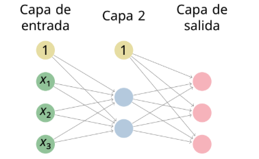

<link rel="stylesheet" href="../css/estilo.css">

# Retropropagación en clasificación multiclase

## Ejercicio 17

Consideremos la red neuronal

donde la función de activación de las neuronas artificiales es la función rectificador en la capa oculta y la función softmax en la capa de salida y donde las matrices iniciales de pesos y de sesgos son:

**Matrices iniciales de pesos:**

$$W^{2}=\begin{pmatrix}-0.9&-0.7&0.3\\ 0.0&0.5&-1.0\end{pmatrix}$$

$$W^{3}=\begin{pmatrix}-0.2&-0.1\\ -0.2&0.3\\ 0.6&-0.6\end{pmatrix}$$

**Vectores iniciales de sesgos (bias):**

$$w_{0}^{2}=\begin{pmatrix}0.7\\ 0.4\end{pmatrix}$$

$$w_{0}^{3}=\begin{pmatrix}0.7\\ 0.9\\ -0.9\end{pmatrix}$$

Dado el siguiente conjunto de ejemplos de entrenamiento

| $X_{1}$ | $X_{2}$ | $X_{3}$ |      $y$      |
| :-----: | :-----: | :-----: | :-----------: |
|  \-3.9  |  \-0.4  |   2.7   | $(0,0,1)^{T}$ |
|   0.6   |  \-3.6  |  \-0.7  | $(1,0,0)^{T}$ |
|  \-2.0  |  \-4.2  |   5.0   | $(1,0,0)^{T}$ |
|   3.1   |   0.3   |  \-2.8  | $(0,1,0)^{T}$ |
|  \-4.5  |  \-0.7  |  \-4.7  | $(0,0,1)^{T}$ |
|  \-2.9  |   1.5   |  \-3.1  | $(1,0,0)^{T}$ |
|  \-2.2  |   3.5   |   1.9   | $(0,0,1)^{T}$ |
|  \-2.8  |   4.9   |   0.6   | $(0,0,1)^{T}$ |
|  \-4.7  |   3.6   |   3.2   | $(0,1,0)^{T}$ |

se pide:

- Calcular la entropía cruzada categórica media de la red sobre el conjunto de ejemplos de entrenamiento.

- Tomando η = 0.1 como factor de aprendizaje y minilotes de tamaño 3 (asignando en orden los ejemplos a los minilotes), actualizar los pesos y ejemplos de la red aplicando el algoritmo de descenso estocástico por el gradiente durante tres épocas. Volver a calcular la entropía cruzada categórica media de la red sobre el conjunto de ejemplos de entrenamiento tras cada época.

### Solución

¡Excelente elección! El **Ejercicio 17** es el reto definitivo porque combina todas las piezas avanzadas: capas ocultas con función rectificador (ReLU), capa de salida con Softmax, función de coste de entropía cruzada categórica y actualización por minilotes.

Para abordar este monstruo con eficacia en un examen, es crucial conocer el mayor "truco mágico" matemático del temario: cuando combinas Softmax en la salida con la entropía cruzada categórica como función de coste, la engorrosa derivada de la matriz Jacobiana se cancela. La fórmula del error en la última capa ($\Delta^L$) se simplifica directamente a **$\Delta^L = a^L - y$**.

Vamos a realizar el ciclo completo de _Forward_ y _Backward Propagation_ para el **primer ejemplo** del primer minilote:
$x = (-3.9, -0.4, 2.7)^T$ con objetivo $y = (0, 0, 1)^T$.

### 1. Propagación Hacia Adelante (Forward)

**Capa 2 (Oculta con ReLU):**
Primero calculamos la entrada neta ($z^2 = W^2 a^1 + w_0^2$):

- $W^2 a^1 = \begin{pmatrix} -0.9 & -0.7 & 0.3 \\ 0.0 & 0.5 & -1.0 \end{pmatrix} \begin{pmatrix} -3.9 \\ -0.4 \\ 2.7 \end{pmatrix} = \begin{pmatrix} 3.51 + 0.28 + 0.81 \\ 0 - 0.2 - 2.7 \end{pmatrix} = \begin{pmatrix} 4.60 \\ -2.90 \end{pmatrix}$
- $z^2 = \begin{pmatrix} 4.60 \\ -2.90 \end{pmatrix} + \begin{pmatrix} 0.7 \\ 0.4 \end{pmatrix} = \begin{pmatrix} 5.30 \\ -2.50 \end{pmatrix}$

Ahora aplicamos la función **Rectificador (ReLU)**:

- $a^2 = \max(0, z^2) = \mathbf{\begin{pmatrix} 5.30 \\ 0 \end{pmatrix}}$

**Capa 3 (Salida con Softmax):**
Calculamos la entrada neta ($z^3 = W^3 a^2 + w_0^3$):

- $W^3 a^2 = \begin{pmatrix} -0.2 & -0.1 \\ -0.2 & 0.3 \\ 0.6 & -0.6 \end{pmatrix} \begin{pmatrix} 5.30 \\ 0 \end{pmatrix} = \begin{pmatrix} -1.06 \\ -1.06 \\ 3.18 \end{pmatrix}$
- $z^3 = \begin{pmatrix} -1.06 \\ -1.06 \\ 3.18 \end{pmatrix} + \begin{pmatrix} 0.7 \\ 0.9 \\ -0.9 \end{pmatrix} = \begin{pmatrix} -0.36 \\ -0.16 \\ 2.28 \end{pmatrix}$

Aplicamos la función **Softmax** (elevando $e$ a cada valor y dividiendo por la suma, que es $\approx 11.326$):

- $a^3 = \mathbf{\begin{pmatrix} 0.0616 \\ 0.0752 \\ 0.8632 \end{pmatrix}}$

_(Nota: Como la clase real era la tercera, este ejemplo tiene un coste individual de $-\log_e(0.8632) = 0.147$)_.

---

### 2. Retropropagación (Backward)

**Error en la Capa 3 ($\Delta^3$):**
Gracias al atajo matemático de Softmax + Entropía cruzada:

- $\Delta^3 = a^3 - y = \begin{pmatrix} 0.0616 \\ 0.0752 \\ 0.8632 \end{pmatrix} - \begin{pmatrix} 0 \\ 0 \\ 1 \end{pmatrix} = \mathbf{\begin{pmatrix} 0.0616 \\ 0.0752 \\ -0.1368 \end{pmatrix}}$

**Error en la Capa 2 ($\Delta^2$):**
La fórmula es $\Delta^2 = ((W^3)^T \Delta^3) \odot ReLU'(z^2)$.
Primero retropropagamos el error por los pesos transponiendo $W^3$:

- $(W^3)^T \Delta^3 = \begin{pmatrix} -0.2 & -0.2 & 0.6 \\ -0.1 & 0.3 & -0.6 \end{pmatrix} \begin{pmatrix} 0.0616 \\ 0.0752 \\ -0.1368 \end{pmatrix} = \begin{pmatrix} -0.1094 \\ 0.0985 \end{pmatrix}$

Ahora, la derivada de ReLU es 1 si $z>0$ y 0 si $z\le0$. Como nuestro $z^2$ era $(5.30, -2.50)^T$, su derivada es $(1, 0)^T$. Al aplicar el producto de Hadamard:

- $\Delta^2 = \begin{pmatrix} -0.1094 \\ 0.0985 \end{pmatrix} \odot \begin{pmatrix} 1 \\ 0 \end{pmatrix} = \mathbf{\begin{pmatrix} -0.1094 \\ 0 \end{pmatrix}}$

---

### 3. Gradientes Locales del Ejemplo 1

Multiplicamos el Delta de la capa por la activación de la capa anterior transpuesta.

**Capa 3:**

- **Gradiente Pesos:** $\frac{\partial C}{\partial W^3} = \Delta^3 (a^2)^T = \begin{pmatrix} 0.0616 \\ 0.0752 \\ -0.1368 \end{pmatrix} (5.30, 0) = \mathbf{\begin{pmatrix} 0.3265 & 0 \\ 0.3986 & 0 \\ -0.7250 & 0 \end{pmatrix}}$
- **Gradiente Sesgo:** $\frac{\partial C}{\partial w_0^3} = \Delta^3 = \mathbf{\begin{pmatrix} 0.0616 \\ 0.0752 \\ -0.1368 \end{pmatrix}}$

**Capa 2:**

- **Gradiente Pesos:** $\frac{\partial C}{\partial W^2} = \Delta^2 (a^1)^T = \begin{pmatrix} -0.1094 \\ 0 \end{pmatrix} (-3.9, -0.4, 2.7) = \mathbf{\begin{pmatrix} 0.4267 & 0.0438 & -0.2954 \\ 0 & 0 & 0 \end{pmatrix}}$
- **Gradiente Sesgo:** $\frac{\partial C}{\partial w_0^2} = \Delta^2 = \mathbf{\begin{pmatrix} -0.1094 \\ 0 \end{pmatrix}}$

---

### 4. ¿Cómo proceder con el Descenso Estocástico (Minilotes)?

Como el Ejercicio 17 te pide agrupaciones en minilotes de tamaño 3 ($m=3$), **¡no debes actualizar los pesos todavía!**

El algoritmo completo te exige:

1. Guardar estas 4 matrices de gradientes que acabamos de calcular para el Ejemplo 1.
2. Repetir exactamente este mismo proceso con los Ejemplos 2 y 3.
3. Sumar las matrices de los tres ejemplos y aplicar la regla de actualización:
   $$W^l_{nuevo} = W^l_{viejo} - \frac{\eta}{3} \sum_{x=1}^{3} (\text{Gradientes Pesos})$$
   $$(w_0^l)_{nuevo} = (w_0^l)_{viejo} - \frac{\eta}{3} \sum_{x=1}^{3} (\text{Gradientes Sesgos})$$

¿Entiendes bien la mecánica de la derivada del Softmax y cómo la neurona "apagada" por la ReLU hace que toda la segunda fila de gradientes en la Capa 2 sea de ceros?

