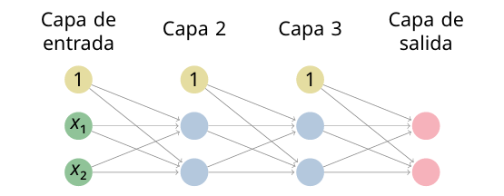

<link rel="stylesheet" href="../css/estilo.css">

# Redes Neuronales

## 1. Perceptron

El **perceptrón** es un tipo fundamental de neurona artificial utilizado principalmente como un modelo de clasificación binaria, donde asocia a cada entrada una salida que suele ser 0 o 1 (clase negativa y positiva).

Para dominar este concepto, estos son los puntos clave que debes conocer sobre su funcionamiento, entrenamiento y limitaciones:

### 1.1 Su funcionamiento matemático

El perceptrón toma decisiones calculando una combinación lineal de las entradas y aplicando una regla muy sencilla:

- Recibe una serie de argumentos o características de entrada ($x_1, \dots, x_m$) y a cada uno le asocia un **peso** ($w_1, \dots, w_m$) que determina su importancia.
- A esta suma ponderada se le añade un **sesgo** ($b$, a menudo representado como un peso virtual $w_0$ asociado a una entrada $x_0=1$). El sesgo determina con qué facilidad se activa el perceptrón; un sesgo mayor hace más fácil que la salida sea 1. Geométricamente, el sesgo es crucial porque permite que el hiperplano que separa las clases no tenga que pasar obligatoriamente por el origen de coordenadas.
- Finalmente, el resultado de esta suma ($z$) pasa por una **función de activación**. En el perceptrón clásico se usa la **función umbral**, que devuelve 1 si $z > 0$, y 0 si $z \le 0$. También se puede utilizar la función signo, que devuelve 1 o -1.

### 1.2 Cómo aprende (Entrenamiento)

El perceptrón aprende mediante **aprendizaje supervisado** ajustando sus pesos cuando se equivoca al predecir.

- Inicialmente, los pesos se asignan de forma aleatoria.
- Si al evaluar un ejemplo de entrenamiento la salida obtenida ($a$) es diferente a la salida real esperada ($y$), los pesos se actualizan usando la fórmula: $w_i \leftarrow w_i + \eta(y - a)x_i$.
- En esta fórmula, $\eta$ representa el **factor de aprendizaje**, un número mayor que cero que regula cómo de grandes son los pasos que da el modelo al ajustar sus pesos.

### 1.3 Su gran limitación: La separabilidad lineal

El aspecto teórico más importante del perceptrón es que **solo es capaz de aprender a clasificar conjuntos de ejemplos que sean linealmente separables**. Esto significa que debe existir un hiperplano (una línea en 2D, un plano en 3D, etc.) que divida perfectamente los ejemplos positivos de los negativos.

- El **Teorema de Minsky y Papert (1969)** demostró que si un problema es linealmente separable y el factor de aprendizaje es adecuado, el algoritmo del perceptrón siempre convergerá y encontrará la solución en un número finito de pasos.
- Sin embargo, si los datos no son linealmente separables, el perceptrón fracasará. El ejemplo clásico de este fracaso es la **función lógica XOR (disyunción exclusiva)**, que es imposible de separar con una sola línea recta, por lo que un perceptrón individual no puede aprenderla.

### 1.4 Evolución hacia las redes neuronales modernas

Para solucionar las limitaciones del perceptrón simple, surgieron dos grandes avances:

- **Redes multicapa:** Al combinar múltiples perceptrones en distintas capas (capas ocultas), la red adquiere una capacidad expresiva mucho mayor, siendo capaz de resolver problemas no lineales como el XOR.
- **Cambio en la función de activación:** La función umbral del perceptrón clásico da saltos bruscos (de 0 a 1) y no es derivable de forma útil, lo que impide usar algoritmos de entrenamiento eficientes como el descenso por el gradiente. Por ello, en las redes neuronales modernas, el perceptrón evoluciona sustituyendo la función umbral por funciones suaves y diferenciables, como la función **sigmoide**, la **tangente hiperbólica** o la función **ReLU**.

### 1.5 Ejercicios

#### 1.5.1 Ejercicio 2

Consideremos un perceptrón con cuatro argumentos, con sesgo 𝑤𝟢 = 0.6 y pesos 𝑤𝟣 = −0.7, 𝑤𝟤 = −0.1, 𝑤𝟥 = −0.4, 𝑤𝟦 = 0.5 y que usa la función signo como función de activación. Se pide calcular la matriz de confusión del perceptrón sobre el siguiente conjunto de ejemplos y derivar a partir de ella su tasa de aciertos, sensibilidad, especificidad y precisión:

| x1   | x2   | x3   | x4   | y   |
| ---- | ---- | ---- | ---- | --- |
| 0.5  | -1.0 | -1.0 | 1.0  | -1  |
| -1.0 | -0.5 | 0.0  | 0.5  | -1  |
| 1.0  | -1.0 | 0.5  | -0.5 | 1   |
| 0.5  | 1.0  | 0.0  | 0.0  | 1   |
| -1.0 | -1.0 | -0.5 | -0.5 | -1  |
| 1.0  | -0.5 | 0.0  | 0.0  | -1  |
| -0.5 | 0.0  | -0.5 | 0.0  | -1  |
| 1.0  | 1.0  | 0.5  | -1.0 | 1   |
| 0.0  | 0.0  | -0.5 | -1.0 | 1   |
| 0.0  | 0.0  | -0.5 | 0.5  | -1  |

Recordemos primero los pesos y la regla de activación:

- **Pesos:** $w_0 = 0.6$, $w_1 = -0.7$, $w_2 = -0.1$, $w_3 = -0.4$, $w_4 = 0.5$.
- **Función signo:** Si $z > 0 \rightarrow 1$ (Positivo). Si $z \le 0 \rightarrow -1$ (Negativo).

Aquí tienes el desarrollo de los ejemplos del 2 al 10:

- **Ejemplo_1** = (1 _ 0.6) + (0.5 _ -0.7) + (-1.0 _ -0.1) + (-1.0 _ -0.4) + (1.0 \* 0.5) = 0.6 - O.35 + 0.1 + 0.4 + 0.5 = 1.25 ->f_signo(1.25) = 1 -> **Falso Positivo (FP)**

- **Ejemplo 2:** $x_1 = -1.0,\; x_2 = -0.5,\; x_3 = 0.0,\; x_4 = 0.5$ (Clase real $y = -1$)
  - $z_2 = (1 \times 0.6) + (-1.0 \times -0.7) + (-0.5 \times -0.1) + (0.0 \times -0.4) + (0.5 \times 0.5)$
  - $z_2 = 0.6 + 0.7 + 0.05 - 0.0 + 0.25 = \mathbf{1.6}$
  - $f\_signo(1.6) = 1$. Predice Positivo (1), la realidad es Negativo (-1) $\rightarrow$ **Falso Positivo (FP)**.

- **Ejemplo 3:** $x_1 = 1.0,\; x_2 = -1.0,\; x_3 = 0.5,\; x_4 = -0.5$ (Clase real $y = 1$)
  - $z_3 = (1 \times 0.6) + (1.0 \times -0.7) + (-1.0 \times -0.1) + (0.5 \times -0.4) + (-0.5 \times 0.5)$
  - $z_3 = 0.6 - 0.7 + 0.1 - 0.2 - 0.25 = \mathbf{-0.45}$
  - $f\_signo(-0.45) = -1$. Predice Negativo (-1), la realidad es Positivo (1) $\rightarrow$ **Falso Negativo (FN)**.

- **Ejemplo 4:** $x_1 = 0.5,\; x_2 = 1.0,\; x_3 = 0.0,\; x_4 = 0.0$ (Clase real $y = 1$)
  - $z_4 = (1 \times 0.6) + (0.5 \times -0.7) + (1.0 \times -0.1) + (0.0 \times -0.4) + (0.0 \times 0.5)$
  - $z_4 = 0.6 - 0.35 - 0.1 - 0.0 + 0.0 = \mathbf{0.15}$
  - $f\_signo(0.15) = 1$. Predice Positivo (1), la realidad es Positivo (1) $\rightarrow$ **Verdadero Positivo (VP)**.

- **Ejemplo 5:** $x_1 = -1.0,\; x_2 = -1.0,\; x_3 = -0.5,\; x_4 = -0.5$ (Clase real $y = -1$)
  - $z_5 = (1 \times 0.6) + (-1.0 \times -0.7) + (-1.0 \times -0.1) + (-0.5 \times -0.4) + (-0.5 \times 0.5)$
  - $z_5 = 0.6 + 0.7 + 0.1 + 0.2 - 0.25 = \mathbf{1.35}$
  - $f\_signo(1.35) = 1$. Predice Positivo (1), la realidad es Negativo (-1) $\rightarrow$ **Falso Positivo (FP)**.

- **Ejemplo 6:** $x_1 = 1.0,\; x_2 = -0.5,\; x_3 = 0.0,\; x_4 = 0.0$ (Clase real $y = -1$)
  - $z_6 = (1 \times 0.6) + (1.0 \times -0.7) + (-0.5 \times -0.1) + (0.0 \times -0.4) + (0.0 \times 0.5)$
  - $z_6 = 0.6 - 0.7 + 0.05 - 0.0 + 0.0 = \mathbf{-0.05}$
  - $f\_signo(-0.05) = -1$. Predice Negativo (-1), la realidad es Negativo (-1) $\rightarrow$ **Verdadero Negativo (VN)**.

- **Ejemplo 7:** $x_1 = -0.5,\; x_2 = 0.0,\; x_3 = -0.5,\; x_4 = 0.0$ (Clase real $y = -1$)
  - $z_7 = (1 \times 0.6) + (-0.5 \times -0.7) + (0.0 \times -0.1) + (-0.5 \times -0.4) + (0.0 \times 0.5)$
  - $z_7 = 0.6 + 0.35 - 0.0 + 0.2 + 0.0 = \mathbf{1.15}$
  - $f\_signo(1.15) = 1$. Predice Positivo (1), la realidad es Negativo (-1) $\rightarrow$ **Falso Positivo (FP)**.

- **Ejemplo 8:** $x_1 = 1.0,\; x_2 = 1.0,\; x_3 = 0.5,\; x_4 = -1.0$ (Clase real $y = 1$)
  - $z_8 = (1 \times 0.6) + (1.0 \times -0.7) + (1.0 \times -0.1) + (0.5 \times -0.4) + (-1.0 \times 0.5)$
  - $z_8 = 0.6 - 0.7 - 0.1 - 0.2 - 0.5 = \mathbf{-0.9}$
  - $f\_signo(-0.9) = -1$. Predice Negativo (-1), la realidad es Positivo (1) $\rightarrow$ **Falso Negativo (FN)**.

- **Ejemplo 9:** $x_1 = 0.0,\; x_2 = 0.0,\; x_3 = -0.5,\; x_4 = -1.0$ (Clase real $y = 1$)
  - $z_9 = (1 \times 0.6) + (0.0 \times -0.7) + (0.0 \times -0.1) + (-0.5 \times -0.4) + (-1.0 \times 0.5)$
  - $z_9 = 0.6 - 0.0 - 0.0 + 0.2 - 0.5 = \mathbf{0.3}$
  - $f\_signo(0.3) = 1$. Predice Positivo (1), la realidad es Positivo (1) $\rightarrow$ **Verdadero Positivo (VP)**.

- **Ejemplo 10:** $x_1 = 0.0,\; x_2 = 0.0,\; x_3 = -0.5,\; x_4 = 0.5$ (Clase real $y = -1$)
  - $z_{10} = (1 \times 0.6) + (0.0 \times -0.7) + (0.0 \times -0.1) + (-0.5 \times -0.4) + (0.5 \times 0.5)$
  - $z_{10} = 0.6 - 0.0 - 0.0 + 0.2 + 0.25 = \mathbf{1.05}$
  - $f\_signo(1.05) = 1$. Predice Positivo (1), la realidad es Negativo (-1) $\rightarrow$ **Falso Positivo (FP)**.

¡Ahí los tienes todos! Con esto ya tienes todas las predicciones listas para cuando desees avanzar al siguiente paso por tu cuenta.

- matriz de confusión

  $$
  \begin{pmatrix}
  VP & FN \\
  FP & VN
  \end{pmatrix}
  $$

  Como VP = 2, FP = 5, FN = 2, VN = 1

$$
  \begin{pmatrix}
  2 & 5 \\
  2 & 1
  \end{pmatrix}
$$

- tasa de aciertos = $VP + VN / |numero_de_ejemplos| = 2+1/10 = 0.3$
- sensibilidad = $VP / (FN + VP) = 2 /(2+2) = 0.5$
- especificidad = $VN / (FP + VN) = 1 /(1+5) = 0.1666$
- precisión = $VP / (VP + FP) = 2 / (5+2) = 0.2857$

#### 1.5.2 ejercicio 4

Consideremos el siguiente conjunto de ejemplos:

| x1  | x2  | y   |
| --- | --- | --- |
| 2   | 0   | 1   |
| 0   | 0   | -1  |
| 2   | 2   | 1   |
| 0   | 1   | -1  |
| 1   | 1   | 1   |
| 1   | 2   | -1  |

Se pide:

- Representar gráficamente el conjunto de ejemplos y comprobar que es linealmente separable.
- Tomando η = 0.1 como factor de aprendizaje y 𝑤𝟢 = 𝑤𝟣 = 𝑤𝟤 = 0 como valor inicial para el sesgo y los pesos, entrenar un perceptrón con función de activación signo hasta que clasifique correctamente todos los ejemplos.

- **Ejemplo 1** $x_0 = 1; x_1 = 2,\; x_2 = 0,\;$ (Clase real $y = 1$)
  $z_1 = (1 \times 0) + (2 \times 0) + (0 \times 0) = 0$ => f_signo(0) = -1
- Como hemos fallado en la predicción -> actualizamos los pesos
  $w0 <- w0 + η(y - a)x0 = 0 + 0.1 (1 - (-1)) \cdot 1 = 0.2$
  $w1 <- w1 + η(y - a)x1 = 0 + 0.1 (1 - (-1)) \cdot 2 = 0.4$
  $w2 <- w2 + η(y - a)x2 = 0 + 0.1 (1 - (-1)) \cdot 0 = 0$

- **Ejemplo 2** $x_0 = 1; x_1 = 0,\; x_2 = 0,\;$ (Clase real $y = -1$)
  $z_1 = (1 \times 0.2) + (0 \times 0.4) + (0 \times 0) = 0$ => f_signo(0.2) = 1
- Como hemos fallado en la predicción -> actualizamos los pesos
  $w0 <- w0 + η(y - a)x0 = 0.2 + 0.1 (-1 - 1) \cdot 1 = 0$
  $w1 <- w1 + η(y - a)x1 = 0.4 + 0.1 (-1 - 1) \cdot 0 = 0.4$
  $w2 <- w2 + η(y - a)x2 = 0 + 0.1 (-1 - 1) \cdot 0 = 0$

- **Ejemplo 3** $x_0 = 1; x_1 = 2,\; x_2 = 2,\;$ (Clase real $y = 1$)
  $z_1 = (1 \times 0) + (2 \times 0.4) + (2 \times 0) = 0.8$ => f_signo(0.8) = 1
- Esta vez si hemos acertado, pasamos al ejemplo 4

- **Ejemplo 4** $x_0 = 1; x_1 = 0,\; x_2 = 1,\;$ (Clase real $y = -1$)
  $z_1 = (1 \times 0) + (0 \times 0.4) + (1 \times 0) = 0$ => f_signo(0) = -1
- También acertamos

- **Ejemplo 5** $x_0 = 1; x_1 = 1,\; x_2 = 1,\;$ (Clase real $y = 1$)
  $z_1 = (1 \times 0) + (1 \times 0.4) + (1 \times 0) = 0.4$ => f_signo(0.4) = 1
- Acierto

- **Ejemplo 6** $x_0 = 1; x_1 = 1,\; x_2 = 2,\;$ (Clase real $y = -1$)
  $z_1 = (1 \times 0) + (1 \times 0.4) + (2 \times 0) = 0.4$ => f_signo(0.4) = 1
- Fallamos, actualizamos pesos
  $w0 <- w0 + η(y - a)x0 = 0 + 0.1 (-1 - 1) \cdot 1 = -0.2$
  $w1 <- w1 + η(y - a)x1 = 0.4 + 0.1 (-1 - 1) \cdot 1 = 0.2$
  $w2 <- w2 + η(y - a)x2 = 0 + 0.1 (-1 - 1) \cdot 2 = -0.4$

**Época 2**

- **Ejemplo 1** $x_0 = 1; x_1 = 2,\; x_2 = 0,\;$ (Clase real $y = 1$)
  $z_1 = (1 \times -0.2) + (2 \times 0.2) + (0 \times -0.4) = 0.2$ => f_signo(0.2) = 1
- Acierto
- **Ejemplo 2** $x_0 = 1; x_1 = 0,\; x_2 = 0,\;$ (Clase real $y = -1$)
  $z_1 = (1 \times -0.2) + (0 \times 0.2) + (0 \times -0.4) = -0.2$ => f_signo(-0.2) = -1
- Acierto
- **Ejemplo 3** $x_0 = 1; x_1 = 2,\; x_2 = 2,\;$ (Clase real $y = 1$)
  $z_1 = (1 \times -0.2) + (2 \times 0.2) + (2 \times -0.4) = -0.6$ => f_signo(-0.6) = -1
- Fallo, ajustamos pesos
  $w0 <- w0 + η(y - a)x0 = -0.2 + 0.1 (1 - (-1)) \cdot 1 = 0$
  $w1 <- w1 + η(y - a)x1 = 0.2 + 0.1 (1 - (-1)) \cdot 2 = 0.6$
  $w2 <- w2 + η(y - a)x2 = -0.4+ 0.1 (1 - (-1)) \cdot 2 = 0$
- **Ejemplo 4** $x_0 = 1; x_1 = 0,\; x_2 = 1,\;$ (Clase real $y = -1$)
  $z_1 = (1 \times 0) + (0 \times 0.6) + (0 \times 0) = 0$ => f_signo(0) = -1
- Acierto
- **Ejemplo 5** $x_0 = 1; x_1 = 0,\; x_2 = 1,\;$ (Clase real $y = 1$)
  $z_1 = (1 \times 0) + (0 \times 0.6) + (1 \times 0) = 0.6$ => f_signo(0.6) = 1
- Acierto
- **Ejemplo 6** $x_0 = 1; x_1 = 1,\; x_2 = 2,\;$ (Clase real $y = -1$)
  $z_1 = (1 \times 0) + (1 \times 0.6) + (2 \times 0) = 0.6$ => f_signo(0.6) = 1
- Fallo....

--- Seguimos hasta que se clasifiquen correctamente todos los ejemplos ---

#### 1.5.3 ejercicio 18

Para encontrar la solución no hay que realizar ningún entrenamiento numérico, sino deducir lógicamente los parámetros basándonos en cómo funciona la combinación lineal del perceptrón.

Esta es la solución paso a paso:

**1. Los pesos de los argumentos ($w_1, w_2, \dots, w_n$)**
Para saber si hay mayoría de unos, el primer paso lógico es contar cuántos unos hemos recibido en la entrada. Para que el producto escalar actúe como un "contador", lo ideal es asignar a cada argumento un peso de exactamente 1.

- Establecemos **$w_i = 1$** para todo $i = 1, \dots, n$.
- De esta forma, la suma $\sum_{i=1}^n w_i x_i$ nos dará como resultado directo la cantidad total de unos presentes en la entrada.

**2. El sesgo ($w_0$)**
El enunciado exige que haya _estrictamente más_ unos que ceros. En un conjunto de $n$ bits totales, esto ocurre matemáticamente cuando la cantidad de unos es estrictamente mayor que la mitad del total de bits, es decir, cuando la suma de los unos es $> \frac{n}{2}$.

Sabemos que este perceptrón, al usar la función umbral, se activará y devolverá 1 solo cuando el resultado de $z$ sea mayor que cero:
$$ \sum\_{i=1}^n x_i + w_0 > 0 $$

Como nuestra condición para que se active es que la suma sea mayor que $\frac{n}{2}$ (es decir, $\sum x_i > \frac{n}{2}$), si reorganizamos esta inecuación pasando la mitad de $n$ al lado izquierdo obtenemos:
$$ \sum\_{i=1}^n x_i - \frac{n}{2} > 0 $$

Por comparación directa con la fórmula del perceptrón, obtenemos que el sesgo necesario es **$w_0 = -\frac{n}{2}$**.

**Solución final:**

El perceptrón que resuelve el problema de la mayoría simple se diseña con los siguientes parámetros:

- **Pesos:** $w_1 = 1,\; w_2 = 1,\; \dots,\; w_n = 1$
- **Sesgo:** $w_0 = -\frac{n}{2}$
- **Función de activación:** Función umbral.

**Un pequeño ejemplo de comprobación para $n=4$ bits:**

- El sesgo sería $w_0 = -\frac{4}{2} = -2$.
- Si tenemos empate (ej. $x_1=1, x_2=1, x_3=0, x_4=0$): El producto escalar es $z = (1+1+0+0) - 2 = 0$. La función umbral para $0$ devuelve **0** (no hay estrictamente más unos).
- Si tenemos mayoría (ej. $x_1=1, x_2=1, x_3=1, x_4=0$): El producto escalar es $z = (1+1+1+0) - 2 = 1$. Al ser $1 > 0$, la función umbral devuelve **1** (sí hay mayoría).

## 2. Neuronas artificiales

### 2.1 Definición

Históricamente, el perceptrón (que evalúa entradas y devuelve 0 o 1) se considera la forma más primitiva de neurona artificial `. Sin embargo, en el contexto del aprendizaje automático moderno, lo que definimos propiamente como una neurona artificial es **una evolución del perceptrón diseñada para permitir el aprendizaje continuo** `.

Esta evolución surge de una necesidad matemática: para que una red neuronal pueda **entrenarse mediante el algoritmo del descenso por el gradiente**, es imperativo que un pequeño cambio en los pesos de las conexiones produzca un cambio pequeño y proporcional en la salida `. Dado que los saltos bruscos de la función umbral del perceptrón clásico no permiten esto, **la neurona artificial se define sustituyendo esa función escalón por funciones suaves, continuas y diferenciables**, tales como la sigmoide, la tangente hiperbólica o la función rectificador (ReLU) `.

Al adoptar este tipo de funciones de activación, el comportamiento de la neurona artificial cambia radicalmente de dos maneras principales:

- **Actúa por defecto como un modelo de regresión:** Al transformar la combinación lineal de las entradas mediante una función continua, la salida de la neurona pasa a ser una variable continua con valores acotados en un intervalo determinado, como $(0, 1)$ si usa la sigmoide o $[0, +\infty)$ si usa la función ReLU ``.
- **Es adaptable a tareas de clasificación binaria:** Para volver a convertir a la neurona artificial en un clasificador (positivo/negativo), simplemente **se discretiza su salida continua fijando un umbral determinado (u)** `. Si el valor continuo que devuelve la neurona supera el umbral $u$, el ejemplo se clasifica como positivo; si es menor o igual, se clasifica como negativo, separando las clases mediante un hiperplano `.

### 2.2 Funciones de activación

Las principales funciones de activación diferenciables utilizadas en neuronas artificiales (descartando las funciones umbral y signo propias del perceptrón clásico) son las siguientes:
| Función de Activación | Expresión Matemática | Derivada matemática |
| :--------------------------------- | :---------------------------------- | :-------------------------------------------------------- |
| **Sigmoide ($\sigma$)** | $$\Large \frac{1}{1 + e^{-z}}$$ | $$\Large \sigma(z)(1 - \sigma(z))$$ |
| **Tangente Hiperbólica ($\tanh$)** | $$\Large \frac{e^z - e^{-z}}{e^z + e^{-z}}$$ | $$\Large 1 - \tanh^2(z)$$ |
| **Rectificador (ReLU)** | $$\Large \max(0, z)$$ | $$\Large 0 \text{ si } z \le 0, 1 \text{ si } z > 0$$ |
| **Softmax** | $$\Large \frac{e^{z_k}}{\sum e^{z_i}}$$ | Matriz Jacobiana compleja (depende de todas las salidas). |

Para que una red neuronal pueda entrenarse utilizando el método del descenso por el gradiente y el algoritmo de retropropagación, es un **requisito indispensable que la función de activación elegida sea diferenciable**. El uso de estas funciones permite que pequeños ajustes en los pesos de las neuronas produzcan cambios suaves en la salida, superando así la gran limitación expresiva del perceptrón.

### 2.3 Funciones de coste

| **Función de Coste**             | **Expresión Matemática**                              | **Derivada (respecto a la salida $a$)** |
| :------------------------------- | :---------------------------------------------------- | :-------------------------------------- |
| **Error Cuadrático Medio (MSE)** | $$\Large \frac{1}{n}\sum_{k=1}^{n}(y_{k}-a_{k})^{2}$$ | $$\Large \frac{2}{n}(a - y)$$           |
| **Entropía Cruzada Binaria**     | $$\Large -y \log_e(a) - (1-y)\log_e(1-a)$$            | $$\Large \frac{a - y}{a(1-a)}$$         |
| **Entropía Cruzada Categórica**  | $$\Large -\sum_{k=1}^{n}y_{k}\log_e(a_{k})$$          | $$\Large -\frac{y}{a}$$                 |

### 2.4 Método de descenso por el gradiente

El **método del descenso por el gradiente** es un algoritmo de optimización utilizado para entrenar neuronas artificiales minimizando una función de pérdida o coste. Su lógica fundamental consiste en realizar ajustes iterativos en los parámetros del modelo (los pesos) avanzando en la dirección matemática que produzca el mayor decremento posible del error de predicción.

La **demostración matemática** que justifica la eficacia de este método se fundamenta en el cálculo infinitesimal y se desarrolla en los siguientes pasos:

**1. Aproximación del cambio en el coste**
Supongamos que tenemos una función de coste $C(v_1, \dots, v_n)$ que depende de los parámetros del modelo. Si realizamos un pequeño cambio en los valores de estos parámetros, denotado como $\Delta v_1, \dots, \Delta v_n$, el cambio total producido en la función de coste ($\Delta C$) se puede aproximar sumando sus derivadas parciales:
$$\Delta C = C(v_1 + \Delta v_1, \dots, v_n + \Delta v_n) - C(v_1, \dots, v_n) \approx \frac{\partial C}{\partial v_1}\Delta v_1 + \dots + \frac{\partial C}{\partial v_n}\Delta v_n$$

Expresado en notación matricial o vectorial, esto equivale al producto escalar del gradiente de la función de coste ($\nabla C$) por el vector de cambio ($\Delta v$):
$$\Delta C \approx \nabla C^T \Delta v$$

**2. Imponer que el coste disminuya**
El objetivo primordial del entrenamiento es minimizar el coste, lo que matemáticamente implica que **debemos garantizar que el cambio sea negativo o nulo ($\Delta C \le 0$)**.
Una condición matemáticamente suficiente para asegurar que esto ocurra es forzar a que el vector de cambio $\Delta v$ sea proporcional y opuesto al gradiente:
$$\Delta v = -\eta \nabla C$$
En esta expresión, $\eta$ es un número real estrictamente mayor que cero ($\eta > 0$) que denominamos **factor de aprendizaje**.

**3. La demostración de convergencia**
Si sustituimos nuestra elección estratégica de $\Delta v$ en la ecuación original de $\Delta C$, obtenemos:
$$\Delta C \approx \nabla C^T (-\eta \nabla C) = -\eta \nabla C^T \nabla C$$

Al desarrollar este producto escalar del gradiente por sí mismo, el resultado es la suma de los cuadrados de todas las derivadas parciales:
$$\Delta C \approx -\eta \left( \left(\frac{\partial C}{\partial v_1}\right)^2 + \dots + \left(\frac{\partial C}{\partial v_n}\right)^2 \right)$$

**Conclusión matemática:**
Dado que cualquier número real elevado al cuadrado da un resultado positivo o cero, el sumatorio de los cuadrados siempre será mayor o igual que cero ($\ge 0$). Al multiplicar ese sumatorio
positivo por $-\eta$ (que es un valor estrictamente negativo al ser $\eta > 0$), **se garantiza de forma absoluta que el resultado global es $\Delta C \le 0$**.

Esto demuestra inequívocamente que avanzar en la dirección opuesta al gradiente ($-\nabla C$) es lo que asegura la mayor bajada de la función de coste. Apoyándose en esta demostración,
el algoritmo actualiza siempre cada peso $w_i$ aplicando la regla: **$w_i \leftarrow w_i - \eta \frac{\partial C}{\partial w_i}$**.

### 2.5 Ejercicios

Los ejercicios del boletín de redes neuronales enfocados explícitamente en el entrenamiento de una única neurona artificial (mediante la actualización de sus pesos y sesgos aplicando el método del
descenso por el gradiente) son tres:

- **Ejercicio 8:**
  Consideremos una neurona artificial con tres argumentos, con sesgo y pesos iniciales 𝑤𝟢 = −0.9, 𝑤𝟣 = −0.7, 𝑤𝟤 = 0.6, 𝑤𝟥 = 0.5 y que usa la función identidad como función de activación.
  Dado el siguiente conjunto de ejemplos.

| x1   | x2  | x3   | y    |
| ---- | --- | ---- | ---- |
| 0.0  | 3.0 | 2.8  | 6.1  |
| 1.0  | 2.0 | 0.7  | -2.9 |
| -0.7 | 1.1 | -0.3 | 5.8  |
| 1.9  | 5.0 | 0.8  | 3.0  |
| 1.9  | 1.0 | 0.4  | -4.6 |

Se pide:

- Calcular el error cuadrático medio de la neurona artificial sobre el conjunto de ejemplos.

𝑤𝟢 = −0.9, 𝑤𝟣 = −0.7, 𝑤𝟤 = 0.6, 𝑤𝟥 = 0.5

| $x_0$ | $x_1$ | $x_2$ | $x_3$ | $y$  | $z = a = \sum x_i w_i$              | Error al cuadrado: $(y - a)^2$                      |
| :---- | :---- | :---- | :---- | :--- | :---------------------------------- | --------------------------------------------------- |
| 1     | 0.0   | 3.0   | 2.8   | 6.1  | -0.9 + 0.0 + 1.8 + 1.4 = **2.3**    | $(6.1 - 2.3)^2 = 3.8^2 = \mathbf{14.44}$            |
| 1     | 1.0   | 2.0   | 0.7   | -2.9 | -0.9 - 0.7 + 1.2 + 0.35 = **-0.05** | $(-2.9 - (-0.05))^2 = (-2.85)^2 = \mathbf{8.1225}$  |
| 1     | -0.7  | 1.1   | -0.3  | 5.8  | -0.9 + 0.49 + 0.66 - 0.15 = **0.1** | $(5.8 - 0.1)^2 = 5.7^2 = \mathbf{32.49}$            |
| 1     | 1.9   | 5.0   | 0.8   | 3.0  | -0.9 - 1.33 + 3.0 + 0.4 = **1.17**  | $(3.0 - 1.17)^2 = 1.83^2 = \mathbf{3.3489}$         |
| 1     | 1.9   | 1.0   | 0.4   | -4.6 | -0.9 - 1.33 + 0.6 + 0.2 = **-1.43** | $(-4.6 - (-1.43))^2 = (-3.17)^2 = \mathbf{10.0489}$ |

El **Error Cuadrático Medio (MSE)** final es el promedio de la suma de los errores al cuadrado:
$MSE = \frac{14.44 + 8.1225 + 32.49 + 3.3489 + 10.0489}{5} = \frac{68.4503}{5} = \mathbf{13.69006}$

- Tomando η = 0.1 como factor de aprendizaje, actualizar el sesgo y los pesos de la neurona artificial realizando una única iteración del método del descenso por el gradiente.

Para obtener la derivada parcial de esta función de coste con respecto a cualquier peso $w_i$, se aplica la regla de la cadena multiplicando dos partes:

1. La derivada del error respecto a la salida $a_j$, que es $\frac{2}{|D|}(a_j - y_j)$.
2. La derivada de la suma ponderada respecto al peso $w_i$. Como en este ejercicio la neurona usa la **función identidad** (la salida es directamente la suma ponderada), esta derivada es
   simplemente el valor de la entrada $x_{ij}$.

Por tanto, la derivada parcial genérica para un peso $w_i$ es:
$$\frac{\partial MSE}{\partial w_i} = \frac{2}{|D|} \sum_{j=1}^{|D|} (a_j - y_j) \cdot x_{ij}$$

En el caso particular de la actualización del **sesgo** (que matemáticamente se corresponde con el peso inicial $w_0$), su atributo de entrada asociado es siempre una constante **$x_0 = 1$**.

Sustituyendo esto, la expresión exacta de la derivada de la función de coste respecto al sesgo queda simplificada de la siguiente manera:
$$\frac{\partial MSE}{\partial w_0} = \frac{2}{|D|} \sum_{j=1}^{|D|} (a_j - y_j)$$

Este resultado es el que debes multiplicar por el factor de aprendizaje $\eta$ y restarlo a tu sesgo actual para actualizarlo,
aplicando la regla **$w_0 \leftarrow w_0 - \eta \frac{\partial MSE}{\partial w_0}$**.

| Pesos | Derivada parcial                                                                                                                                                                                                                   | Actualización                                                                    |
| :---- | :--------------------------------------------------------------------------------------------------------------------------------------------------------------------------------------------------------------------------------- | :------------------------------------------------------------------------------- |
| $w_0$ | $\frac{2}{5} \sum (a_j - y_j) = \frac{2}{5}(-3.8 + 2.85 - 5.7 - 1.83 + 3.17) = \frac{2}{5}(-5.51) = -2.124$                                                                                                                        | $w_0 \leftarrow -0.9 - (0.1 \times -2.124) = -0.9 + 0.2124 = \mathbf{-0.6876}$   |
| $w_1$ | $\frac{2}{5} \sum (a_j - y_j) \cdot x_{j1} = \frac{2}{5}(-3.8 \cdot 0 + 2.85 \cdot 1 - 5.7 \cdot -0.7 - 1.83 \cdot 1.9 + 3.17 \cdot 1.9) = \frac{2}{5}(0 + 2.85 + 3.99 - 3.477 + 6.023) = \frac{2}{5}(9.396) = 3.7544$             | $w_1 \leftarrow -0.7 - (0.1 \times 3.7544) = -0.7 - 0.37544 = \mathbf{-1.07544}$ |
| $w_2$ | $\frac{2}{5} \sum (a_j - y_j) \cdot x_{j2} = \frac{2}{5}(-3.8 \cdot 3.0 + 2.85 \cdot 2.0 - 5.7 \cdot 1.1 - 1.83 \cdot 5.0 + 3.17 \cdot 1.0) = \frac{2}{5}(-11.4 + 5.7 - 6.27 - 9.15 + 3.17) = \frac{2}{5}(-18.65) = -7.18$         | $w_2 \leftarrow 0.6 - (0.1 \times -7.18) = 0.6 + 0.718 = \mathbf{1.318}$         |
| $w_3$ | $\frac{2}{5} \sum (a_j - y_j) \cdot x_{j3} = \frac{2}{5}(-3.8 \cdot 2.8 + 2.85 \cdot 0.7 - 5.7 \cdot -0.3 - 1.83 \cdot 0.8 + 3.17 \cdot 0.4) = \frac{2}{5}(-10.64 + 1.995 + 1.71 - 1.464 + 1.268) = \frac{2}{5}(-8.431) = -2.8524$ | $w_3 \leftarrow 0.5 - (0.1 \times -2.8524) = 0.5 + 0.28524 = \mathbf{0.78524}$   |

- Volver a calcular el error cuadrático medio de la neurona artificial sobre el conjunto de ejemplos y comprobar que se ha reducido.
  w0 = -0.6796, w1 = -1.07544, w2 = 1.318, w3 = 0.78524

| $x_0$ | $x_1$ | $x_2$ | $x_3$ | $y$  | $z = a = \sum x_i w_i$                              | Error al cuadrado: $(y - a)^2$                        |
| :---- | :---- | :---- | :---- | :--- | :-------------------------------------------------- | ----------------------------------------------------- |
| 1     | 0.0   | 3.0   | 2.8   | 6.1  | -0.6796 + 0.0 + 4.038 + 2.344 = **5.7024**          | $(6.1 - 5.7024)^2 = 0.3976^2 = \mathbf{0.1581}$       |
| 1     | 1.0   | 2.0   | 0.7   | -2.9 | -0.6796 - 1.07544 + 2.636 + 0.549 = **1.43096**     | $(-2.9 - 1.43096)^2 = (-4.33096)^2 = \mathbf{18.75}$  |
| 1     | -0.7  | 1.1   | -0.3  | 5.8  | -0.6796 + 0.75208 + 1.318 - 0.235572 = **1.155908** | $(5.8 - 1.155908)^2 = 4.644092^2 = \mathbf{21.57}$    |
| 1     | 1.9   | 5.0   | 0.8   | 3.0  | -0.6796 - 2.043096 + 6.73 + 0.669792 = **4.717696** | $(3.0 - 4.717696)^2 = (-1.717696)^2 = \mathbf{2.95}$  |
| 1     | 1.9   | 1.0   | 0.4   | -4.6 | -0.6796 - 2.043096 + 1.318 + 0.314096 = **-1.0906** | $(-4.6 - (-1.0906))^2 = (-3.5094)^2 = \mathbf{12.31}$ |

El nuevo **Error Cuadrático Medio (MSE)** es:
$MSE = \frac{0.1581 + 18.75 + 21.57 + 2.95 + 12.31}{5} = \frac{55.7381}{5} = \mathbf{11.14762}$

- **Ejercicio 9:**
  Consideremos una neurona artificial con dos argumentos, con sesgo y pesos iniciales 𝑤𝟢 = −0.2, 𝑤𝟣 = −0.5, 𝑤𝟤 = 0.5 y que usa la función sigmoide como función de activación.

Dado el siguiente conjunto de ejemplos:

| x1   | x2   | y   |
| ---- | ---- | --- |
| 4.3  | -3.0 | 0   |
| -1.0 | 1.1  | 1   |
| -5.0 | -4.8 | 0   |
| 1.6  | 2.0  | 0   |
| -1.1 | 1.3  | 1   |

Se pide:

- Calcular la entropía cruzada binaria media de la neurona artificial sobre el conjunto de ejemplos.
  𝑤𝟢 = −0.2, 𝑤𝟣 = −0.5, 𝑤𝟤 = 0.5

| x0  | x1   | x2   | y   | z = w0*x0 + w1*x1 + w2\*x2                                     | a = σ(z) = 1 / (1 + e^(-z))         | Entropía cruzada: $-y \log(a) - (1-y) \log(1-a)$ |
| --- | ---- | ---- | --- | -------------------------------------------------------------- | ----------------------------------- | ------------------------------------------------ |
| 1   | 4.3  | -3.0 | 0   | -0.2 + (-0.5 _ 4.3) + (0.5 _ -3.0) = -0.2 - 2.15 - 1.5 = -3.85 | a = 1 / (1 + e^(-(-3.85))) = 0.0208 | -0 log(0.0208) - (1-0) log(1-0.0208) = 0.021     |
| 1   | -1.0 | 1.1  | 1   | -0.2 + (-0.5 _ -1.0) + (0.5 _ 1.1) = -0.2 + 0.5 + 0.55 = 0.85  | a = 1 / (1 + e^(-0.85)) = 0.7006    | -1 log(0.7006) - (1-1) log(1-0.7006) = 0.356     |
| 1   | -5.0 | -4.8 | 0   | -0.2 + (-0.5 _ -5.0) + (0.5 _ -4.8) = -0.2 + 2.5 - 2.4 = -0.1  | a = 1 / (1 + e^(-(-0.1))) = 0.475   | -0 log(0.475) - (1-0) log(1-0.475) = 0.644       |
| 1   | 1.6  | 2.0  | 0   | -0.2 + (-0.5 _ 1.6) + (0.5 _ 2.0) = -0.2 - 0.8 + 1.0 = 0.0     | a = 1 / (1 + e^(-0.0)) = 0.5        | -0 log(0.5) - (1-0) log(1-0.5) = 0.693           |
| 1   | -1.1 | 1.3  | 1   | -0.2 + (-0.5 _ -1.1) + (0.5 _ 1.3) = -0.2 + 0.55 + 0.65 = 1.0  | a = 1 / (1 + e^(-1.0)) = 0.731      | -1 log(0.731) - (1-1) log(1-0.731) = 0.313       |

- Tomando η = 0.2 como factor de aprendizaje, actualizar el sesgo y los pesos de la neurona artificial realizando una única iteración del método del descenso por el gradiente.

| Peso ($w_i$) | Derivada parcial: $\nabla w_i = \frac{1}{N} \sum (a - y) x_i$                                  | Actualización: $w_i^{(nuevo)} = w_i^{(actual)} - \eta \cdot \nabla w_i$         |
| ------------ | ---------------------------------------------------------------------------------------------- | ------------------------------------------------------------------------------- |
| **$w_0$**    | $\frac{0.0208 - 0.2994 + 0.4750 + 0.5000 - 0.2689}{5} = \frac{0.4275}{5} = \mathbf{0.0855}$    | $w_0^{(nuevo)} = -0.2 - 0.2 \cdot (0.0855) = -0.2 - 0.0171 = \mathbf{-0.2171}$  |
| **$w_1$**    | $\frac{0.0894 + 0.2994 - 2.3750 + 0.8000 + 0.2958}{5} = \frac{-0.8904}{5} = \mathbf{-0.1781}$  | $w_1^{(nuevo)} = -0.5 - 0.2 \cdot (-0.1781) = -0.5 + 0.0356 = \mathbf{-0.4644}$ |
| **$w_2$**    | $\frac{-0.0624 - 0.3293 - 2.2800 + 1.0000 - 0.3496}{5} = \frac{-2.0213}{5} = \mathbf{-0.4043}$ | $w_2^{(nuevo)} = 0.5 - 0.2 \cdot (-0.4043) = 0.5 + 0.0809 = \mathbf{0.5809}$    |

- **Explicación teórica**

  Sabemos que la neurona utiliza la **función de activación sigmoide**, ya que es la pareja estándar de la entropía cruzada binaria.

Aquí tienes el desarrollo paso a paso.

- 1. Definición de las funciones

Primero, definimos las tres partes fundamentales de nuestra neurona para un solo ejemplo de entrenamiento:

- **Suma ponderada:**
  $$z = \sum_{i} w_i x_i + b$$

- **Activación (Sigmoide):**
  $$a = \sigma(z) = \frac{1}{1 + e^{-z}}$$

- **Función de coste (BCE):**
  $$L(y, a) = - \left[ y \ln(a) + (1 - y) \ln(1 - a) \right]$$

_(Donde $y$ es el valor real esperado, 0 o 1, y $a$ es la predicción de la neurona)._

- 2. Derivación mediante la Regla de la Cadena

Para actualizar los pesos ($w_i$) y el sesgo ($b$), necesitamos calcular el gradiente del coste con respecto a ellos: $\frac{\partial L}{\partial w_i}$ y $\frac{\partial L}{\partial b}$.

Aplicando la regla de la cadena:

$$\frac{\partial L}{\partial w_i} = \frac{\partial L}{\partial a} \cdot \frac{\partial a}{\partial z} \cdot \frac{\partial z}{\partial w_i}$$

Vamos a calcular cada término por separado:

**A. Derivada del coste respecto a la activación:**

$$\frac{\partial L}{\partial a} = - \left( \frac{y}{a} - \frac{1 - y}{1 - a} \right) = \frac{a - y}{a(1 - a)}$$

**B. Derivada de la activación (sigmoide) respecto a la suma ponderada:**
Una propiedad matemática muy útil de la función sigmoide es que su derivada se expresa en función de sí misma:

$$\frac{\partial a}{\partial z} = a(1 - a)$$

**C. Derivada de la suma ponderada respecto a los pesos y el sesgo:**

$$\frac{\partial z}{\partial w_i} = x_i$$

$$\frac{\partial z}{\partial b} = 1$$

- 3. El Gradiente Simplificado

Ahora multiplicamos las partes **A** y **B**. Fíjate en cómo se cancela el denominador:

$$\frac{\partial L}{\partial z} = \frac{\partial L}{\partial a} \cdot \frac{\partial a}{\partial z} = \frac{a - y}{a(1 - a)} \cdot a(1 - a) = (a - y)$$

Finalmente, multiplicamos por la parte **C** para obtener los gradientes finales:

- **Gradiente respecto a los pesos:**
  $$\frac{\partial L}{\partial w_i} = (a - y)x_i$$

- **Gradiente respecto al sesgo:**
  $$\frac{\partial L}{\partial b} = (a - y)$$

- 4. Regla de Actualización (Descenso por el Gradiente)

Con el factor de aprendizaje $\eta = 0.2$, las fórmulas para actualizar los parámetros en esta única iteración quedan así:

- **Nuevos Pesos:**

$$w_i^{(nuevo)} = w_i^{(actual)} - 0.2 \cdot (a - y)x_i$$

- **Nuevo Sesgo:**

$$b^{(nuevo)} = b^{(actual)} - 0.2 \cdot (a - y)$$

## 3. Redes neuronales

Las fuentes definen una **red neuronal (específicamente, con alimentación hacia adelante o _feedforward_)** fundamentalmente como un **modelo de regresión para aprendizaje supervisado a partir
de atributos numéricos**. Matemáticamente, implementa una función general $f:\mathbb{R}^{m}\rightarrow\mathbb{R}^{n}$ que toma un conjunto de atributos numéricos como argumentos de entrada y
devuelve un resultado numérico.

Estructuralmente, se inspiran en las interconexiones del cerebro y se construyen a partir de unidades básicas llamadas **neuronas artificiales organizadas en distintas capas**. El funcionamiento de
la red consiste en calcular su función global como la **composición matemática sucesiva de las funciones calculadas individualmente en cada una de sus capas**.

Para representar estas redes se suele emplear un **grafo acíclico** (las conexiones no forman bucles o ciclos), donde los nodos representan a las neuronas artificiales y las aristas conectan todas
las neuronas de una capa con cada una de las neuronas de la capa inmediatamente siguiente.

Esta organización en capas se divide siempre en tres bloques funcionales:

- Una **capa de entrada**, que no realiza ningún tipo de cálculo, sino que únicamente recibe y transfiere a la siguiente capa los argumentos numéricos iniciales.
- Una o varias **capas ocultas** intermedias, denominadas así porque los resultados numéricos que calculan no son observables de forma directa por un usuario externo.
- Una **capa de salida**, que es la encargada de proporcionar el resultado final definitivo de la función de la red.

### 3.1 Algoritmo de retropropagación

Su objetivo principal es **calcular el gradiente de una función de coste** (es decir, las derivadas parciales de dicha función respecto a cada peso y sesgo de la red) de una manera mucho más óptima
que aplicando la regla de la cadena de forma aislada, ya que evita repetir cálculos iterativos idénticos.

Para evitar un caos de subíndices, el algoritmo se ejecuta utilizando sistemáticamente **notación matricial y vectorial**. Su funcionamiento se estructura en cuatro grandes fases:

**1. Propagación hacia adelante (_Forward pass_)**
Los atributos numéricos del ejemplo de entrada ($x$) se introducen en la primera capa. Capa por capa, se calculan las sumas ponderadas ($z^l$) y el resultado de aplicar sus funciones de activación ($a^l$),
propagando la información de izquierda a derecha hasta obtener una predicción final ($a^L$) en la capa de salida.

**2. Cálculo del error en la capa de salida**
Se evalúa la similitud entre la predicción de la red y el valor real u objetivo ($y$) para calcular un vector de error en la última capa, denotado como $\delta^L$ o $\Delta^L$. Matemáticamente, si se usan
funciones de coste compatibles con la capa de salida (como la entropía cruzada binaria junto con la sigmoide), la fórmula de este error se simplifica drásticamente siendo igual a la diferencia
directa: $a^L - y$.

**3. Retropropagación del error (_Backward pass_)**
Esta es la fase central del algoritmo. El error calculado en la última capa se **propaga en sentido inverso** hacia las capas ocultas previas. Para calcular el error de una capa interna ($\delta^l$),
se multiplica matricialmente el error de la capa siguiente ($\delta^{l+1}$) por la matriz transpuesta de los pesos que las conectan ($(w^{l+1})^T$), y el resultado se multiplica elemento a elemento
por la derivada de la función de activación de la capa actual. De esta forma, el algoritmo rastrea y reparte cuánta "responsabilidad" en el error final tuvo cada neurona individual.

**4. Cálculo de los gradientes locales**
Una vez que el algoritmo ha propagado las deltas y cada neurona conoce su propio error local, obtener las derivadas para actualizar el modelo es casi directo:

- Para los **sesgos**, la derivada es directamente el error $\delta^l$ que ha llegado a la neurona.
- Para los **pesos**, la derivada es el producto del error de la neurona de llegada por la activación de la neurona de la que partió la conexión ($(a^{l-1})^T$).

Estas derivadas obtenidas se combinan finalmente con el método del **descenso estocástico por el gradiente**. Tras acumular los gradientes calculados para un pequeño grupo de ejemplos (_mini-batch_),
se multiplican por un factor de aprendizaje ($\eta$) y se restan a las matrices de pesos actuales de la red, perfeccionando las respuestas del modelo iteración tras iteración durante distintas épocas.

### 3.4 Ejercicios

- **Ejercicio 14:**

Consideremos la red neuronal

donde la función de activación de las neuronas artificiales es la función sigmoide y los pesos y sesgos iniciales son todos iguales a 1.

Se pide:

- Determinar el nuevo valor de los pesos y sesgos de las neuronas de la red tras una iteración del algoritmo de retropropagación aplicado al ejemplo de
  argumentos 𝑥𝟣 = 𝑥𝟤 = 1 y salida correcta 𝒚 = (1,1), tomando η = 0.1 como factor de aprendizaje y el error cuadrático medio (agregando mediante la media
  aritmética los errores de cada neurona de salida) como función de coste.

Para resolver este ejercicio paso a paso utilizando el algoritmo de retropropagación (backpropagation), vamos a estructurar el cálculo en las tres fases principales:

- propagación hacia adelante (forward pass)
- cálculo de errores (backward pass)
- actualización de pesos (weight update)

**Nota importante sobre simetría:** Dado que las entradas son $x_1=1, x_2=1$, las salidas esperadas son $y_1=1, y_2=1$, y todos los pesos ($w$) y sesgos ($b$) iniciales valen $1$,
**la red es perfectamente simétrica**. Esto significa que todas las neuronas dentro de una misma capa recibirán exactamente los mismos valores, calcularán la misma activación y tendrán
el mismo gradiente de error. Calcularemos un único valor genérico por capa para simplificar.

Usaremos la siguiente notación para identificar las capas de la imagen:

- **Capa 0 (Entrada):** Entradas $a^{(0)} = [1, 1]$
- **Capa 1 (Capa 2 de la imagen):** Pesos $W^{(1)}$, sesgos $b^{(1)}$, activación $a^{(1)}$
- **Capa 2 (Capa 3 de la imagen):** Pesos $W^{(2)}$, sesgos $b^{(2)}$, activación $a^{(2)}$
- **Capa 3 (Capa de salida):** Pesos $W^{(3)}$, sesgos $b^{(3)}$, activación $a^{(3)}$

**Paso 1: Propagación hacia adelante (Forward Pass)**

Para cada capa, la suma ponderada es $z = w \cdot \text{entrada}_1 + w \cdot \text{entrada}_2 + b$ y la activación es la función sigmoide $a = \sigma(z) = \frac{1}{1 + e^{-z}}$.

- **Capa 1 (Capa 2 en el esquema):**

* $z^{(1)} = 1(1) + 1(1) + 1 = 3$
* $a^{(1)} = \sigma(3) = \frac{1}{1 + e^{-3}} \approx \mathbf{0.95257}$

- **Capa 2 (Capa 3 en el esquema):**

- $z^{(2)} = 1(0.95257) + 1(0.95257) + 1 = 2(0.95257) + 1 = 2.90514$
- $a^{(2)} = \sigma(2.90514) = \frac{1}{1 + e^{-2.90514}} \approx \mathbf{0.94810}$

- **Capa 3 (Capa de salida):**

- $z^{(3)} = 1(0.94810) + 1(0.94810) + 1 = 2(0.94810) + 1 = 2.89620$
- $a^{(3)} = \sigma(2.89620) = \frac{1}{1 + e^{-2.89620}} \approx \mathbf{0.94766}$

**Paso 2: Cálculo del Error y Deltas ($\delta$) (Retropropagación)**

El enunciado indica como función de coste el Error Cuadrático Medio ($L$) agregado por la media aritmética:

$$L = \frac{1}{2} \left[ (a_1^{(3)} - y_1)^2 + (a_2^{(3)} - y_2)^2 \right]$$

La derivada de este coste respecto a una activación de salida es simplemente la diferencia: $\frac{\partial L}{\partial a^{(3)}} = (a^{(3)} - y)$.

Además, la derivada de la función sigmoide es $\sigma'(z) = a(1 - a)$.

**1. Deltas de la Capa de Salida ($\delta^{(3)}$):**

- Derivada del error: $0.94766 - 1 = -0.05234$
- Derivada de la sigmoide: $0.94766 \times (1 - 0.94766) \approx 0.04960$
- $\delta^{(3)} = \text{Derivada Error} \times \sigma'(z^{(3)}) = -0.05234 \times 0.04960 = \mathbf{-0.002596}$

**2. Deltas de la Capa 2 ($\delta^{(2)}$):**
Cada neurona en esta capa envía su señal a 2 neuronas en la capa posterior (cuyos pesos son $1$).

- Suma de deltas futuros: $\sum \delta^{(3)} \cdot W^{(3)} = (-0.002596 \times 1) + (-0.002596 \times 1) = -0.005192$
- Derivada sigmoide: $0.94810 \times (1 - 0.94810) \approx 0.04921$
- $\delta^{(2)} = -0.005192 \times 0.04921 = \mathbf{-0.0002555}$

**3. Deltas de la Capa 1 ($\delta^{(1)}$):**
Sigue la misma lógica que la capa anterior.

- Suma de deltas futuros: $\sum \delta^{(2)} \cdot W^{(2)} = 2 \times (-0.0002555) = -0.000511$
- Derivada sigmoide: $0.95257 \times (1 - 0.95257) \approx 0.04518$
- $\delta^{(1)} = -0.000511 \times 0.04518 = \mathbf{-0.0000231}$

**Paso 3: Cálculo de los Gradientes ($\nabla$)**

El gradiente para un peso de una neurona es su delta multiplicado por la entrada que recibió ($\nabla W = \delta \times a_{anterior}$). Para el sesgo, el gradiente es simplemente
su delta ($\nabla b = \delta$).

- **Gradientes Capa 3:**
- $\nabla W^{(3)} = \delta^{(3)} \times a^{(2)} = -0.002596 \times 0.94810 = \mathbf{-0.002461}$
- $\nabla b^{(3)} = \delta^{(3)} = \mathbf{-0.002596}$

- **Gradientes Capa 2:**
- $\nabla W^{(2)} = \delta^{(2)} \times a^{(1)} = -0.0002555 \times 0.95257 = \mathbf{-0.0002434}$
- $\nabla b^{(2)} = \delta^{(2)} = \mathbf{-0.0002555}$

- **Gradientes Capa 1:**
- $\nabla W^{(1)} = \delta^{(1)} \times a^{(0)} = -0.0000231 \times 1 = \mathbf{-0.0000231}$
- $\nabla b^{(1)} = \delta^{(1)} = \mathbf{-0.0000231}$

**Paso 4: Actualización de Parámetros**

Finalmente, aplicamos el factor de aprendizaje ($\eta = 0.1$) para encontrar los nuevos pesos y sesgos: $Nuevo = Actual - \eta \cdot \nabla$

| Capa                  | Gradiente Peso ($\nabla W$) | Gradiente Sesgo ($\nabla b$) | Nuevo Peso ($W - 0.1\nabla W$)          | Nuevo Sesgo ($b - 0.1\nabla b$)         |
| --------------------- | --------------------------- | ---------------------------- | --------------------------------------- | --------------------------------------- |
| **Capa 3 (Salida)**   | $-0.002461$                 | $-0.002596$                  | $1 - 0.1(-0.002461) =$ **$1.0002461$**  | $1 - 0.1(-0.002596) =$ **$1.0002596$**  |
| **Capa 2 (Oculta 2)** | $-0.0002434$                | $-0.0002555$                 | $1 - 0.1(-0.0002434) =$ **$1.0000243$** | $1 - 0.1(-0.0002555) =$ **$1.0000256$** |
| **Capa 1 (Oculta 1)** | $-0.0000231$                | $-0.0000231$                 | $1 - 0.1(-0.0000231) =$ **$1.0000023$** | $1 - 0.1(-0.0000231) =$ **$1.0000023$** |

**(Conclusión):** Tras una iteración, todas las neuronas en una misma capa adoptan estos valores, que como vemos, incrementan ligeramente por encima de `1` debido al signo negativo general de los
gradientes (para compensar el error positivo).

## 4. Configuración de redes neuronales

| **Tipo de Problema**                                                 | **Neuronas en Capa de Salida ($n^L$)** | **Función de Activación ($g^L$)** | **Función de Coste a Minimizar** |
| :------------------------------------------------------------------- | :------------------------------------- | :-------------------------------- | :------------------------------- |
| **Regresión multisalida** (predecir $n$ atributos continuos)         | **$n$ neuronas**                       | Función **Identidad**             | **Error Cuadrático Medio** (MSE) |
| **Clasificación binaria** (2 clases codificadas como 0 y 1)          | **1 neurona**                          | Función **Sigmoide**              | **Entropía Cruzada Binaria**     |
| **Clasificación multiclase** ($n$ clases con codificación _one-hot_) | **$n$ neuronas**                       | Función **Softmax**               | **Entropía Cruzada Categórica**  |

## 5. Mini-batch gradient descent

En el contexto del entrenamiento de redes neuronales, un **mini-lote** (o _mini-batch_ en inglés) es un **pequeño subconjunto aleatorio de ejemplos de entrenamiento** extraído del conjunto de datos total ``.

Se utiliza fundamentalmente en la optimización del modelo mediante el algoritmo de **descenso estocástico por el gradiente** para lograr un equilibrio entre eficiencia computacional y estabilidad matemática. Su funcionamiento y utilidad radican en lo siguiente:

- En lugar de calcular el gradiente evaluando la totalidad del conjunto de datos de golpe (lo cual es sumamente lento y costoso a nivel de memoria), el algoritmo procesa únicamente los $m$ ejemplos que componen un mini-lote ``.
- Calcula el error y propaga hacia atrás los gradientes producidos de forma individual por cada uno de esos ejemplos para, a continuación, **sumarlos y promediarlos** ``.
- Finalmente, realiza **una única actualización conjunta de los pesos y sesgos** de la red utilizando ese gradiente promedio ``.

Durante el proceso práctico de entrenamiento, el conjunto de datos total se divide de forma aleatoria en múltiples mini-lotes sucesivos. Cuando el algoritmo ha iterado y actualizado los pesos para todos y cada uno de los mini-lotes (es decir, cuando la red ha evaluado el lote completo de ejemplos de entrenamiento al menos una vez), se dice que ha transcurrido una **época** (_epoch_) ``.
