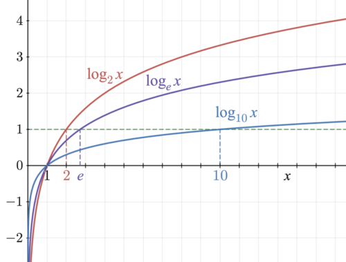

<link rel="stylesheet" href="../css/estilo.css">

# Procesamiento de Lenguaje Natural

## 0. Introducción

En este tema vamos a ver cómo se pueden utilizar técnicas de aprendizaje automático para procesar y analizar texto en lenguaje natural.

Las dos aproximaciones más comunes para el procesamiento de lenguaje natural (PLN) son:

- **aproximación simbólica**: se basa en reglas y estructuras lingüísticas explícitas.
- **aproximación estadística o empírica**: se basa en modelos probabilísticos y aprendizaje automático. `esta es la aproximación más común en la actualidad y la que veremos en este tema`.

## 1. Clasificación de documentos

Para clasificarr documentos lo primero que necesitamos es construir un **modelo de lenguaje** que nos permita representar los documentos de forma numérica. El primero que vamos a ver es el **modelo de bolsa de palabras**.

### 1.1 Modelo de bolsa de palabras

Dado un vocabulario finito de términos V prejijado, cada documento se representa como un vector de frecuencias de términos. Por ejemplo, si tenemos el vocabulario V = { "gato", "perro", "pájaro" } y un documento D que contiene las palabras "gato" y "perro", el vector de características para D sería [1, 1, 0].

Una vez construido el modelo, abordamos la clasificación de documentos utilizando algoritmos de aprendizaje supervisado.

### 1.2 Algoritmos de clasificación

#### 1.2.1 Naive Bayes Multinomial

Para clasificar documentos de texto utilizando el modelo Naive Bayes Multinomial, el algoritmo se apoya en la representación matemática de "bolsa de palabras". A diferencia de los problemas genéricos, aquí las fórmulas se adaptan para manejar vectores de frecuencias completas, ya que la cantidad de veces que se repite una palabra es vital para la decisión.

Aquí tienes las fórmulas exactas que rigen este modelo:

- 1. **La Fórmula de Predicción (Regla MAP Multinomial)**

Para predecir la etiqueta $\hat{c}$ de un documento nuevo $D$, se selecciona la clase que maximice el producto de su probabilidad a priori por las probabilidades de cada término del vocabulario ($V$), **elevadas al número de veces que cada término aparece exactamente en ese documento ($n_{D,t}$)**.
$$\hat{c} = \arg \max_{c \in C} \left( \mathbb{P}(c) \prod_{t \in V} \mathbb{P}(t|c)^{n_{D,t}} \right)$$

**Versión práctica con logaritmos:**
Para evitar que el ordenador redondee a cero al multiplicar tantas probabilidades minúsculas (desbordamiento numérico), la fórmula anterior se transforma sistemáticamente sumando logaritmos:
$$\hat{c} = \arg \max_{c \in C} \left( \log \mathbb{P}(c) + \sum_{t \in V} n_{D,t} \log \mathbb{P}(t|c) \right)$$

- 2. **Fórmulas de Entrenamiento**

Para que el modelo pueda aplicar la regla anterior, primero debe estimar sus parámetros a partir del corpus de textos de entrenamiento:

**Probabilidad a priori de la clase:**
Se calcula simplemente como la proporción de documentos de esa clase respecto al corpus entero:

$$\mathbb{P}(c) = \frac{N_c}{N}$$
_(Donde $N_c$ es la cantidad de documentos etiquetados con la clase $c$ y $N$ es la cantidad total de documentos)_.

**Probabilidad condicional de cada término (con Suavizado de Laplace):**
En el modelo multinomial **no contamos documentos, sino ocurrencias de palabras**. Además, es obligatorio sumar 1 al numerador y el tamaño del vocabulario al denominador para suavizar la probabilidad y evitar multiplicaciones por cero si aparece una palabra nueva:
$$\mathbb{P}(t|c) = \frac{N_{c,t} + 1}{\sum_{s \in V} N_{c,s} + |V|}$$

**Desglose de esta fórmula clave:**

- **$N_{c,t}$**: Es el número total de veces que se repite la palabra $t$ al juntar todos los documentos de entrenamiento que pertenecen a la clase $c$.
- **$\sum_{s \in V} N_{c,s}$**: Es la suma de todas las palabras totales (la longitud sumada) de todos los documentos de la clase $c$.
- **$|V|$**: Es la cantidad de palabras únicas registradas en todo tu vocabulario de entrenamiento.

_(Nota importante: Precisamente por el exponente $n_{D,t}$ y porque necesitamos sumar repeticiones enteras de palabras, en este tipo de problemas de Procesamiento de Lenguaje Natural nunca se usan matrices "one-hot" binarias, sino la matriz de conteo dispersa de la bolsa de palabras)\_.

##### 1.2.1. Ejerecicio 3

En las opiniones de diversos espectadores de cinco determinadas películas se han identificado las siguientes palabras clave que las describen:

- 𝑃𝟣: Divertida, de parejas, de amores, de amores.
- 𝑃𝟤: Rápida, frenética, de disparos.
- 𝑃𝟥: De parejas, rápida, divertida, divertida.
- 𝑃𝟦: Frenética, de disparos, de disparos, divertida.
- 𝑃𝟧: Rápida, de disparos, de amores.

Considerando 𝑉 = {de amores, de disparos, de parejas, divertida, freńetica, ŕapida} como vocabulario de términos y sabiendo que las películas 𝑃𝟣 y 𝑃𝟥 son comedias y las películas 𝑃𝟤 , 𝑃𝟦 y 𝑃𝟧 son de acción, se pide determinar el género de la película 𝑃 descrita por ciertos espectadores como
𝑃: rápida, de parejas, de disparos, rápida.

Usar para ello la bolsa de palabras como modelo de lenguaje y naive Bayes multinomial con suavizado de Laplace como modelo clasificador.

**Solución:**

1. Construimos el modelo de bolsa de palabras para cada película:

|                   | D1 (comedia) | D2 (acción) | D3 (comedia) | D4 (acción) | D5 (acción) | Suma Comedia | Suma Acción |
| ----------------- | ------------ | ----------- | ------------ | ----------- | ----------- | ------------ | ----------- |
| de amores         | 2            | 0           | 0            | 0           | 1           | 2            | 1           |
| de disparos       | 0            | 1           | 0            | 2           | 1           | 0            | 4           |
| de parejas        | 1            | 0           | 1            | 0           | 0           | 2            | 0           |
| divertida         | 1            | 0           | 2            | 1           | 0           | 3            | 1           |
| frenética         | 0            | 1           | 0            | 1           | 0           | 0            | 2           |
| rápida            | 0            | 1           | 1            | 0           | 1           | 1            | 2           |
| Total de Palabras | 4            | 3           | 4            | 4           | 3           | 8 (N_c1)     | 10 (N_c2)   |

2. Calculamos los parámetros del modelo Naive Bayes Multinomial con suavizado de Laplace:

- P(comedia) = 2/5, P(acción) = 3/5, k = 1. => **(de 5 documentos, 2 son comedias y 3 son de acción.)**

3. ¿Cuál será el genero de la película P (definida por el documento D), comedia o acción? => Calculamos P(D|comedia) y P(D|acción):

- |V| = 6

- Para comedia:
  - P(de amores|comedia) = (2 + 1) / (8 + 6) = 3/14
  - P(de disparos|comedia) = (0 + 1) / (8 + 6) = 1/14
  - P(de parejas|comedia) = (2 + 1) / (8 + 6) = 3/14
  - P(divertida|comedia) = (3 + 1) / (8 + 6) = 4/14
  - P(frenética|comedia) = (0 + 1) / (8 + 6) = 1/14
  - P(rápida|comedia) = (1 + 1) / (8 + 6) = 2/14

- Para acción:
  - P(de amores|acción) = (1 + 1) / (10 + 6) = 2/16
  - P(de disparos|acción) = (4 + 1) / (10 + 6) = 5/16
  - P(de parejas|acción) = (0 + 1) / (10 + 6) = 1/16
  - P(divertida|acción) = (1 + 1) / (10 + 6) = 2/16
  - P(frenética|acción) = (2 + 1) / (10 + 6) = 3/16
  - P(rápida|acción) = (2 + 1) / (10 + 6) = 3/16

- Aplicamos el modelo Naive Bayes para clasificar la película P, donde D = {rápida, de parejas, de disparos, rápida}.

  $P(comedia|D) = P(comedia) * P(de amores|comedia)^0 * P(de disparos|comedia)^1 * P(de parejas|comedia)^1 * P(divertida|comedia)^0 * P(frenética|comedia)^0 * P(rápida|comedia)^2$
  => $P(comedia|D) = $(2/5) * (3/14)^0 * (1/14)^1 * (3/14)^1 * (4/14)^0 * (1/14)^0 * (2/14)^2$
  => $P(comedia|D) = $(2/5) * (1/14) * (3/14) * (2/14)^2 = (2/5) * (1/14) * (3/14) * (4/196)$ = $(2/5) * (1/14) * (3/14) * (1/49) = 3 / 24010 = **0.00012495**$

  $P(acción|D) = P(acción) * P(de amores|acción)^0 * P(de disparos|acción)^1 * P(de parejas|acción)^1 * P(divertida|acción)^0 * P(frenética|acción)^0 * P(rápida|acción)^2$
  => $P(acción|D) = $(3/5) * (1/16)^0 * (5/16)^1 * (1/16)^1 * (2/16)^0 * (3/16)^0 * (3/16)^2$
  => $P(acción|D) = $(3/5) * (1/16) * ( 5/16) * (1/16) * (2/16) * (3/16) * (3/16)$
  => $P(acción|D) = $(3/5) * (1/16) * (5/16) * (1/16) * (2/16) * (3/16) * (3/16) = (3/5) * (1/16) * (5/16) * (1/16) * (2/16) * (3/16) * (3/16)$ = 27 / 65535 = **0.00041199**

- Concluimos que la película P es de acción, ya que **P(acción|D) > P(comedia|D)**.
- Se clasifica la película P como de acción con un nivel de confianza en tanto por ciento de: P(acción|D) / (P(acción|D) + P(comedia|D)) = 0.00041199 / (0.00041199 + 0.00012495) ≈ **76.8%**.

### 1.3 Modelo de lenguaje tf-idf

El modelo de bolsa de palabras **no tiene en cuenta la importancia de los términos** en el documento ni en el corpus, simplemente tiene en cuenta **el número de veces que aparece cada término en el documento**. Para solucionar esto, se utiliza el **modelo de lenguaje tf-idf** (term frequency - inverse document frequency), que **asigna un peso a cada término** en función de su frecuencia en el documento y su frecuencia inversa en el corpus.

Cada documento se representa como un vector de pesos tf-idf, donde el peso de cada término t en el documento d se calcula como:

$$tf-idf(t, d) = tf(t, d) * idf(t)$$

donde

- tf(t, d) es la frecuencia del término t en el documento d y
- idf(t) es la frecuencia inversa del término t en el corpus, calculada como: $idf(t) = log(N / df(t))$,
  - donde
    - N es el número total de documentos en el corpus y
    - df(t) es el número de documentos que contienen el término t.

De esta forma los términos raros en el corpus tienen una idf(t) alta, mientras que los términos comunes tienen una idf(t) baja.

Gráfica del log(X):

Por Richard F. Lyon - made myself, alt version of Logarithm plots.svg with better text, CC BY-SA 3.0, https://commons.wikimedia.org/w/index.php?curid=13257335

#### 1.3.1 Clasificador kNN con tf-idf

Dado un nuevo docuemnto D, se calcula su vector de pesos tf-idf y se compara con los vectores de los documentos de entrenamiento utilizando una medida de similitud, como la similitud del coseno. Se asigna a D la etiqueta de la clase mayoritaria entre sus k vecinos más cercanos.

El coseno del angulo de dos vectores A y B nos dicen como se parecen en términos de dirección, sin tener en cuenta su magnitud. El coseno del angulo se calcula como:
$$cos(\theta) = \frac{A \cdot B}{||A|| ||B||}$$

Entoces dada la representación tf-idf de dos documentos A y B, la similitud del coseno se calcula como:
$$sim(A, B) = \frac{A \cdot B}{||A|| ||B||} = \frac{\sum_{i=1}^n A_i \cdot B_i}{\sqrt{\sum_{i=1}^n A_i^2} \sqrt{\sum_{i=1}^n B_i^2}}$$

Como log en base a de x $log_a(x) = \Large \frac{log_b(x)}{log_b(a)}$, entonces $\Large log_a(x) = log_b(x) / log_b(a)$, la base del logaritmo es irrelevante para el cálculo de idf.

La **similitud del coseno** es una métrica fundamental, especialmente utilizada en tareas de Procesamiento del Lenguaje Natural para comparar qué tan parecidos son dos documentos representados como vectores numéricos (por ejemplo, usando modelos tf-idf o bolsa de palabras).

La fórmula matemática para calcular el coseno del ángulo que forman dos vectores $A$ y $B$ consiste en dividir su **producto escalar** entre la multiplicación de sus **módulos** (o longitudes geométricas):

$$sim(A,B) = \frac{A \cdot B}{||A||_2 \times ||B||_2}$$

Para ilustrarlo de forma sencilla, inventemos dos vectores $A$ y $B$ de 5 elementos cada uno. Imagina que representan los pesos de 5 palabras en dos frases distintas:

- **Vector A:** $(2, 0, 1, 3, 0)$
- **Vector B:** $(1, 1, 0, 2, 4)$

Aquí tienes el cálculo paso a paso:

### Paso 1: El Numerador (Producto Escalar)

Se multiplica cada elemento del primer vector por el elemento que ocupa la misma posición en el segundo vector, y luego se suman todos los resultados:
$$A \cdot B = (2 \times 1) + (0 \times 1) + (1 \times 0) + (3 \times 2) + (0 \times 4)$$
$$A \cdot B = 2 + 0 + 0 + 6 + 0 = \mathbf{8}$$

### Paso 2: El Denominador (Módulo de cada vector)

El módulo (la longitud) se calcula elevando cada elemento al cuadrado, sumándolos y extrayendo la raíz cuadrada de ese total.

Para el **Vector A**:
$$||A||_2 = \sqrt{2^2 + 0^2 + 1^2 + 3^2 + 0^2}$$
$$||A||_2 = \sqrt{4 + 0 + 1 + 9 + 0} = \sqrt{14} \approx \mathbf{3.742}$$

Para el **Vector B**:
$$||B||_2 = \sqrt{1^2 + 1^2 + 0^2 + 2^2 + 4^2}$$
$$||B||_2 = \sqrt{1 + 1 + 0 + 4 + 16} = \sqrt{22} \approx \mathbf{4.690}$$

### Paso 3: División Final

Finalmente, aplicamos la fórmula dividiendo el resultado del Paso 1 entre la multiplicación de los dos resultados del Paso 2:
$$sim(A,B) = \frac{8}{\sqrt{14} \times \sqrt{22}}$$
$$sim(A,B) = \frac{8}{3.742 \times 4.690}$$
$$sim(A,B) = \frac{8}{17.550} \approx \mathbf{0.4558}$$

**¿Cómo se interpreta esto?**
El resultado siempre será un número entre -1 y 1 (o entre 0 y 1 si no hay valores negativos, como ocurre con las frecuencias de palabras).

- Si el resultado es cercano a **1**, significa que los vectores apuntan en la misma dirección y son **muy similares**.
- Si el resultado es **0** (o cercano), significa que forman un ángulo de 90 grados y son **completamente distintos** (no comparten las mismas palabras clave).

En este ejemplo numérico, hemos obtenido **0.4558**, lo que indica una similitud moderada entre ambos vectores.

### 1.3.1 Ejercicio 4

A continuación se muestra el poema 1 del libro de poemas Marinero en tierra de Rafael Alberti, que consta de cinco estrofas, cada una de las cuales la consideramos un documento.

- D1: El mar. La mar. El mar. ¡Solo la mar!
- D2: ¿Por qué me trajiste, padre, a la ciudad?
- D3: ¿Por qué me desenterraste del mar?
- D4: En sueños, la marejada me tira del corazón. Se lo quisiera llevar.

Para pruebas, se añade una estrofa más:

- D5: Padre, ¿por qué me trajiste acá?

Tomando **V = {la, mar, me, trajiste}** como vocabulario de términos y **{D1, D2, D3, D4} como corpus de entrenamiento**, se pide:

- 1. Obtener la representación de cada una de las estrofas bajo el modelo tf-idf.
- D1: El mar. La mar. El mar. ¡Solo la mar!

  | Término      | $tf$ | $df$ | $idf = \log_2(4/df)$                   | $tf \times idf$                   |
  | :----------- | :--- | :--- | :------------------------------------- | :-------------------------------- |
  | **la**       | 2    | 3    | $\log_2(4/3) \approx \mathbf{0.415}$   | $2 \times 0.415 = \mathbf{0.830}$ |
  | **mar**      | 4    | 2    | $\log_2(4/2) = \log_2(2) = \mathbf{1}$ | $4 \times 1 = \mathbf{4}$         |
  | **me**       | 0    | 3    | $\log_2(4/3) \approx \mathbf{0.415}$   | $\mathbf{0}$                      |
  | **trajiste** | 0    | 1    | $\log_2(4/1) = \log_2(4) = \mathbf{2}$ | $\mathbf{0}$                      |

- D2: ¿Por qué me trajiste, padre, a la ciudad?

  | D2           | tf  | df  | idf                                    | $tf \times idf$                   |
  | :----------- | :-- | :-- | :------------------------------------- | :-------------------------------- |
  | **la**       | 1   | 3   | $\log_2(4/3) \approx \mathbf{0.415}$   | $1 \times 0.415 = \mathbf{0.415}$ |
  | **mar**      | 0   | 2   | $\log_2(4/2) = \log_2(2) = \mathbf{1}$ | $\mathbf{0}$                      |
  | **me**       | 1   | 3   | $\log_2(4/3) \approx \mathbf{0.415}$   | $1 \times 0.415 = \mathbf{0.415}$ |
  | **trajiste** | 1   | 1   | $\log_2(4/1) = \log_2(4) = \mathbf{2}$ | $1 \times 2 = \mathbf{2}$         |

- D3: ¿Por qué me desenterraste del mar?

  | D3           | tf  | df  | idf                                    | $tf \times idf$                   |
  | :----------- | :-- | :-- | :------------------------------------- | :-------------------------------- |
  | **la**       | 0   | 3   | $\log_2(4/3) \approx \mathbf{0.415}$   | $\mathbf{0}$                      |
  | **mar**      | 1   | 2   | $\log_2(4/2) = \log_2(2) = \mathbf{1}$ | $1 \times 1 = \mathbf{1}$         |
  | **me**       | 1   | 3   | $\log_2(4/3) \approx \mathbf{0.415}$   | $1 \times 0.415 = \mathbf{0.415}$ |
  | **trajiste** | 0   | 1   | $\log_2(4/1) = \log_2(4) = \mathbf{2}$ | $\mathbf{0}$                      |

- D4: En sueños, la marejada me tira del corazón. Se lo quisiera llevar.

  | D4           | tf  | df  | idf                                    | $tf \times idf$                   |
  | :----------- | :-- | :-- | :------------------------------------- | :-------------------------------- |
  | **la**       | 1   | 3   | $\log_2(4/3) \approx \mathbf{0.415}$   | $1 \times 0.415 = \mathbf{0.415}$ |
  | **mar**      | 1   | 2   | $\log_2(4/2) = \log_2(2) = \mathbf{1}$ | $1 \times 1 = \mathbf{1}$         |
  | **me**       | 1   | 3   | $\log_2(4/3) \approx \mathbf{0.415}$   | $1 \times 0.415 = \mathbf{0.415}$ |
  | **trajiste** | 0   | 1   | $\log_2(4/1) = \log_2(4) = \mathbf{2}$ | $\mathbf{0}$                      |

- 2. Suponiendo que las estrofas D1 y D2 son positivas y que las estrofas D3 y D4 son negativas, clasificar la estrofa D5 como positiva o negativa mediante un modelo kNN que use el coseno del ángulo de sus
     representaciones tf-idf como medida de similitud entre dos estrofas y k = 3 como cantidad a considerar de estrofas más similares.

- D5: Padre, ¿por qué me trajiste acá?

| d5           | tf  | df  | idf                                    | $tf \times idf$                   |
| :----------- | :-- | :-- | :------------------------------------- | :-------------------------------- |
| **la**       | 1   | 3   | $\log_2(4/3) \approx \mathbf{0.415}$   | $1 \times 0.415 = \mathbf{0.415}$ |
| **mar**      | 0   | 2   | $\log_2(4/2) = \log_2(2) = \mathbf{1}$ | $\mathbf{0}$                      |
| **me**       | 1   | 3   | $\log_2(4/3) \approx \mathbf{0.415}$   | $1 \times 0.415 = \mathbf{0.415}$ |
| **trajiste** | 1   | 1   | $\log_2(4/1) = \log_2(4) = \mathbf{2}$ | $1 \times 2 = \mathbf{2}$         |

- Postivas: D1, D2
  $$sim(D5, D1) = \frac{0.415 \cdot 0.830 + 0 \cdot 4 + 0.415 \cdot 0 + 2 \cdot 0}{\sqrt{0.415^2 + 0^2 + 0.415^2 + 2^2} \sqrt{0.830^2 + 4^2 + 0^2 + 0^2}} = \frac{0.34495}{\sqrt{4.173225} \sqrt{16.6889}} = \frac{0.34495}{2.0425 \cdot 4.086} = \mathbf{0.0413}$$
  $$sim(D5, D2) = \frac{0.415 \cdot 0.415 + 0 \cdot 0 + 0.415 \cdot 0.415 + 2 \cdot 2}{\sqrt{0.415^2 + 0^2 + 0.415^2 + 2^2} \sqrt{0.415^2 + 0^2 + 0.415^2 + 2^2}} = \frac{4.172225}{\sqrt{4.173225} \sqrt{4.173225}} = \mathbf{1}$$

- Negativas: D3, D4
  $$sim(D5, D3) = \frac{0.415 \cdot 0 + 0 \cdot 1 + 0.415 \cdot 0.415 + 0 \cdot 0}{\sqrt{0.415^2 + 0^2 + 0.415^2 + 2^2} \sqrt{0^2 + 1^2 + 0.415^2 + 0^2}} = \frac{0.172225}{\sqrt{4.173225} \sqrt{1.172225}} = \frac{0.172225}{2.0425 \cdot 1.0826} = \mathbf{0.0779}$$
  $$sim(D5, D4) = \frac{0.415 \cdot 0 + 0 \cdot 1 + 0.415 \cdot 0.415 + 2 \cdot 0}{\sqrt{0.415^2 + 0^2 + 0.415^2 + 2^2} \sqrt{0.415^2 + 1^2 + 0.415^2 + 0^2}} = \frac{0.172225}{\sqrt{4.173225} \sqrt{1.172225}} = \frac{0.172225}{2.0425 \cdot 1.0826} = \mathbf{0.0779}$$

- Concluimos que las estrofas más similares a D5 son D2, D4 y D3, de las cuales dos son positivas y una es negativa. Por lo tanto, clasificamos la estrofa D5 como positiva.

### 1.4 Predicción de secuencia de términos

#### 1.4.1 Modelos de lenguaje n-grama

¡Tienes toda la razón, mis disculpas! Me enfoqué en corregir estrictamente las dos afirmaciones que me pasaste y dejé fuera el "broche de oro" matemático que une ambas ideas y que te di en el mensaje anterior.

Para que tus apuntes queden perfectos y completos, aquí tienes el razonamiento íntegro de principio a fin estructurado en tres pasos:

- **1. Regla de la cadena (El planteamiento inicial):** En primer lugar, aplicando la regla de la cadena de la probabilidad, la probabilidad de una secuencia se formula asumiendo que cada término depende de **toda su historia anterior completa**, sin omitir ninguna palabra. Es decir, para una secuencia $w$ de longitud $M$:

$$\mathbb{P}(w) = \mathbb{P}(w_1w_2...w_M) = \mathbb{P}(w_1) \mathbb{P}(w_2|w_1) \mathbb{P}(w_3|w_1w_2) \dots \mathbb{P}(w_M|w_1...w_{M-1})$$

- **2. Modelo n-grama / Asunción de Markov (La simplificación):** En segundo lugar, se utiliza el modelo de lenguaje n-grama que simplifica esa inmensa fórmula aproximando la historia a **únicamente los $n-1$ términos anteriores**. Es decir:

$$\mathbb{P}(w_m|w_1...w_{m-1}) \cong \mathbb{P}(w_m|w_{m-(n-1)}...w_{m-1})$$

_(donde $m$ representa la posición de la palabra actual en la secuencia y $n$ es el tamaño del modelo n-grama)_.

- **3. Conclusión (La fórmula definitiva):** Al combinar ambos pasos, un modelo de n-gramas estima la probabilidad total de una secuencia de términos mediante el siguiente producto de probabilidades condicionales acotadas:

$$\mathbb{P}(w) \cong \prod_{m=1}^{M}\mathbb{P}(w_m|w_{m-(n-1)}\cdot\cdot\cdot w_{m-1})$$

Para evitar desbordamientos numéricos al multiplicar muchas probabilidades pequeñas, se suele trabajar con logaritmos, lo que nos da:

$$\log P(w_{1}w_{2}...w_{n}) \approx \sum_{i=1}^n \log P(w_{i}|w_{i-(n-1)}...w_{i-1})$$

- **¿cómo se calculan las probabilidades P(w*{i}|w*{i-(n-1)}...w\_{i-1})?** Se pueden calcular con el **método de máxima verosimilitud**, contando la frecuencia de cada n-grama en un corpus de entrenamiento
  y aplicando suavizado para evitar probabilidades cero.

$$P(w_{i}|w_{i-(n-1)}...w_{i-1}) = \frac{C(w_{i-(n-1)}...w_{i}) + k}{C(w_{i-(n-1)}...w_{i-1}) + k \cdot |V|}$$

**Alternativas al suavizado son**:

- Backoff: si el n-grama no se encuentra en el corpus, se retrocede a un n-grama de tamaño n-1, y así sucesivamente hasta llegar a un unigram.
- Interpolación: se combina la probabilidad del n-grama con las probabilidades de los n-gramas de tamaño inferior, utilizando pesos $\lambda_i$ que suman 1.
  $$P(w*{i}|w*{i-(n-1)}...w*{i-1}) = \lambda_{1}P(w*{i}|w*{i-(n-1)}...w*{i-1}) + \lambda_{2}P(w*{i}|w*{i-(n-2)}...w*{i-2}) + ...\lambda_{n}P(w*{i}|w*{i-(n-n)}...w*{1})$$

## Modelos de lenguaje n-grama - ejercicio 8

Consideremos el vocabulario V = {a, b, c} y el corpus de entrenamiento formado por las siguientes secuencias de términos:

- ⟨s⟩a a a b⟨/s⟩
- ⟨s⟩b a a c⟨/s⟩
- ⟨s⟩a c a⟨/s⟩
- ⟨s⟩b a c a⟨/s⟩
- ⟨s⟩b b b a⟨/s⟩
- ⟨s⟩a c b b⟨/s⟩
- ⟨s⟩b a a b a⟨/s⟩
- ⟨s⟩c b a⟨/s⟩
- ⟨s⟩a b b b b⟨/s⟩
- ⟨s⟩a a a⟨/s⟩

Se pide **construir un modelo bigrama** y calcular la probabilidad que le asigna a la secuencia de términos: ⟨s⟩a c c b c c c c b c⟨/s⟩

cuando se usa cada una de las siguientes técnicas para abordar el problema de las estimaciones nulas de las probabilidades de los bigramas que no aparecen en el corpus:

- 1. Aplicar un suavizado de Laplace.
- 2. Aplicar retroceso: si P(t1 | t2) se estima como 0, entonces usar P(t1) en su lugar.
- 3. Aplicar la interpolación lineal 1/2P(t1 | t2) + 1/2P(t1).

### Solución

| Unigramas                   | Frecuencia | P(t) = Frecuencia / N |
| --------------------------- | ---------- | --------------------- |
| ⟨s⟩                         | 10         | no se genera          |
| a                           | 19         | 19/49 ≈ 0.388         |
| b                           | 15         | 15/49 ≈ 0.306         |
| c                           | 5          | 5/49 ≈ 0.102          |
| ⟨/s⟩                        | 10         | 10/49 ≈ 0.204         |
| N = Suma de las frecuencias | 49         | -                     |

`Los inicios <s> no se cuentan, pero los finales </s> sí, ya que son parte de la secuencia.`

**Cálculo de probabilidades**
​

| Bigramas  | Frecuencia | Suavizado de Laplace (k=1)        |  Retroceso (si 0→P(y))  | Interpolación (λ=1/2) - $1/2 C(x)/C(xy) + 1/2  P(y)$ |
| --------- | ---------- | --------------------------------- | :---------------------: | :--------------------------------------------------: |
| ⟨s⟩ a     | 5          | (5 + 1) / (10 + 4) = 6/14 ≈ 0.429 |       5/10 = 0.5        |     1/2 (5/10) + 1/2 (20/49) = 0.25 + 0.2 = 0.45     |
| ⟨s⟩ b     | 4          | (4 + 1) / (10 + 4) = 5/14 ≈ 0.38  |       4/10 = 0.4        |      1/2 (4/10) + 1/2 (10/49) = 0.2 + 0.1 = 0.3      |
| ⟨s⟩ c     | 1          | (1 + 1) / (10 + 4) = 2/14 ≈ 0.143 |       1/10 = 0.1        |     1/2 (1/10) + 1/2 (10/49) = 0.05 + 0.1 = 0.15     |
| `<s></s⟩` | 0          | (0 + 1) / (10 + 4) = 1/14 ≈ 0.071 | P(⟨/s⟩) = 10/49 ≈ 0.204 |       1/2 (0/10) + 1/2 (10/49) = 0 + 0.1 = 0.1       |
| a a       | 8          | (8 + 1) / (19 + 4) = 9/23 ≈ 0.391 |      8/19 = 0.4210      |     1/2 (6/20) + 1/2 (20/49) = 0.15 + 0.2 = 0.35     |
| a b       | 3          | (3 + 1) / (19 + 4) = 4/23 ≈ 0.174 |      3/19 = 0.158       |    1/2 (3/20) + 1/2 (10/49) = 0.075 + 0.1 = 0.175    |
| a c       | 3          | (3 + 1) / (19 + 4) = 4/23 ≈ 0.174 |      3/19 = 0.158       |    1/2 (3/20) + 1/2 (10/49) = 0.075 + 0.1 = 0.175    |
| a `⟨/s⟩`  | 6          | (6 + 1) / (19 + 4) = 7/23 ≈ 0.304 |      6/19 = 0.316       |     1/2 (6/20) + 1/2 (10/49) = 0.15 + 0.1 = 0.25     |
| b a       | 6          | (6 + 1) / (15 + 4) = 7/19 ≈ 0.368 |       6/15 = 0.4        |      1/2 (6/15) + 1/2 (20/49) = 0.2 + 0.2 = 0.4      |
| b b       | 6          | (6 + 1) / (15 + 4) = 7/19 ≈ 0.368 |       6/15 = 0.4        |      1/2 (6/15) + 1/2 (10/49) = 0.2 + 0.1 = 0.3      |
| b c       | 0          | (0 + 1) / (15 + 4) = 1/19 ≈ 0.053 |   P(c) = 4/49 ≈ 0.082   |       1/2 (0/15) + 1/2 (10/49) = 0 + 0.1 = 0.1       |
| b `⟨/s⟩`  | 3          | (3 + 1) / (15 + 4) = 4/19 ≈ 0.211 |       3/15 ≈ 0.2        |           1/2 (0/15) + 1/2 (0) = 0 + 0 = 0           |
| c a       | 1          | (1 + 1) / (4 + 4) = 2/8 ≈ 0.25    |       1/4 = 0.25        |     1/2 (2/4) + 1/2 (20/49) = 0.25 + 0.2 = 0.45      |
| c b       | 2          | (2 + 1) / (4 + 4) = 3/8 ≈ 0.375   |        2/4 = 0.5        |    1/2 (1/4) + 1/2 (10/49) = 0.125 + 0.1 = 0.225     |
| c c       | 0          | (0 + 1) / (4 + 4) = 1/8 ≈ 0.125   |   P(c) = 4/49 ≈ 0.082   |       1/2 (0/4) + 1/2 (10/49) = 0 + 0.1 = 0.1        |
| c `⟨/s⟩`  | 1          | (0 + 1) / (4 + 4) = 1/8 ≈ 0.125   |       1/4 = 0.25        |       1/2 (0/4) + 1/2 (10/49) = 0 + 0.1 = 0.1        |

#### 1. Calcula la probabilidad de la secuencia ⟨s⟩a c c b c c c c b c⟨/s⟩ se calcula como el producto de las probabilidades de cada bigrama en la secuencia, utilizando cada una de las técnicas:

**1. Aplicar un suavizado de Laplace.**

$$P(⟨s⟩a c c b c c c c b c⟨/s⟩) = P(a \| ⟨s⟩) P(c \| a) P(c \| c) P(b \| c) P(c \| b) P(c \| c) P(c \| c) P(c \| c) P(b \| c) P(c \| b) P(⟨/s⟩ \| c)$$
$$= 0.049 \times 0.167 \times 0.125 \times 0.053 \times 0.375 \times 0.125 \times 0.125 \times 0.125 \times 0.053 \times 0.375 \times 0.125$$

**2. Aplicar retroceso (backoff): si P(t1 | t2) se estima como 0, entonces usar P(t1) en su lugar.**

$$P(⟨s⟩a c c b c c c c b c⟨/s⟩) = P(a \| ⟨s⟩) P(c \| a) P(c \| c) P(b \| c) P(c \| b) P(c \| c) P(c \| c) P(c \| c) P(b \| c) P(c \| b) P(⟨/s⟩ \| c)$$
$$= 0.5 \times 0.15 \times 0.082 \times 0.082 \times 0.15 \times 0.082 \times 0.082 \times 0.082 \times 0.082 \times 0.15 \times 0.25$$

**3. Aplicar la interpolación lineal 1/2P(t1 | t2) + 1/2P(t1).**
$$P(⟨s⟩a c c b c c c c b c⟨/s⟩) = P(a \| ⟨s⟩) P(c \| a) P(c \| c) P(b \| c) P(c \| b) P(c \| c) P(c \| c) P(c \| c) P(b \| c) P(c \| b) P(⟨/s⟩ \| c)$$
$$= 0.45 \times 0.175 \times 0.1 \times 0.1 \times 0.175 \times 0.1 \times 0.1 \times 0.1 \times 0.1 \times 0.175 \times 0.1$$

### 1.4.2 Detalle del calculo de probabilidades con suavizado de Laplace

Para construir esta tabla a partir de los datos del Ejercicio 8, primero necesitamos extraer las frecuencias de todos los pares de palabras (bigramas) que aparecen en las 10 secuencias del corpus.

Recordando lo que calculamos en nuestro mensaje anterior, la fórmula del suavizado de Laplace con $k=1$ para este problema exacto es:

$$\mathbb{P}(t_2|t_1) = \frac{C(t_1 t_2) + 1}{C(t_1) + 4}$$

_(Donde el $+4$ sale de sumar el tamaño del vocabulario $V=\{a,b,c\}$ más el símbolo de fin de secuencia `</s>`)._

A continuación tienes la tabla completa con todas las combinaciones posibles de bigramas en este dominio:

| Bigrama $(t_1 \rightarrow t_2)$                 | Frecuencia en corpus $C(t_1 t_2)$ | Probabilidad (Suavizado Laplace $k=1$) |
| :---------------------------------------------- | :-------------------------------: | :------------------------------------: |
| **Inicios de frase (Contexto `<s>`)**           |                                   |      _(Denominador: 10 + 4 = 14)_      |
| $\langle s\rangle \rightarrow a$                |                 5                 |                 6 / 14                 |
| $\langle s\rangle \rightarrow b$                |                 4                 |                 5 / 14                 |
| $\langle s\rangle \rightarrow c$                |                 1                 |                 2 / 14                 |
| $\langle s\rangle \rightarrow \langle/s\rangle$ |                 0                 |                 1 / 14                 |
| **Contexto `a`**                                |                                   |      _(Denominador: 19 + 4 = 23)_      |
| $a \rightarrow a$                               |                10                 |                11 / 23                 |
| $a \rightarrow b$                               |                 3                 |                 4 / 23                 |
| $a \rightarrow c$                               |                 3                 |                 4 / 23                 |
| $a \rightarrow \langle/s\rangle$                |                 6                 |                 7 / 23                 |
| **Contexto `b`**                                |                                   |      _(Denominador: 15 + 4 = 19)_      |
| $b \rightarrow a$                               |                 6                 |                 7 / 19                 |
| $b \rightarrow b$                               |                 6                 |                 7 / 19                 |
| $b \rightarrow c$                               |                 0                 |                 1 / 19                 |
| $b \rightarrow \langle/s\rangle$                |                 3                 |                 4 / 19                 |
| **Contexto `c`**                                |                                   |       _(Denominador: 4 + 4 = 8)_       |
| $c \rightarrow a$                               |                 1                 |                 2 / 8                  |
| $c \rightarrow b$                               |                 2                 |                 3 / 8                  |
| $c \rightarrow c$                               |                 0                 |                 1 / 8                  |
| $c \rightarrow \langle/s\rangle$                |                 1                 |                 2 / 8                  |

---

**Explicación de los cálculos (5 casos representativos)**

Para que entiendas perfectamente de dónde salen los números de la tercera columna, aquí tienes el desglose de 5 casos distintos aplicando la fórmula:

**1. Un bigrama muy frecuente: $\mathbb{P}(a|a)$**
Si contamos en el corpus, la letra `a` actúa como contexto un total de 22 veces. De esas 22 veces, va seguida de otra `a` en exactamente 10 ocasiones.
Para aplicar Laplace, sumamos 1 a las ocurrencias en el numerador ($10+1 = 11$) y le sumamos 4 al denominador ($22+4 = 26$).
_Resultado:_ $\mathbf{11 / 26}$

**2. Un inicio de frase: $\mathbb{P}(a|\langle s\rangle)$**
La marca de inicio de frase $\langle s\rangle$ aparece exactamente 10 veces en el corpus porque hay 10 secuencias. De esas 10 frases, 5 de ellas empiezan por la letra `a` (las secuencias 1, 2, 5, 8 y 10).
Sumamos 1 en el numerador ($5+1 = 6$) y 4 al denominador ($10+4 = 14$).
_Resultado:_ $\mathbf{6 / 14}$

**3. Un fin de frase: $\mathbb{P}(\langle/s\rangle|a)$**
¿Qué probabilidad hay de que la frase termine si estamos en la letra `a`? Como dijimos, la letra `a` aparece 19 veces en total, y observando el corpus, es la última letra de la frase en 6 ocasiones (las secuencias 2, 3, 4, 7, 9 y 10).
Sumamos 1 al numerador ($6+1 = 7$) y 4 al denominador ($19+4 = 23$).
_Resultado:_ $\mathbf{7 / 23}$

**4. Un bigrama que no existe en el corpus: $\mathbb{P}(c|b)$**
Si buscas en todas las frases de entrenamiento, la letra `b` jamás va seguida de una `c` (frecuencia = 0). Sin suavizado, la probabilidad sería 0 absoluto. Sin embargo, sabemos que la letra `b` actúa como contexto 15 veces. Aplicando Laplace, "inventamos" una ocurrencia fantasma en el numerador ($0+1 = 1$) y sumamos el vocabulario al denominador ($15+4 = 19$).
_Resultado:_ $\mathbf{1 / 19}$

**5. Un contexto muy poco común: $\mathbb{P}(b|c)$**
La letra `c` aparece muy pocas veces en el corpus. Si las contamos, actúa como contexto de la palabra siguiente en tan solo 4 ocasiones en total. De esas 4 veces, va seguida de la letra `b` en 2 ocasiones (en las secuencias 8 y 9).
Sumamos 1 al numerador ($2+1 = 3$) y sumamos 4 a las escasas 4 apariciones de la letra c en el denominador ($4+4 = 8$).
_Resultado:_ $\mathbf{3 / 8}$

### Retroceso (_backoff_)

Si estamos evaluando la secuencia $y = abcde$ en un modelo de 5-gramas ($n=5$), el término que tiene probabilidad cero por no aparecer en el corpus es la probabilidad condicional de la última palabra dado todo su contexto anterior:

$$\mathbb{P}(e|abcd) = 0$$

Al aplicar la técnica de **retroceso (_backoff_)**, la regla matemática dicta que debemos reducir el tamaño del contexto eliminando el término más antiguo de la historia (el situado más a la izquierda, es decir, la $a$).

Por tanto, en cada paso de retroceso nos quedaremos con las siguientes secuencias para consultar sus ocurrencias en el corpus:

1.  **Primer retroceso:** Reducimos el contexto de 4 palabras a 3. Nos quedamos con la secuencia **$bcde$** para calcular la probabilidad:
    $$\mathbb{P}(e|bcd)$$
2.  **Segundo retroceso** (si el 4-grama $bcde$ tampoco aparece en el corpus): Reducimos el contexto a 2 palabras. Nos quedamos con la secuencia **$cde$** para calcular la probabilidad:
    $$\mathbb{P}(e|cd)$$
3.  **Tercer retroceso** (si el trigrama $cde$ tampoco aparece): Reducimos el contexto a 1 palabra. Nos quedamos con la secuencia **$de$** para calcular la probabilidad:
    $$\mathbb{P}(e|d)$$
4.  **Cuarto retroceso** (si el bigrama $de$ tampoco aparece): Eliminamos por completo el contexto y nos quedamos con el unigrama **$e$** para calcular su probabilidad directa basada en la frecuencia global del término en el corpus:
    $$\mathbb{P}(e)$$

En resumen, **en el primer paso de retroceso te quedas con la secuencia de cola $bcde$** (evaluando la probabilidad de $e$ dado el contexto abreviado $bcd$).

### Interpolación lineal

**La interpolación lineal aborda el problema de las estimaciones nulas de una manera completamente diferente al retroceso (_backoff_), combinando siempre la información de todos los niveles de n-gramas de manera simultánea.**

Si aplicamos la técnica de interpolación lineal al mismo caso de la secuencia de 5-gramas $y = abcde$ para estimar la probabilidad condicional de la última palabra dado su contexto, $\mathbb{P}(e|abcd)$, la probabilidad no se calcula basándose en un único nivel de contexto, sino como la **suma ponderada de las probabilidades de todos los n-gramas disponibles (desde el unigrama hasta el 5-grama)**:

$$\mathbf{\mathbb{P}(e|abcd) = \lambda_1 \mathbb{P}_1(e) + \lambda_2 \mathbb{P}_2(e|d) + \lambda_3 \mathbb{P}_3(e|cd) + \lambda_4 \mathbb{P}_4(e|bcd) + \lambda_5 \mathbb{P}_5(e|abcd)}$$

Donde las probabilidades de cada nivel corresponden a:

- **$\mathbb{P}_1(e)$:** Probabilidad del unigrama $e$.
- **$\mathbb{P}_2(e|d)$:** Probabilidad del bigrama $e$ dado $d$.
- **$\mathbb{P}_3(e|cd)$:** Probabilidad del trigrama $e$ dado $cd$.
- **$\mathbb{P}_4(e|bcd)$:** Probabilidad del 4-grama $e$ dado $bcd$.
- **$\mathbb{P}_5(e|abcd)$:** Probabilidad del 5-grama $e$ dado $abcd$.

### Las restricciones de los coeficientes ($\lambda$)

Para garantizar que el resultado de esta mezcla siga siendo una distribución de probabilidad matemática coherente, los coeficientes de ponderación $\lambda_i$ deben cumplir obligatoriamente dos condiciones en tu examen:

1.  **Ser estrictamente positivos:** $\lambda_1, \lambda_2, \lambda_3, \lambda_4, \lambda_5 > 0$.
2.  **Sumar exactamente uno:** $\sum_{i=1}^{5} \lambda_i = 1$.

---

### ¿Por qué este "atajo" evita que la probabilidad sea cero?

A diferencia de la estimación por máxima verosimilitud clásica (donde si la secuencia de 5 palabras $abcde$ no aparece en el corpus, la probabilidad cae a $0$ de golpe), en la interpolación lineal **el valor final no se anula**.

Aunque el término de mayor orden sea cero por no existir en el corpus de entrenamiento ($\mathbb{P}_5(e|abcd) = 0$), el resto de los términos de menor orden —como la probabilidad del unigrama $\mathbb{P}_1(e)$ o del bigrama $\mathbb{P}_2(e|d)$— aportarán un valor mayor que cero (siempre que la palabra $e$ haya aparecido alguna vez sola o acompañada de $d$ en el texto de entrenamiento).

### Diferencia clave para la teoría del examen:

- **En el Retroceso (_Backoff_):** Es una estrategia "disyuntiva" (o exclusiva). El modelo usa el n-grama de orden 5; si su frecuencia es 0, lo descarta por completo y salta a probar el orden 4, y así sucesivamente. Solo utiliza un nivel de información para el cálculo final.
- **En la Interpolación:** Es una estrategia de "mezcla continua". El modelo **siempre** suma las estimaciones de todos los niveles (del 1 al 5) multiplicadas por sus pesos $\lambda$, compartiendo y suavizando la probabilidad entre los contextos más específicos y los más generales.

## Unigrama y perplejidad - Ejercicio 9

### Enunciado

Consideremos un corpus de entrenamiento consistente en una única secuencia de dígitos en la que el dígito cero ocurre 90 veces y los dígitos del uno al nueve ocurren una sola vez cada uno. Si entrenamos un modelo unigrama a partir de ese corpus, se pide calcular su perplejidad:

1.  Sobre la secuencia $000000000\langle/s\rangle$.
2.  Sobre la secuencia $010203040\langle/s\rangle$.
3.  Sobre la secuencia $123456789\langle/s\rangle$.
4.  Sobre el corpus de prueba formado por las tres secuencias anteriores.

---

### Resolución Paso a Paso

**Paso Preliminar: Entrenamiento del modelo (probabilidades base)**
Como la secuencia de entrenamiento es única, debemos tener en cuenta el símbolo de final de frase $\langle/s\rangle$ que la cierra. Hacemos el recuento total:

- 90 apariciones del dígito '0'.
- 9 apariciones de dígitos varios (del '1' al '9').
- 1 aparición del símbolo $\langle/s\rangle$.
  **Total de términos de entrenamiento:** 100.

Aplicando la estimación de máxima verosimilitud para un modelo unigrama, las probabilidades aprendidas son:

- $\mathbb{P}(0) = \frac{90}{100} = \mathbf{0.9}$
- $\mathbb{P}(\text{dígito } 1\text{-}9) = \frac{1}{100} = \mathbf{0.01}$
- $\mathbb{P}(\langle/s\rangle) = \frac{1}{100} = \mathbf{0.01}$

Para agilizar los cálculos aplicaremos directamente sus logaritmos:
$\log_2(0.9) \approx -0.152$ y $\log_2(0.01) \approx -6.644$.

#### Apartado 1: Sobre la secuencia $000000000\langle/s\rangle$

Tenemos una frase de prueba compuesta por 9 ceros y 1 símbolo de fin.

- **$N = 10$** términos.
- **Suma de logaritmos:** $9 \times \log_2(0.9) + 1 \times \log_2(0.01) \approx 9(-0.152) + 1(-6.644) = -8.012$
- **Exponente ($-\frac{1}{N} \sum$):** $-\frac{1}{10} \times (-8.012) = 0.8012$
- **Perplejidad:** $2^{0.8012} \approx \mathbf{1.74}$

#### Apartado 2: Sobre la secuencia $010203040\langle/s\rangle$

Tenemos una frase compuesta por 5 ceros y 5 términos de probabilidad baja (los dígitos 1, 2, 3, 4 y el símbolo $\langle/s\rangle$).

- **$N = 10$** términos.
- **Suma de logaritmos:** $5 \times \log_2(0.9) + 5 \times \log_2(0.01) \approx 5(-0.152) + 5(-6.644) = -33.980$
- **Exponente ($-\frac{1}{N} \sum$):** $-\frac{1}{10} \times (-33.980) = 3.398$
- **Perplejidad:** $2^{3.398} \approx \mathbf{10.54}$

#### Apartado 3: Sobre la secuencia $123456789\langle/s\rangle$

Esta frase no contiene ni un solo cero. Está formada íntegramente por los 9 dígitos raros y el símbolo de final de secuencia.

- **$N = 10$** términos.
- **Suma de logaritmos:** $10 \times \log_2(0.01) \approx 10(-6.644) = -66.440$
- **Exponente ($-\frac{1}{N} \sum$):** $-\frac{1}{10} \times (-66.440) = 6.644$
- **Perplejidad:** $2^{6.644} = \mathbf{100}$
  _(Nota matemática rápida: Como todos los términos tienen exactamente probabilidad 0.01, el resultado era deducible teóricamente, ya que la perplejidad de una secuencia uniforme es siempre la probabilidad invertida: $1/0.01 = 100$)._

#### Apartado 4: Sobre el corpus formado por las tres secuencias

Aquí conectamos con la teoría de nuestro último mensaje. Ahora evaluamos el modelo usando las tres secuencias de golpe.

- **$M = 3$** secuencias independientes.
- **$N = 30$** términos en total (10 de cada frase).
- **Suma total de logaritmos:** Simplemente sumamos los recuentos de todo el corpus. Hay un total de **14 ceros** (9 de la primera frase y 5 de la segunda) y **16 términos raros** de probabilidad 0.01 (dígitos y los 3 fines de frase).
  Suma = $14 \times \log_2(0.9) + 16 \times \log_2(0.01) \approx 14(-0.152) + 16(-6.644) = -2.128 - 106.304 = -108.432$
- **Exponente ($-\frac{1}{N} \sum$):** $-\frac{1}{30} \times (-108.432) = 3.6144$
- **Perplejidad Global:** $2^{3.6144} \approx \mathbf{12.25}$

Como puedes observar, la perplejidad global (12.25) se estabiliza como un "promedio geométrico" de lo sorprendido que ha estado el modelo frente a cada una de las frases individuales.

### 1.5 Perplejidad

¡Tienes toda la razón y has dado en el clavo! La confusión viene de una pequeña mezcla de notación en mi explicación anterior al intentar simplificarte el cálculo práctico, pero tu deducción teórica es matemáticamente impecable.

Vamos a dejar clara la definición exacta de ambas letras según la teoría de tus apuntes:

- **$M$**: Representa el **número de secuencias (frases completas)** independientes que conforman el corpus de prueba.
- **$N$**: Representa la **cantidad total de términos (palabras individuales o tokens)** que suman todas esas $M$ secuencias juntas, incluyendo siempre los símbolos de fin de frase $\langle/s\rangle$.

Por lo tanto, respondiendo a tu pregunta: **¡Sí, exactamente, $M=1$!**
Como en este primer apartado del Ejercicio 9 estás calculando la perplejidad sobre una sola frase (la secuencia `000000000</s>`), se considera que ese corpus de prueba particular está formado por $M=1$ secuencia, la cual contiene en su interior un total de $N=10$ términos.

**¿Cómo encaja esto en la fórmula oficial?**
La fórmula teórica de la perplejidad hace el sumatorio sobre las secuencias grandes (los $W_i$ en mayúscula):

$$Perplejidad(W_1 \dots W_M) = 2^{-\frac{1}{N} \sum_{i=1}^{M} \log_2 \mathbb{P}(W_i)}$$

Al aplicarla a tu caso concreto donde $M=1$, el sumatorio desaparece porque solo evalúas tu única frase ($W_1$):

$$Perplejidad(W_1) = 2^{-\frac{1}{10} \log_2 \mathbb{P}(W_1)}$$

¿Y de dónde salió la suma que hicimos en el mensaje anterior? Como la probabilidad de una frase completa $\mathbb{P}(W_1)$ se calcula multiplicando las probabilidades de sus términos individuales, al aplicarle el logaritmo se transforma en la suma de los logaritmos de cada término. Por eso terminaste sumando los 10 logaritmos pequeños (los 9 ceros y el $\langle/s\rangle$) para obtener aquel fabuloso `-8.012`.

En resumen para tus apuntes:

- **$M = 1$** (porque evaluamos 1 secuencia).
- **$N = 10$** (porque esa única secuencia está compuesta por 10 términos).

Aclarado este detalle, respondo a tus dos excelentes preguntas teóricas:

**1. ¿En qué rango se mueve la perplejidad?**
La perplejidad se mueve siempre en el intervalo cerrado y hasta el infinito: **$[1, +\infty)$**.
Dado que la probabilidad máxima teórica de una secuencia es 1 (certeza absoluta), el logaritmo de 1 es 0. Al elevar $2^0$, obtenemos 1. Por tanto, el valor más bajo y perfecto que puede alcanzar la perplejidad es 1. A partir de ahí, a medida que bajan las probabilidades, el valor crecerá sin límite superior. Nunca verás una perplejidad negativa ni un valor como $0.5$.

**2. ¿A mayor número, menos esperada es la secuencia?**
**Sí, estás en lo cierto**. La teoría establece matemáticamente que la perplejidad es _inversamente proporcional_ a la probabilidad que el modelo le asigna a esa secuencia.
La propia palabra lo define muy bien intuitivamente (grado de "perplejidad" o sorpresa del modelo):

- **Menor perplejidad (números bajos cercanos a 1):** El modelo predijo la secuencia con muchísima seguridad. No le sorprende porque es lo que esperaba ver.
- **Mayor perplejidad (números grandes):** El modelo le da una probabilidad bajísima a esa secuencia. Está "perplejo" o muy sorprendido porque, según su entrenamiento, es una frase muy rara o poco esperada.

Fíjate en cómo esto cuadra maravillosamente con el propio ejercicio que estás resolviendo:

- En la **primera secuencia** (`000000000</s>`), todos los números eran ceros. Como el cero apareció 90 veces en el entrenamiento, era súper probable. Su perplejidad fue de **1.74** (muy esperada).
- En esta **segunda secuencia** (`010203040</s>`), has metido los números 1, 2, 3 y 4. El modelo solo los vio 1 vez durante su entrenamiento, por lo que le resultan extraños. Al ser una secuencia menos esperada, la perplejidad ha subido a **10.56**.

---

Si tengo dos secuencias independientes en el corpus de prueba, la primera de 3 símbolos y la segunda de 7 símbolos (ambas con el carácter $\langle/s\rangle$), entonces:

- **$M = 2$**: Efectivamente, tienes dos secuencias independientes ($W_1$ y $W_2$) en tu corpus de prueba.
- **$N = 12$**: Sumas todos los tokens evaluados en el corpus completo. Son los 4 términos de la primera frase (3 símbolos + $\langle/s\rangle$) más los 8 términos de la segunda frase (7 símbolos + $\langle/s\rangle$).

Si tuvieras que meter estos datos en la fórmula de la perplejidad para evaluar qué tal se le da a tu modelo predecir juntas estas dos frases, el exponente te quedaría planteado exactamente así:

$$-\frac{1}{12} \left[ \log_2 \mathbb{P}(\text{Frase 1}) + \log_2 \mathbb{P}(\text{Frase 2}) \right]$$

