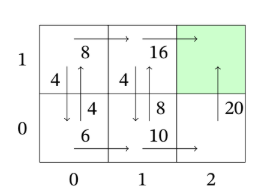

<link rel="stylesheet" href="../css/estilo.css">

# Aprendizaje por refuerzo

## Algunos conceptos clave:

### A. Bases del Aprendizaje:

- Se aplica cuando **se desconoce la dinámica del sistema** (se ignoran las probabilidades de transición y las funciones de recompensa).
- Se basa en el ensayo y error a través de la **interacción directa con el entorno**.
- Gestión del equilibrio necesario entre la **explotación** (repetir las acciones que se saben buenas) y la **exploración** (descubrir nuevas alternativas), utilizando mecanismos como la **política $\epsilon$-voraz**.

### B. Método de Montecarlo:

- Aproximación de la utilidad calculando el promedio empírico de las recompensas acumuladas tras simular episodios hasta estados terminales.
- Variantes del método: **Montecarlo de primera visita** y **Montecarlo de cada visita**.
- Estimación de la utilidad para cada par estado-acción **$q_\pi(s,a)$** mediante el uso de **inicios exploratorios** para garantizar la variedad.

### C. Método de las Diferencias Temporales (DT):

- Combina las ventajas de estimaciones locales (como la programación dinámica) y el aprendizaje basado en la experiencia sin modelo (como Montecarlo).
- Uso del **error DT ($\delta_t$)** para actualizar las estimaciones basándose en la recompensa inmediata y la utilidad esperada del paso siguiente.

### D. Algoritmo Q-learning:

- Método independiente de la política que aproxima directamente la función de utilidad óptima de pares estado-acción ($q^*$) utilizando un **factor de aprendizaje ($\alpha$)**.

### E. Probabilidad inducida

La **probabilidad inducida** se refiere a la probabilidad de que ocurra una secuencia específica de estados (denominada historia) al ejecutar una política determinada en un sistema.

### F. Definición propiedad de Markov

En un Proceso de Decisión de Markov, la ejecución de una política $\pi$ genera una historia $h = {s_0, s_1, s_2, \dots}$, que es una **sucesión infinita de estados**. La probabilidad de esta historia está condicionada por la política seguida y se basa en la **propiedad de Markov**, la cual **establece que la probabilidad de estar en un estado solo depende del estado anterior y de la acción realizada**.

### G. Cálculo de la probabilidad de una historia inducida por una política

La probabilidad de una historia $h$ inducida por una política $\pi$ se calcula mediante el producto de las probabilidades de transición de cada paso de la secuencia:

$$
P(h \mid \pi) = \prod_{i \ge 0} P_{\pi(s_i)}(s_{i+1} \mid s_i)
$$

Donde:

- **$s_i$**: Es el estado en el instante $i$.
- **$\pi(s_i)$**: Es la acción que la política prescribe realizar cuando se está en el estado $s_i$.
- **$P_{\pi(s_i)}(s_{i+1}|s_i)$**: Es la probabilidad de que, al aplicar la acción indicada por la política en el estado actual, el sistema transicione al siguiente estado de la historia.

## Concepto de Utilidad y Recompensa

En la planificación bajo incertidumbre y el aprendizaje por refuerzo, la **Utilidad** representa el **valor o beneficio acumulado que un agente espera recibir a largo plazo** a partir de un estado o de una secuencia de decisiones (historia).

Para comprender qué significa este concepto en el mundo real, la clave está en diferenciarlo de la **Recompensa inmediata** y analizar cómo se modela el comportamiento humano y empresarial:

---

### 1. Recompensa (Corto Plazo) vs. Utilidad (Largo Plazo)

En el mundo real, tomamos decisiones constantemente donde sacrificamos el beneficio inmediato para asegurar el éxito futuro. El formalismo matemático captura esto separando ambos conceptos:

- **La Recompensa ($R$):** Es el estímulo o feedback inmediato (positivo o negativo) que el entorno da al agente justo después de realizar una acción. En el mundo real, equivale a la **satisfacción momentánea** o al flujo de caja instantáneo (como el placer de comer un pastel o el ingreso por una venta puntual hoy).
- **La Utilidad ($U$):** Es la suma de todas las recompensas que se van a recibir desde el momento actual hacia el futuro. En el mundo real, representa el **éxito estratégico, la sostenibilidad o el valor de ciclo de vida**.

#### El ejemplo de la empresa (Ejercicio 5 de tu boletín):

Considera una empresa que puede estar en la situación de ser **"pobre pero conocida"**.

- Su **recompensa inmediata** en ese estado es $0$ (ya que la recompensa de ser pobre es nula).
- Sin embargo, su **utilidad** a largo plazo es potencialmente **muy alta**. ¿Por qué? Porque al ser "conocida", existe una probabilidad de transición muy favorable del 50% de pasar a ser "rica y conocida" en la siguiente campaña si no gasta en publicidad, o de mantenerse en una posición fuerte.
- La utilidad mide que, estratégicamente, estar en ese estado es valioso para el negocio a largo plazo, aunque hoy la cuenta bancaria esté a cero.

---

### 2. El Factor de Descuento ($\gamma$): La Impaciencia y la Incertidumbre

En tus fuentes, la utilidad se calcula aplicando un **factor de descuento** $\gamma$ (donde $0 \le \gamma < 1$) a las recompensas futuras:
$$U = \sum_{i\ge0} \gamma^{i} R_i$$

En el mundo real, este factor de descuento tiene dos traducciones perfectas:

1.  **Preferencia temporal (Impaciencia):** Un euro hoy vale más que un euro dentro de diez años. Los seres humanos y las organizaciones devaluamos las ganancias lejanas porque preferimos disfrutar de los beneficios en el "presente extendido".
2.  **Riesgo e Incertidumbre:** Cuanto más lejano es el futuro, más impredecible se vuelve el entorno. El descuento amortigua la contribución de eventos lejanos porque existe la posibilidad de que el "juego termine" antes (por ejemplo, que la empresa quiebre o que el agente deje de operar), reduciendo el impacto de lo que ocurra en un horizonte efectivo muy lejano.

---

### 3. La Utilidad Esperada ($U_{\pi}$): Tomar Decisiones Bajo Riesgo

En un entorno con incertidumbre, las acciones no tienen efectos deterministas (al aplicar una acción, pueden ocurrir cosas distintas con diferentes probabilidades).

En el mundo real, la **Utilidad Esperada** representa **el valor promedio ponderado por el riesgo** de seguir una determinada estrategia (política $\pi$).

#### El ejemplo del robot mensajero:

Imagina un robot que debe moverse entre localizaciones. Para ir de la localización $l_1$ a la $l_4$, puede elegir el "camino directo" $ir(l_1, l_4)$ que es muy rápido (bajo coste/alta recompensa), pero tiene un riesgo del 50% de fallar y dejarlo atascado. O puede elegir dar un rodeo más largo pero 100% seguro.

- La **utilidad esperada de la política directa** pondera matemáticamente el beneficio de llegar rápido frente a la alta probabilidad de quedarse atascado y perder tiempo (recompensas negativas acumuladas).
- La política óptima de un agente en el mundo real es aquella que **maximiza la utilidad esperada ante la incertidumbre física del entorno**, encontrando el equilibrio perfecto entre velocidad y seguridad.

---

### 4. El Límite de la Utilidad ($U_{max}$)

Tus fuentes definen que la utilidad máxima que puede aspirar a tener cualquier trayectoria está acotada superiormente por:

$$U_{max} = \frac{R_{max}}{1 - \gamma}$$

En el mundo real, esto representa el **techo utópico de rendimiento**. Es el valor que obtendría un agente si tuviera la "suerte extrema" de experimentar un éxito absoluto y constante de manera infinita. Este límite es fundamental para los algoritmos, ya que nos da una referencia para saber cuándo una estrategia es lo suficientemente buena como para dejar de entrenar al agente (criterio de parada).

## Método de montecarlo

Has entendido perfectamente el escenario del problema: al no tener el "mapa interno del entorno" (las funciones de probabilidad de transición $P$ ni las recompensas $R$), el agente está ciego y los algoritmos clásicos que usaban ecuaciones matemáticas interconectadas ya no sirven.

El primer "clic" mental que debes hacer para entender el método de Montecarlo es **el cambio de la función $U(s)$ a la función $q(s,a)$**.
En los métodos anteriores calculábamos el valor de un estado ($U(s)$) y usábamos las probabilidades $P$ para deducir qué acción era mejor. Como ahora no tenemos $P$, Montecarlo no puede calcular $U(s)$, sino que tiene que estimar directamente **$q(s,a)$**: **la utilidad esperada de aplicar una acción concreta $a$ estando en un estado $s$**.

Para encontrar la política óptima usando ensayo y error, el método de Montecarlo intercala la evaluación empírica con la mejora de la política en un proceso cíclico:

**1. Inicialización en blanco**
El agente arranca con una tabla de valores $q(s,a)$ inicializada a 0 para todos los pares estado-acción, y con una política inicial aleatoria. También prepara listas vacías para ir guardando el historial de ganancias de cada par.

**2. Generar un episodio completo ("Jugar una partida completa")**
A diferencia de los métodos anteriores que calculaban estado a estado resolviendo ecuaciones, el método de Montecarlo **no es local**: necesita jugar partidas enteras para aprender.
Pones al agente en un estado inicial y le dejas interactuar con el entorno siguiendo una política $\epsilon$-voraz (es decir, casi siempre usa la mejor acción que conoce, pero a veces elige una al azar para explorar) `. El agente sigue avanzando hasta que choca obligatoriamente con un **estado terminal** (el fin del juego) `.
Al terminar, tienes una secuencia real grabada: $(s_0, a_0, R_0), (s_1, a_1, R_1) \dots$ `.

**3. Evaluación empírica retrospectiva**
Una vez finalizado el episodio, el algoritmo viaja "hacia atrás" revisando la secuencia. Para cada estado y acción que haya ejecutado (por ejemplo, estar en $s_1$ y hacer $a_2$), el algoritmo mira **cuánta recompensa real acumuló desde ese instante exacto hasta que terminó el juego**, aplicándole el factor de descuento ($\gamma$) a los pasos futuros.

**4. Actualizar la tabla $q$ mediante promedios**
Esa utilidad total conseguida en el paso anterior se guarda en la memoria del par $(s_1, a_2)$. El algoritmo recalcula el valor $q(s_1, a_2)$ haciendo **la media aritmética** de todas las utilidades reales que ha recolectado en todos los episodios pasados donde ejecutó esa misma acción en ese mismo estado.
Gracias a la Ley Fuerte de los Grandes Números, si el agente juega suficientes partidas, esa simple media matemática acabará convergiendo al valor real y exacto que tiene esa acción.

**5. Mejora Voraz de la Política**
Inmediatamente después de actualizar los números de la tabla $q$, el algoritmo actualiza su política para los estados que acaba de visitar. Simplemente mira la tabla y hace un $arg\ m\hat{a}x$: **"De todas las acciones que he probado en el estado $s$, ¿cuál tiene ahora mismo la media $q$ más alta?"** `. Esa acción se convierte en la nueva directriz de la política para ese estado `.

**Resumen del ciclo:**
El agente juega un episodio hasta el final $\rightarrow$ Calcula exactamente cuánto ganó desde cada paso $\rightarrow$ Hace la media de esas ganancias en su tabla $q(s,a)$ $\rightarrow$ Actualiza su política escogiendo la acción con la media más alta $\rightarrow$ Vuelve a jugar otro episodio.

Repitiendo este proceso de experimentar, promediar ganancias y ajustar la política miles de veces, el agente termina descubriendo empíricamente la política óptima $\pi^*$ sin haber conocido jamás las reglas ocultas del entorno.

## Montecarlo explicado a mi forma

**1. El Escenario (Sin modelo del entorno)**
Buscamos encontrar la política óptima ($\pi^*$) pero **no conocemos la dinámica del sistema**: ignoramos las probabilidades de transición ($P(s'|s,a)$) y la función de recompensas exactas ($R(s,a)$) `. Solo conocemos el conjunto de estados, las acciones aplicables y asumimos que existe un **estado terminal** (absorbente) al que siempre se acaba llegando para finalizar las partidas `.

**2. El Cambio de Enfoque (De la función $U$ a la función $q$)**
Al estar "ciegos" y no disponer del mapa de probabilidades para proyectar el futuro mediante las ecuaciones de Bellman, **abandonamos el uso de la utilidad de los estados $U(s)$** para tomar decisiones. En su lugar, el método estima directamente la tabla **$q(s,a)$**: la utilidad esperada de aplicar una acción concreta $a$ estando en un determinado estado $s$.

**3. Inicialización**
Se inicializa una política arbitraria ($\pi$) y una tabla $q(s,a)$ con valores aleatorios o ceros para cada par estado-acción. Además, se crea una memoria en forma de lista vacía llamada `Racum(s,a)` para cada par, donde iremos guardando el historial de sus rendimientos acumulados empíricos.

**4. Generación de la Historia (Experiencia)**
Partiendo de un estado inicial cualquiera, el agente genera un episodio completo hasta chocar con el estado terminal, produciendo una secuencia real de experiencia: $(s_0, a_0, R_0), (s_1, a_1, R_1), \dots, s_T$.

- _Clave de exploración:_ Para generar esta historia, el agente no sigue ciegamente su política actual. Usa **inicios exploratorios o una política $\epsilon$-voraz** (con probabilidad $\epsilon$ elige una acción al azar) para garantizar la exploración de rutas nuevas y evitar quedarse atascado en soluciones subóptimas.

**5. Análisis Retrospectivo y Actualización**
Una vez finalizada la historia, el algoritmo la recorre **desde el final hacia el principio**, actualizando el conocimiento paso a paso:

- _(Opcional)_: Si usamos la variante de "primera visita", comprobamos si es la **primera vez** que el par $s_i, a_i$ aparece en este episodio concreto. Si ya había aparecido antes en la misma partida, ignoramos este cálculo.
- **Cálculo de la utilidad real acumulada ($U_i$):** Calculamos la variable temporal que mide el rendimiento exacto obtenido desde ese paso en adelante, usando la fórmula recursiva con el factor de descuento: **$U_i = R_i + \gamma U_{i+1}$** (la teoría lo define como la suma descontada $U \leftarrow \sum \gamma^{j-i} R_j$).
- **Actualización de listas:** Añadimos ese valor $U_i$ recién calculado a la lista histórica `Racum(s_i, a_i)`.
- **Actualización de la tabla $q$:** Para ese mismo par $s_i, a_i$, actualizamos su valor en la tabla $q$ calculando la **media aritmética** de todos los números que hay actualmente en su lista `Racum`.
- **Mejora de la política:** Actualizamos al instante la política para ese estado $s_i$ mediante el criterio voraz, asignándole la acción que hace que la función $q$ sea **máxima** ($\pi(s_i) \leftarrow arg\ m\hat{a}x_a q(s_i, a)$).

Repitiendo este proceso miles de veces (generar episodio $\rightarrow$ retrospectiva $\rightarrow$ promediar $\rightarrow$ actualizar política voraz), las estimaciones empíricas convergen por la Ley Fuerte de los Grandes Números y la política se vuelve óptima.

## Ejercicio 6: modelo ilustrativo de Montecarlo

Para presentar la resolución de un ejercicio de **Montecarlo en Aprendizaje por Refuerzo** de forma que un corrector de examen pueda calificarlo en 10 segundos con total seguridad, la clave radica en **desglosar el episodio de atrás hacia adelante en una tabla unificada**.

A continuación, resolvemos de forma óptima y ultra-visual el **Ejercicio 6 del boletín de problemas**, aplicando tanto el método de **Primera Visita** como el de **Cada Visita** con inicios exploratorios.

---

### Datos Iniciales del Problema (Ejercicio 6)

- **Estados:** $S = \{s_1, s_2, s_3\}$ ($s_3$ es terminal)
- **Acciones:** $A = \{a_1, a_2, a_3\}$
- **Parámetros:** $\gamma = 0.9$ | Valores iniciales: $q(s,a) = 0$ | Listas $Racum(s,a) = []$
- **Regla de desempate en argmáx:** Se elige la primera acción con valor máximo.
- **Episodio a evaluar:**

  $$\mathbf{s_2 \xrightarrow{a_1, R_0=-1} s_2 \xrightarrow{a_2, R_1=-1} s_1 \xrightarrow{a_2, R_2=-1} s_2 \xrightarrow{a_2, R_3=-1} s_1 \xrightarrow{a_2, R_4=-1} s_2 \xrightarrow{a_2, R_5=-1} s_3 \text{ (terminal)}}$$

---

### Paso 1: Tabla de Análisis del Episodio (Cálculo de Retornos $U_t$)

Para evitar errores matemáticos, calculamos los retornos $U_t$ de atrás hacia adelante (desde $t=5$ hasta $t=0$) usando la fórmula recursiva de actualización: **$U_t = R_t + \gamma U_{t+1}$** (con $U_6 = 0$ por ser $s_3$ terminal):

| Paso ($t$) | Par $(s_t, a_t)$ | Recompensa ($R_t$) | Estado Siguiente ($s_{t+1}$) | Cálculo del Retorno Acumulado ($U_t$)        | ¿Primera Visita del Par? |
| :--------: | :--------------: | :----------------: | :--------------------------: | :------------------------------------------- | :----------------------: |
|  **$5$**   |   $(s_2, a_2)$   |        $-1$        |       $s_3$ (terminal)       | $U_5 = -1.0$                                 |     **Sí** (último)      |
|  **$4$**   |   $(s_1, a_2)$   |        $-1$        |            $s_2$             | $U_4 = -1 + 0.9(-1.0) = \mathbf{-1.9}$       |      No (ver $t=2$)      |
|  **$3$**   |   $(s_2, a_2)$   |        $-1$        |            $s_1$             | $U_3 = -1 + 0.9(-1.9) = \mathbf{-2.71}$      |      No (ver $t=1$)      |
|  **$2$**   |   $(s_1, a_2)$   |        $-1$        |            $s_2$             | $U_2 = -1 + 0.9(-2.71) = \mathbf{-3.439}$    |          **Sí**          |
|  **$1$**   |   $(s_2, a_2)$   |        $-1$        |            $s_1$             | $U_1 = -1 + 0.9(-3.439) = \mathbf{-4.0951}$  |          **Sí**          |
|  **$0$**   |   $(s_2, a_1)$   |        $-1$        |            $s_2$             | $U_0 = -1 + 0.9(-4.0951) = \mathbf{-4.6856}$ |          **Sí**          |

---

### Paso 2: Caso A - Actualización por Montecarlo de Primera Visita

Bajo el algoritmo de **Primera Visita**, solo actualizamos $q(s,a)$ con los retornos correspondientes a la primera vez que apareció cada par en la secuencia (marcados con **Sí** en la tabla anterior):

1.  **Par $(s_2, a_1)$** (ocurre primero en $t=0$):
    - $Racum(s_2, a_1) \leftarrow [-4.6856]$
    - $q(s_2, a_1) = \mathbf{-4.69}$
2.  **Par $(s_2, a_2)$** (ocurre primero en $t=1$)
    - $Racum(s_2, a_2) \leftarrow [-4.0951]$
    - $q(s_2, a_2) = \mathbf{-4.10}$
3.  **Par $(s_1, a_2)$** (ocurre primero en $t=2$):
    - $Racum(s_1, a_2) \leftarrow [-3.439]$
    - $q(s_1, a_2) = \mathbf{-3.44}$

#### Tabla $q(s, a)$ resultante (Primera Visita):

|  Estado   |  $a_1$  |  $a_2$  | $a_3$ |
| :-------: | :-----: | :-----: | :---: |
| **$s_1$** |  $0.0$  | $-3.44$ | $0.0$ |
| **$s_2$** | $-4.69$ | $-4.10$ | $0.0$ |

#### Derivación de la Nueva Política Voraz ($\pi'$):

- **$\pi'(s_1)$** $= \arg\max(0.0, -3.44, 0.0) \rightarrow$ Empate entre $a_1$ y $a_3$. Aplicando desempate por primer índice: **$\mathbf{a_1}$**.
- **$\pi'(s_2)$** $= \arg\max(-4.69, -4.10, 0.0) \rightarrow$ El máximo es $0.0$: **$\mathbf{a_3}$**.

---

### Paso 3: Caso B - Actualización por Montecarlo de Cada Visita

Bajo el algoritmo de **Cada Visita**, añadimos todos los retornos calculados a las listas correspondientes:

1.  **Par $(s_2, a_1)$**:
    - $Racum(s_2, a_1) \leftarrow [-4.6856]$
    - $q(s_2, a_1) = \text{Media}([-4.6856]) = \mathbf{-4.69}$
2.  **Par $(s_2, a_2)$** (aparece en $t=1$, $t=3$ y $t=5$):
    - $Racum(s_2, a_2) \leftarrow [-4.0951, -2.71, -1.0]$
    - $q(s_2, a_2) = \text{Media}([-4.0951, -2.71, -1.0]) = \frac{-7.8051}{3} = \mathbf{-2.60}$
3.  **Par $(s_1, a_2)$** (aparece en $t=2$ y $t=4$):
    - $Racum(s_1, a_2) \leftarrow [-3.439, -1.9]$
    - $q(s_1, a_2) = \text{Media}([-3.439, -1.9]) = \frac{-5.339}{2} = \mathbf{-2.67}$

#### Tabla $q(s, a)$ resultante (Cada Visita):

|  Estado   |  $a_1$  |  $a_2$  | $a_3$ |
| :-------: | :-----: | :-----: | :---: |
| **$s_1$** |  $0.0$  | $-2.67$ | $0.0$ |
| **$s_2$** | $-4.69$ | $-2.60$ | $0.0$ |

#### Derivación de la Nueva Política Voraz ($\pi'$):

- **$\pi'(s_1)$** $= \arg\max(0.0, -2.67, 0.0) \rightarrow$ Empate entre $a_1$ y $a_3$: **$\mathbf{a_1}$**.
- **$\pi'(s_2)$** $= \arg\max(-4.69, -2.60, 0.0) \rightarrow$ El máximo es $0.0$: **$\mathbf{a_3}$**.

---

### ¿Por qué este formato es perfecto para tu examen?

- **El corrector no tiene que leer texto:** solo busca el bloque de retornos del Paso 1 para verificar que la matemática es correcta, mira tu matriz de valores $q$ para comprobar la media y valida la política final.
- **Explicita las reglas de desempate:** Justificar matemáticamente por qué eliges $a_1$ en $s_1$ (por desempate posicional de argmáx sobre el valor nulo de $a_3$ no visitado) te dará el 100% de la puntuación por rigurosidad.

## Método de las diferencias temporales

¡Exactamente! Has dado con la clave del funcionamiento del algoritmo. El método **"inventa"** temporalmente ese valor futuro, algo que en la teoría formal se denomina usar una **estimación**.

A diferencia de Montecarlo, que espera pacientemente a que termine la partida para conocer la verdad absoluta de la historia, el método de las diferencias temporales **consulta su propia memoria** para ver qué valor numérico tiene guardado en ese preciso instante para el estado destino $s_{t+1}$, y lo usa como si fuera un hecho seguro.

El proceso de esta "invención" funciona así:

1. Antes de que el agente empiece a moverse por el entorno, se inicializa su tabla de utilidades con valores completamente arbitrarios (generalmente ceros o números aleatorios).
2. Al dar el salto de $s_t$ a $s_{t+1}$, el entorno le da un golpe de realidad inmediato entregándole una recompensa $R_t$
3. Para evaluar cómo de buena ha sido esa jugada sin tener que seguir jugando hasta el final, el agente **mira su tabla de valoraciones actual y extrae su propia "adivinanza" del estado en el que acaba de caer ($U(s_{t+1})$)**.
4. Finalmente, suma esa verdad a corto plazo ($R_t$) con su invención a largo plazo ($\gamma U(s_{t+1})$), y usa ese cóctel para corregir y actualizar el valor del estado que acaba de abandonar ($U(s_t)$).

**¿Por qué funciona si al principio está adivinando basándose en ceros?**
Durante los primeros pasos, sus invenciones son pésimas y totalmente erróneas. Sin embargo, conforme el agente explora y choca repetidamente contra los estados terminales del juego (donde la recompensa real es definitiva y no hay nada más que adivinar), esos valores reales exactos empiezan a "contagiarse" hacia los estados inmediatamente anteriores.

Paso a paso, cada estado va actualizando su valor apoyándose en la estimación de su vecino, de forma que los valores reales fluyen como una ola desde el final del juego hacia el principio. La teoría matemática nos garantiza que **estas estimaciones basadas en otras estimaciones acaban convergiendo con total seguridad hacia la utilidad real óptima** ($U^*$ o $q^*$), siempre y cuando se ajuste correctamente la tasa de aprendizaje ($\alpha$) a lo largo del tiempo.

Esa es precisamente la mayor innovación de las diferencias temporales: el agente **aprende haciendo predicciones basadas en sus propias predicciones anteriores**, corrigiendo continuamente su nivel de error gracias a la pequeña porción de realidad que recolecta en cada paso ($R_t$).

## Ejercicio 8: Modelo ilustrativo de Diferencias Temporales (Q-learning)

Para presentar la resolución de un ejercicio de **Diferencias Temporales (DT)** de forma que sea impecable y facilísima de calificar por cualquier evaluador en un examen, la mejor estrategia es estructurar el desarrollo mediante una **tabla de transiciones paso a paso** acompañada de un desglose aritmético explícito.

A continuación, resolvemos de manera óptima el **Ejercicio 8 del boletín de problemas**, el cual aplica el algoritmo de diferencias temporales para el control (**Q-learning**).

---

### Datos Iniciales del Problema (Ejercicio 8)

- **Estados:** $S = \{s_1, s_2, s_3, s_4\}$
- **Acciones:** $A = \{a_1, a_2\}$ (todas aplicables en cada estado).
- **Parámetros:** Factor de descuento $\gamma = 0.9$, Factor de aprendizaje $\alpha = 0.5$
- **Valores Iniciales:** $q(s,a) = 0, \quad \forall s \in S, \forall a \in A$
- **Episodio Generado:**

  $$\mathbf{s_1 \xrightarrow{a_1, R=10} s_2 \xrightarrow{a_1, R=20} s_3 \xrightarrow{a_2, R=30} s_4 \xrightarrow{a_1, R=70} s_1 \xrightarrow{a_2, R=20} s_3 \xrightarrow{a_1, R=60} s_2}$$

---

### Fórmula de Actualización (Q-learning / Diferencias Temporales para $q$)

El algoritmo estima directamente la función de utilidad óptima de pares estado-acción mediante la siguiente ecuación recursiva de diferencias temporales:

$$q(s, a) \leftarrow q(s, a) + \alpha \cdot \underbrace{\left[ R + \gamma \cdot \max_{a' \in A(s')} q(s', a') - q(s, a) \right]}_{\text{Error DT } (\delta_t)}$$

---

### Paso 1: Tabla de Seguimiento del Episodio (Fácil de Corregir)

Esta tabla recoge la evolución cronológica de cada paso de tiempo, mostrando de forma directa el cálculo del **Error de Diferencia Temporal ($\delta_t$)** y el nuevo valor actualizado:

| Paso ($t$) | Transición $(s \to a \to R \to s')$ |      $\max_{a'} q(s', a')$      | Ecuación de Actualización Aritmética |     Nuevo Valor $q(s, a)$      |
| :--------: | :---------------------------------- | :-----------------------------: | :----------------------------------- | :----------------------------: |
|  **$0$**   | $s_1 \xrightarrow{a_1, 10} s_2$     |              $0.0$              | $0 + 0.5 \cdot [10 + 0.9(0) - 0]$    |  $q(s_1, a_1) = \mathbf{5.0}$  |
|  **$1$**   | $s_2 \xrightarrow{a_1, 20} s_3$     |              $0.0$              | $0 + 0.5 \cdot [20 + 0.9(0) - 0]$    | $q(s_2, a_1) = \mathbf{10.0}$  |
|  **$2$**   | $s_3 \xrightarrow{a_2, 30} s_4$     |              $0.0$              | $0 + 0.5 \cdot [30 + 0.9(0) - 0]$    | $q(s_3, a_2) = \mathbf{15.0}$  |
|  **$3$**   | $s_4 \xrightarrow{a_1, 70} s_1$     |  $\max(5.0, 0) = \mathbf{5.0}$  | $0 + 0.5 \cdot [70 + 0.9(5.0) - 0]$  | $q(s_4, a_1) = \mathbf{37.25}$ |
|  **$4$**   | $s_1 \xrightarrow{a_2, 20} s_3$     | $\max(0, 15.0) = \mathbf{15.0}$ | $0 + 0.5 \cdot [20 + 0.9(15.0) - 0]$ | $q(s_1, a_2) = \mathbf{16.75}$ |
|  **$5$**   | $s_3 \xrightarrow{a_1, 60} s_2$     | $\max(10.0, 0) = \mathbf{10.0}$ | $0 + 0.5 \cdot [60 + 0.9(10.0) - 0]$ | $q(s_3, a_1) = \mathbf{34.5}$  |

---

### Paso 2: Desglose Aritmético Detallado (Por si el corrector quiere ver el desarrollo)

- **Paso 0 ($t=0$):**
  $$\delta_0 = 10 + 0.9 \cdot \max(q(s_2,a_1), q(s_2,a_2)) - q(s_1, a_1) = 10 + 0.9(0) - 0 = 10$$
  $$q(s_1, a_1) \leftarrow 0 + 0.5(10) = \mathbf{5.0}$$
- **Paso 1 ($t=1$):**
  $$\delta_1 = 20 + 0.9 \cdot \max(q(s_3,a_1), q(s_3,a_2)) - q(s_2, a_1) = 20 + 0.9(0) - 0 = 20$$
  $$q(s_2, a_1) \leftarrow 0 + 0.5(20) = \mathbf{10.0}$$
- **Paso 2 ($t=2$):**
  $$\delta_2 = 30 + 0.9 \cdot \max(q(s_4,a_1), q(s_4,a_2)) - q(s_3, a_2) = 30 + 0.9(0) - 0 = 30$$
  $$q(s_3, a_2) \leftarrow 0 + 0.5(30) = \mathbf{15.0}$$
- **Paso 3 ($t=3$):** _(¡Ojo! Aquí $q(s_1, a_1)$ ya vale 5.0)_
  $$\delta_3 = 70 + 0.9 \cdot \max(q(s_1,a_1), q(s_1,a_2)) - q(s_4, a_1) = 70 + 0.9(5.0) - 0 = 74.5$$
  $$q(s_4, a_1) \leftarrow 0 + 0.5(74.5) = \mathbf{37.25}$$
- **Paso 4 ($t=4$):** _(¡Ojo! Aquí $q(s_3, a_2)$ ya vale 15.0)_
  $$\delta_4 = 20 + 0.9 \cdot \max(q(s_3,a_1), q(s_3,a_2)) - q(s_1, a_2) = 20 + 0.9(15.0) - 0 = 33.5$$
  $$q(s_1, a_2) \leftarrow 0 + 0.5(33.5) = \mathbf{16.75}$$
- **Paso 5 ($t=5$):** _(¡Ojo! Aquí $q(s_2, a_1)$ ya vale 10.0)_
  $$\delta_5 = 60 + 0.9 \cdot \max(q(s_2,a_1), q(s_2,a_2)) - q(s_3, a_1) = 60 + 0.9(10.0) - 0 = 69.0$$
  $$q(s_3, a_1) \leftarrow 0 + 0.5(69.0) = \mathbf{34.5}$$

---

### Paso 3: Matriz $Q$ Resultante (Estado Final)

Una vez finalizado el episodio, la tabla de valores de utilidad $q(s, a)$ se presenta de forma concentrada para su comprobación inmediata:

|  Estado   | Acción $a_1$ | Acción $a_2$ |
| :-------: | :----------: | :----------: |
| **$s_1$** |    $5.0$     |   $16.75$    |
| **$s_2$** |    $10.0$    |    $0.0$     |
| **$s_3$** |    $34.5$    |    $15.0$    |
| **$s_4$** |   $37.25$    |    $0.0$     |

---

### Paso 4: Política Voraz Derivada ($\pi$)

Asociamos a cada estado la acción con el valor de utilidad $q$ más alto (aplicando desempate por el primer argumento en caso de igualdad, aunque aquí no es necesario):

$$\pi(s_1) = \mathbf{a_2} \quad (16.75 > 5.0)$$
$$\pi(s_2) = \mathbf{a_1} \quad (10.0 > 0.0)$$
$$\pi(s_3) = \mathbf{a_1} \quad (34.5 > 15.0)$$
$$\pi(s_4) = \mathbf{a_1} \quad (37.25 > 0.0)$$

---

### 💡 Tip de Examen sobre la diferencia entre Q-learning y Diferencias Temporales tradicionales (TD(0))

En la parte teórica de tu examen, si te preguntan en qué se diferencia el algoritmo que acabamos de aplicar de la técnica tradicional de Diferencias Temporales:

- **Diferencias Temporales estándar (TD(0)) es un método de predicción:** Se utiliza cuando ya tenemos una política fija $\pi$ y queremos estimar únicamente la utilidad de los estados $U_\pi(s)$ sumando la recompensa actual y la utilidad estimada del siguiente estado:
  $$U(s_t) \leftarrow U(s_t) + \alpha \left[ R_t + \gamma U(s_{t+1}) - U(s_t) \right]$$
- **Q-learning es un método de control (optimización):** No requiere que le den una política fija; en su lugar, aproxima directamente los valores óptimos $q^*(s,a)$ de pares estado-acción de forma independiente a la política que se esté ejecutando en ese momento (_off-policy_), aplicando el operador de maximización ($\max_{a'}$) sobre el siguiente estado.

## Algoritmo Q-Learning

El algoritmo **Q-learning** es la culminación de los conceptos que hemos ido viendo. Es, de hecho, una variante específica y muy potente dentro de la familia de los algoritmos de **Diferencias Temporales (DT)**.

Su enfoque principal es encontrar directamente la **función de utilidad óptima de pares estado-acción ($q^*$)** mediante ensayo y error, interactuando con el entorno paso a paso.

Para entender en qué se diferencia, vamos a compararlo con los tres métodos anteriores:

**1. Diferencia con la Programación Dinámica (Iteración de valores/políticas)**
Al igual que todos los métodos de aprendizaje por refuerzo, Q-learning **no necesita el mapa del juego**. No requiere conocer las probabilidades de transición ($P$) ni las recompensas del sistema ($R$) de antemano; aprende a ciegas moviéndose por el entorno.

**2. Diferencia con el método de Montecarlo**
Mientras Montecarlo tiene que jugar el episodio entero hasta llegar a un estado terminal para poder actualizar su tabla, Q-learning actualiza su conocimiento **"al vuelo" en cada paso**. Ejecuta una acción, mira la recompensa inmediata ($R_t$), mira la tabla para ver el valor estimado del estado en el que ha aterrizado, y actualiza el estado que acaba de dejar.

**3. La diferencia CRUCIAL: El operador máximo y la independencia de la política**
La verdadera magia de Q-learning, y lo que lo separa del resto, es una característica matemática que la teoría define así: **aproxima la utilidad óptima con independencia de la política seguida**.

Para entender esto, mira la ecuación de actualización que usa el algoritmo en cada paso:
$q(s_t, a_t) \leftarrow q(s_t, a_t) + \alpha(R_t + \gamma \mathbf{\max_{a'} q(s_{t+1}, a')} - q(s_t, a_t))$

Fíjate en ese operador $\mathbf{\max_{a'}}$ insertado en la estimación del futuro. Esto tiene un impacto conceptual enorme:

- Para poder descubrir cosas nuevas, el agente de Q-learning se mueve usando una política $\epsilon$-voraz (es decir, a veces hace la jugada óptima, pero de vez en cuando **elige una acción aleatoria para explorar**).
- En otros algoritmos, si el agente hace un movimiento aleatorio estúpido para explorar, la penalización de ese error mancha el valor del estado anterior.
- Sin embargo, gracias al operador $m\hat{a}x$, Q-learning separa cómo se mueve de cómo aprende. Aunque hoy esté explorando dando tumbos, a la hora de actualizar sus matemáticas **asume siempre que, a partir del próximo paso, jugará a la perfección** (eligiendo la acción $a'$ que le dé el máximo valor en el estado $s_{t+1}$).

**En resumen:**
El enfoque de Q-learning le permite explorar el entorno de forma muy agresiva o aleatoria sin que esas malas decisiones temporales "envenenen" su tabla matemática. Aprende a tropezones (como Montecarlo), actualiza paso a paso (como Diferencias Temporales) pero evalúa el futuro como si fuera perfecto (como la Iteración de Valores) `. Una vez que el algoritmo termina de iterar, solo tienes que mirar la tabla $q$ y extraer la política voraz definitiva`.

### Ejemplo de actualización de la tabla q

Vamos a verlo con un caso práctico numérico paso a paso basado en el Ejercicio 8 de los apuntes. Tenemos un sistema con 4 estados ($s_1, s_2, s_3, s_4$) y 2 acciones posibles ($a_1, a_2$).

**Las condiciones iniciales de nuestro agente:**

- Al no saber nada del mundo, **toda la tabla $q(s,a)$ empieza en 0** para todos los estados y acciones.
- Factor de descuento: **$\gamma = 0.9$**.
- Tasa de aprendizaje (cómo de rápido sustituimos el valor viejo por el nuevo): **$\alpha = 0.5$**.

La fórmula que vamos a aplicar tras cada paso es:
$q(s, a) \leftarrow q(s, a) + 0.5 \cdot [R + 0.9 \cdot \mathbf{\max_{a'} q(s', a')} - q(s, a)]$

Imagina que dejas al agente interactuar y genera esta primera secuencia de experiencia real:
$s_1 \xrightarrow{a_1, R=10} s_2 \xrightarrow{a_1, R=20} s_3 \xrightarrow{a_2, R=30} s_4 \xrightarrow{a_1, R=70} s_1$.

Veamos cómo se actualiza su "cerebro" al vuelo:

**Paso 1: Estando en $s_1$, aplica $a_1$, gana 10 puntos y cae en $s_2$.**
El algoritmo pausa y actualiza el par que acaba de dejar ($s_1, a_1$). Para estimar el futuro, mira los valores actuales de su destino ($s_2$). Como acaba de empezar a jugar, las acciones desde $s_2$ valen 0.
$q(s_1, a_1) = 0 + 0.5 \cdot [10 + 0.9 \cdot \max(0, 0) - 0] = \mathbf{5}$

**Paso 2: Estando en $s_2$, aplica $a_1$, gana 20 puntos y cae en $s_3$.**
Vuelve a mirar el futuro (las acciones desde $s_3$), que siguen valiendo 0.
$q(s_2, a_1) = 0 + 0.5 \cdot [20 + 0.9 \cdot \max(0, 0) - 0] = \mathbf{10}$

**Paso 3: Estando en $s_3$, aplica $a_2$, gana 30 puntos y cae en $s_4$.**
Misma situación, el futuro en $s_4$ todavía es 0.
$q(s_3, a_2) = 0 + 0.5 \cdot [30 + 0.9 \cdot \max(0, 0) - 0] = \mathbf{15}$

**Paso 4: ¡Aquí ocurre la magia! Estando en $s_4$, aplica $a_1$, gana 70 puntos y vuelve a caer en $s_1$.**
Ahora, al evaluar su futuro (el estado destino $s_1$), **su tabla ya no está vacía**. El agente busca en su memoria y ve que en el Paso 1 actualizó el valor de $q(s_1, a_1)$ a 5. El otro valor posible, $q(s_1, a_2)$, sigue siendo 0.
Aplica el operador máximo sobre ese futuro: $\max(5, 0) = \mathbf{5}$.
Sustituimos en la fórmula para actualizar $s_4$:
$q(s_4, a_1) = 0 + 0.5 \cdot [70 + 0.9 \cdot (\mathbf{5}) - 0]$
$q(s_4, a_1) = 0.5 \cdot [70 + 4.5] = \mathbf{37.25}$

Como puedes ver claramente en este último paso, el algoritmo Q-learning **no ha necesitado esperar a que acabe el juego**, ni necesita conocer las probabilidades de transición. Simplemente ha cogido la recompensa enorme que acaba de descubrir hoy ($R=70$) y le ha sumado un "préstamo" del valor futuro que él mismo había aprendido tres pasos atrás ($q=5$), actualizando al instante su tabla para saber que hacer $a_1$ estando en $s_4$ es una decisión fantástica (valor de 37.25).

### ¿Cuándo se actualiza la política óptima $\pi$?

¡Tienes toda la razón y es una observación excelente! Si te fijas estrictamente en el pseudocódigo formal del algoritmo Q-learning, **no hay ninguna línea dentro del bucle que actualice explícitamente una política $\pi$**, a diferencia de métodos como la Iteración de Políticas o Montecarlo.

**¿Por qué no se actualiza la política durante el bucle?**
Porque el enfoque principal de Q-learning es aprender de forma _off-policy_ (independiente de la política). Su único objetivo durante las miles de iteraciones es perfeccionar la tabla de utilidades de los pares estado-acción hasta que esos números converjan hacia la verdad absoluta, es decir, hacia los valores óptimos ($q^*$).

Para poder avanzar por el entorno, el agente no necesita guardar y mantener una política estricta en memoria. Simplemente, cada vez que llega a un estado, evalúa su tabla $q$ actual y genera una decisión "al vuelo" usando una estrategia $\epsilon$-voraz (es decir, calculando la mejor acción en ese instante pero incluyendo una pequeña probabilidad de explorar al azar).

**Entonces, ¿cómo se obtiene la política óptima $\pi^*$?**
La política óptima se extrae **una única vez al final del proceso**, justo cuando el bucle de aprendizaje termina al cumplirse la condición de parada (línea 12 del pseudocódigo: _"devolver política voraz derivada de q"_).

Una vez que la tabla $q$ está completamente estabilizada con los valores definitivos, el algoritmo simplemente la recorre estado por estado y le aplica el **criterio voraz ($arg\ m\hat{a}x$)**. Para cada estado $s$, extrae la acción que tiene el valor numérico más alto:
$\pi^*(s) = arg\ m\hat{a}x_a q(s,a)$

Es exactamente la misma filosofía de ahorro de recursos que estudiamos en el algoritmo de _Iteración de Valores_: el sistema prefiere operar a ciegas solo con números durante todo el entrenamiento y gastar el esfuerzo de deducir cuáles son las mejores acciones una sola vez al final, cuando ya tiene la garantía de que su tabla matemática es perfecta.

## Ejercicio 7 - Q-learning en la cuadrícula.

Este tipo de ejercicio es un clásico de examen y resolverlo de forma estructurada te asegurará la máxima nota de forma directa.

---

### Paso 1: Interpretación de la Cuadrícula y Valores $q$ Iniciales

La cuadrícula es una malla de **3 columnas (0, 1, 2)** y **2 filas (0, 1)**. La casilla verde **$(2, 1)$** es el **estado terminal**.

Leyendo los números junto a las flechas de tu gráfico, extraemos la función de utilidad $q(s, a)$ inicial para cada casilla:

- **Casilla $(0, 0)$ (Abajo-Izquierda):**
  - $q((0,0), \text{arriba}) = \mathbf{4}$
  - $q((0,0), \text{derecha}) = \mathbf{6}$
- **Casilla $(0, 1)$ (Arriba-Izquierda):**
  - $q((0,1), \text{abajo}) = \mathbf{4}$
  - $q((0,1), \text{derecha}) = \mathbf{8}$
- **Casilla $(1, 1)$ (Arriba-Centro):**
  - $q((1,1), \text{abajo}) = \mathbf{4}$
  - $q((1,1), \text{derecha}) = \mathbf{16}$
- **Casilla $(1, 0)$ (Abajo-Centro):**
  - $q((1,0), \text{arriba}) = \mathbf{8}$
  - $q((1,0), \text{derecha}) = \mathbf{10}$
- **Casilla $(2, 0)$ (Abajo-Derecha):**
  - $q((2,0), \text{arriba}) = \mathbf{20}$
- **Casilla $(2, 1)$ (Terminal - Verde):** Al ser terminal, su utilidad futura máxima es siempre **$0.0$**.

---

### Paso 2: Fórmula de Actualización de Q-learning

La ecuación de diferencias temporales para aproximar los valores $q^*$ óptimos es [9: 60]:
$$q(s, a) \leftarrow q(s, a) + \alpha \cdot \left[ R + \gamma \cdot \max_{a' \in A(s')} q(s', a') - q(s, a) \right]$$

#### El "Atajo" Matemático del Examen:

Dado que el enunciado te indica que **$\alpha = 1$** y **$\gamma = 0.6$**, la fórmula se simplifica enormemente eliminando el término de valor anterior

$$q(s, a) \leftarrow R + 0.6 \cdot \max_{a' \in A(s')} q(s', a')$$

---

### Paso 3: Resolución Paso a Paso del Episodio (Fácil de Corregir)

Analizamos de manera cronológica cada una de las 5 transiciones del episodio (**lo da el enunciado**) del robot:

**Episodio:**

| Estado | Acción  | Recompensa |
| ------ | ------- | ---------- |
| (0,0)  | arriba  | 0          |
| (0,1)  | derecha | 0          |
| (1,1)  | abajo   | 0          |
| (1,0)  | derecha | 0          |
| (2,0)  | arriba  | 20         |
| (2,1)  |         |            |

#### 1. Transición: $(0, 0) \xrightarrow{\text{arriba}, R=0} (0, 1)$

- **Valor anterior:** $q((0,0), \text{arriba}) = 4$
- **Estado siguiente:** $(0, 1)$, cuyas acciones disponibles son $\{\text{abajo}, \text{derecha}\}$.
- **Máximo del estado siguiente:** $\max[q((0,1), \text{abajo}), q((0,1), \text{derecha})] = \max(4, 8) = \mathbf{8}$
- **Cálculo:**
  $$\delta_0 = 0 + 0.6 \cdot (8) - 4 = 4.8 - 4 = \mathbf{0.8}$$
  $$q((0,0), \text{arriba}) \leftarrow 4 + 1.0 \cdot (0.8) = \mathbf{4.8}$$

#### 2. Transición: $(0, 1) \xrightarrow{\text{derecha}, R=0} (1, 1)$

- **Valor anterior:** $q((0,1), \text{derecha}) = 8$
- **Estado siguiente:** $(1, 1)$, cuyas acciones disponibles son $\{\text{abajo}, \text{derecha}\}$.
- **Máximo del estado siguiente:** $\max[q((1,1), \text{abajo}), q((1,1), \text{derecha})] = \max(4, 16) = \mathbf{16}$
- **Cálculo:**
  $$\delta_1 = 0 + 0.6 \cdot (16) - 8 = 9.6 - 8 = \mathbf{1.6}$$
  $$q((0,1), \text{derecha}) \leftarrow 8 + 1.0 \cdot (1.6) = \mathbf{9.6}$$

#### 3. Transición: $(1, 1) \xrightarrow{\text{abajo}, R=0} (1, 0)$

- **Valor anterior:** $q((1,1), \text{abajo}) = 4$
- **Estado siguiente:** $(1, 0)$, cuyas acciones disponibles son $\{\text{arriba}, \text{derecha}\}$.
- **Máximo del estado siguiente:** $\max[q((1,0), \text{arriba}), q((1,0), \text{derecha})] = \max(8, 10) = \mathbf{10}$
- **Cálculo:**
  $$\delta_2 = 0 + 0.6 \cdot (10) - 4 = 6.0 - 4 = \mathbf{2.0}$$
  $$q((1,1), \text{abajo}) \leftarrow 4 + 1.0 \cdot (2.0) = \mathbf{6.0}$$

#### 4. Transición: $(1, 0) \xrightarrow{\text{derecha}, R=0} (2, 0)$

- **Valor anterior:** $q((1,0), \text{derecha}) = 10$
- **Estado siguiente:** $(2, 0)$, cuya única acción disponible es $\{\text{arriba}\}$.
- **Máximo del estado siguiente:** $\max[q((2,0), \text{arriba})] = \mathbf{20}$
- **Cálculo:**
  $$\delta_3 = 0 + 0.6 \cdot (20) - 10 = 12.0 - 10 = \mathbf{2.0}$$
  $$q((1,0), \text{derecha}) \leftarrow 10 + 1.0 \cdot (2.0) = \mathbf{12.0}$$

#### 5. Transición: $(2, 0) \xrightarrow{\text{arriba}, R=20} (2, 1)$

- **Valor anterior:** $q((2,0), \text{arriba}) = 20$
- **Estado siguiente:** $(2, 1)$ (**Terminal - Casilla Verde**).
- **Máximo del estado siguiente:** Al ser terminal, su valor futuro es **$0.0$**.
- **Cálculo:**
  $$\delta_4 = 20 + 0.6 \cdot (0) - 20 = \mathbf{0.0}$$
  $$q((2,0), \text{arriba}) \leftarrow 20 + 1.0 \cdot (0.0) = \mathbf{20.0} \text{(Permanece inalterado)}$$

---

### Paso 4: Matriz $Q$ Resultante (Estado Final)

Para que el corrector verifique tu resultado de un solo vistazo, preséntale la tabla final comparando los valores antes y después de la interacción:

|  Estado $s$  | Acción $a$ | Valor $q$ Inicial | Cálculo de Actualización | Valor $q$ Final |
| :----------: | :--------: | :---------------: | :----------------------- | :-------------: |
| **$(0, 0)$** |   arriba   |        $4$        | $0 + 0.6 \cdot (8)$      |    **$4.8$**    |
| **$(0, 0)$** |  derecha   |        $6$        | _No visitado_            |    **$6.0$**    |
| **$(0, 1)$** |   abajo    |        $4$        | _No visitado_            |    **$4.0$**    |
| **$(0, 1)$** |  derecha   |        $8$        | $0 + 0.6 \cdot (16)$     |    **$9.6$**    |
| **$(1, 1)$** |   abajo    |        $4$        | $0 + 0.6 \cdot (10)$     |    **$6.0$**    |
| **$(1, 1)$** |  derecha   |       $16$        | _No visitado_            |   **$16.0$**    |
| **$(1, 0)$** |   arriba   |        $8$        | _No visitado_            |    **$8.0$**    |
| **$(1, 0)$** |  derecha   |       $10$        | $0 + 0.6 \cdot (20)$     |   **$12.0$**    |
| **$(2, 0)$** |   arriba   |       $20$        | $20 + 0.6 \cdot (0)$     |   **$20.0$**    |

---

### Paso 5: Nueva Política Voraz Derivada ($\pi'$)

Una vez actualizados los valores, extraemos la política voraz buscando la acción con la utilidad $q$ más alta en cada casilla:

- **$\pi'((0,0))$** $= \arg\max(4.8, 6.0) \rightarrow$ **derecha** _(¡Ojo! La política ha cambiado de arriba a derecha porque $6.0 > 4.8$)_.
- **$\pi'((0,1))$** $= \arg\max(4.0, 9.6) \rightarrow$ **derecha**.
- **$\pi'((1,1))$** $= \arg\max(6.0, 16.0) \rightarrow$ **derecha**.
- **$\pi'((1,0))$** $= \arg\max(8.0, 12.0) \rightarrow$ **derecha**.
- **$\pi'((2,0))$** $= \arg\max(20.0) \rightarrow$ **arriba**.

### Veamos este último paso con detalle:

Esos números dentro del **$\arg\max(\dots)$** provienen de comparar los valores de la función **$q(s, a)$** para **todas las acciones posibles** en cada casilla, una vez que hemos terminado de simular y actualizar todo el episodio.

La regla general para obtener la política voraz es:

$$\pi'(s) = \arg\max_{a} q(s, a)$$

Aquí tienes el desglose exacto de dónde sale cada número para cada una de las casillas:

---

### 1. Casilla $(0, 0)$ (Abajo-Izquierda)

Las dos acciones posibles en esta casilla son **$\{\text{arriba}, \text{derecha}\}$**. Sus valores tras el episodio son:

- **$q((0,0), \text{arriba})$:** **$4.8$** _(era $4.0$ originalmente, pero lo actualizamos en el Paso 1 de la simulación)_.
- **$q((0,0), \text{derecha})$:** **$6.0$** _(era $6.0$ y permanece intacto porque el robot no usó la acción "derecha" estando en esta casilla)_.

Al aplicar la fórmula:
$$\pi'((0,0)) = \arg\max_{a} q((0,0), a) = \arg\max \left( \begin{array}{cc} q((0,0), \text{arriba}) = \mathbf{4.8}, \\ q((0,0), \text{derecha}) = \mathbf{6.0} \end{array} \right) \rightarrow \text{\textbf{derecha}}$$
Como $6.0 > 4.8$, la política se mantiene en **derecha**.

---

### 2. Casilla $(0, 1)$ (Arriba-Izquierda)

Las dos acciones posibles son **$\{\text{abajo}, \text{derecha}\}$**. Sus valores finales son:

- **$q((0,1), \text{abajo})$:** **$4.0$** _(permanece intacto porque no se visitó en el episodio)_.
- **$q((0,1), \text{derecha})$:** **$9.6$** _(era $8.0$ y se actualizó en el Paso 2)_.

Al aplicar la fórmula:
$$\pi'((0,1)) = \arg\max_{a} q((0,1), a) = \arg\max \left( \begin{array}{cc} q((0,1), \text{abajo}) = \mathbf{4.0}, \\ q((0,1), \text{derecha}) = \mathbf{9.6} \end{array} \right) \rightarrow \text{\textbf{derecha}}$$
Como $9.6 > 4.0$, la política se mantiene en **derecha**.

---

### 3. Casilla $(1, 1)$ (Arriba-Centro)

Las dos acciones posibles son **$\{\text{abajo}, \text{derecha}\}$**. Sus valores finales son:

- **$q((1,1), \text{abajo})$:** **$6.0$** _(era $4.0$ y se actualizó en el Paso 3)_.
- **$q((1,1), \text{derecha})$:** **$16.0$** _(permanece en su altísimo valor inicial de $16.0$ porque no se usó en el episodio)_.

Al aplicar la fórmula:
$$\pi'((1,1)) = \arg\max_{a} q((1,1), a) = \arg\max \left( \begin{array}{cc} q((1,1), \text{abajo}) = \mathbf{6.0}, \\ q((1,1), \text{derecha}) = \mathbf{16.0} \end{array} \right) \rightarrow \text{\textbf{derecha}}$$
Como $16.0 > 6.0$, la política se mantiene en **derecha**.

---

### 4. Casilla $(1, 0)$ (Abajo-Centro)

Las dos acciones posibles son **$\{\text{arriba}, \text{derecha}\}$**. Sus valores finales son:

- **$q((1,0), \text{arriba})$:** **$8.0$** _(permanece intacto porque no se usó)_.
- **$q((1,0), \text{derecha})$:** **$12.0$** _(era $10.0$ y se actualizó en el Paso 4)_.

Al aplicar la fórmula:
$$\pi'((1,0)) = \arg\max_{a} q((1,0), a) = \arg\max \left( \begin{array}{cc} q((1,0), \text{arriba}) = \mathbf{8.0}, \\ q((1,0), \text{derecha}) = \mathbf{12.0} \end{array} \right) \rightarrow \text{\textbf{derecha}}$$
Como $12.0 > 8.0$, la política se mantiene en **derecha**.

---

### 5. Casilla $(2, 0)$ (Abajo-Derecha)

En esta casilla, según los movimientos posibles del robot en el gráfico, la única acción ejecutable para no salirse del mapa es **$\{\text{arriba}\}$**. Su valor final es:

- **$q((2,0), \text{arriba})$:** **$20.0$** _(se evaluó en el Paso 5 y se mantuvo en $20.0$)_.

Al aplicar la fórmula:
$$\pi'((2,0)) = \arg\max_{a} q((2,0), a) = \arg\max \left( \begin{array}{c} q((2,0), \text{arriba}) = \mathbf{20.0} \end{array} \right) \rightarrow \text{\textbf{arriba}}$$
Al no haber otras alternativas disponibles, la política asocia directamente la acción **arriba**.

---

### La política voraz anterior (u original).

La **política voraz anterior** (u original) no viene redactada explícitamente en el enunciado como una lista de instrucciones, sino que **se deduce directamente de los valores iniciales de la función $q(s, a)$** indicados en el gráfico de la cuadrícula antes de comenzar las actualizaciones.

En el aprendizaje por refuerzo, la política voraz (_greedy_) asociada a una función $q$ en cualquier momento se define simplemente eligiendo la acción que tiene el valor de utilidad más alto en cada estado:
$$\pi(s) = \arg\max_{a} q(s, a)$$

Para entender el origen de las comparaciones y corregir un pequeño desliz de mi explicación anterior, analicemos detalladamente de dónde proceden estos conceptos:

---

### 1. Deducción de la Política Anterior (Antes del Episodio)

Si aplicamos la definición de política voraz a los números que aparecen en tu gráfico original antes de que el robot se mueva:

- **En la casilla $(0, 0)$:** Los valores son $q(\text{arriba}) = 4$ y $q(\text{derecha}) = 6$.  
  $$\pi_{\text{anterior}}((0,0)) = \arg\max(4, 6) = \mathbf{\text{derecha}}$$
- **En la casilla $(0, 1)$:** Los valores son $q(\text{abajo}) = 4$ y $q(\text{derecha}) = 8$.  
  $$\pi_{\text{anterior}}((0,1)) = \arg\max(4, 8) = \mathbf{\text{derecha}}$$
- **En la casilla $(1, 1)$:** Los valores son $q(\text{abajo}) = 4$ y $q(\text{derecha}) = 16$.  
  $$\pi_{\text{anterior}}((1,1)) = \arg\max(4, 16) = \mathbf{\text{derecha}}$$
- **En la casilla $(1, 0)$:** Los valores son $q(\text{arriba}) = 8$ y $q(\text{derecha}) = 10$.  
  $$\pi_{\text{anterior}}((1,0)) = \arg\max(8, 10) = \mathbf{\text{derecha}}$$
- **En la casilla $(2, 0)$:** Solo hay una acción con valor $q(\text{arriba}) = 20$.  
  $$\pi_{\text{anterior}}((2,0)) = \mathbf{\text{arriba}}$$

---

### 2. ¿Por qué el robot va "arriba" en $(0,0)$ si su política voraz era "derecha"?

Esta es la clave del aprendizaje por refuerzo: **el episodio que te da el enunciado no tiene por qué seguir la política voraz actual** [16, 86; 9: 51, 61].

Para poder aprender la utilidad de todo el mapa, el agente necesita **explorar** [9: 51]. Por ello, Q-learning utiliza políticas exploratorias (como la política $\epsilon$-voraz) para generar las trayectorias, lo que permite que el robot tome la acción _arriba_ en $(0,0)$ voluntariamente para ver qué ocurre, a pesar de que su instinto voraz (_greedy_) le decía que la mejor opción conocida era ir a la _derecha_ [16, 86; 9: 51, 61].

---

### 3. ¿Por qué decimos "la política cambia" o "se mantiene"? (Fe de erratas)

Decimos esto al comparar la política voraz que calculamos **al final** (tras actualizar la tabla $q$ con la experiencia del episodio) frente a la política voraz que había **al principio**.

Al revisar la comparación del primer estado, vemos que cometí un error de interpretación en mi mensaje anterior al decir que cambiaba. Hagamos la comparación correcta:

- **En la casilla $(0, 0)$:**
  - _Antes:_ El máximo era _derecha_ ($6 > 4$).
  - _Después de actualizar:_ $q(\text{arriba})$ sube de $4$ a $4.8$. Al evaluar $\arg\max(4.8, 6.0)$, el máximo sigue siendo $6.0$ (_derecha_).
  - _Conclusión:_ La política **se mantiene** en **derecha**. (Mi indicación anterior de que había cambiado fue un lapsus, ya que la acción _derecha_ ya era la óptima antes de empezar).
- **En la casilla $(0, 1)$:**
  - _Antes:_ El máximo era _derecha_ ($8 > 4$).
  - _Después:_ $q(\text{derecha})$ sube a $9.6$. Al evaluar $\arg\max(4, 9.6)$, el máximo sigue siendo $9.6$ (_derecha_).
  - _Conclusión:_ La política **se mantiene** en **derecha**.

En este ejercicio 7 de examen en particular, si compruebas todos los estados uno a uno, verás que **la política voraz se mantiene idéntica en todas las casillas**. Aunque hemos mejorado y refinado los valores numéricos de las utilidades de las acciones que ha probado el robot, ninguna de estas actualizaciones ha sido lo suficientemente grande como para hacer que una acción mala supere a la que ya era la mejor acción registrada inicialmente.

